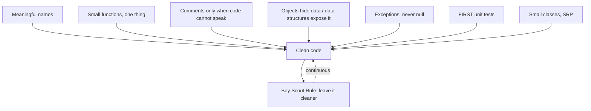

# Clean Code

Robert C. Martin's 2008 handbook argues that professionalism in software is
inseparable from the readability and cleanliness of the code we leave behind. Bad
code slows every future change; the cost compounds until a team grinds to a halt.
The remedy is not heroics but disciplined attention to small things, applied
constantly. The book gathers those disciplines into concrete heuristics, illustrated
mostly in Java. It is explicit that many of the specific rules are **opinionated** —
the authors present them as *their* craft, learned in practice, not as universal law.
The value is in internalizing the reasoning, then forming your own judgment.

A recurring theme: writing clean code is a craft learned by deliberate practice, akin
to how a musician or surgeon trains. See [Learning the Craft](../ai-org/learning-the-craft.md).

## Meaningful names

Names carry most of a reader's understanding, so spend the effort. A good name reveals
intent — why it exists, what it does, how it is used — so no comment is needed to
explain it. Avoid disinformation and near-duplicate names that differ trivially. Make
distinctions meaningful rather than noise (`a1`, `a2`, or `ProductInfo` vs
`ProductData`). Favor pronounceable, searchable names; single letters are only fine in
tiny scopes. Pick one word per concept and use it consistently across the codebase.
Class names should be nouns, method names verbs.

## Functions

The single most emphasized chapter. Functions should be **small** — then smaller.
Guidelines that follow from that:

- **Do one thing.** A function should do it well and do only it. A useful test: you
  cannot meaningfully extract another function from it with a name that is not just a
  restatement of the original.
- **One level of abstraction per function.** Do not mix high-level policy with
  low-level detail in the same body. Code should read top-down like prose, each
  function followed by those at the next level down (the "stepdown rule").
- **Few arguments.** Zero is ideal, then one, then two; three or more needs strong
  justification. Bundle related arguments into an object when they travel together.
  Avoid flag arguments — a boolean parameter signals the function does more than one
  thing. Avoid output arguments; prefer return values.
- **No side effects.** A function named for one thing should not secretly do another
  (e.g., initializing a session inside a `checkPassword`).
- **Command-query separation.** A function either does something or answers something,
  not both.

## Comments

Comments are, at best, a necessary evil and usually a **failure to express ourselves
in code**. Every comment is a small defeat; prefer refactoring the code so the comment
becomes unnecessary. Comments do not compensate for bad code — clean the code instead.
They also rot: code moves, comments do not, and stale comments actively mislead.

Some comments earn their place: legal headers, explanation of intent, clarification of
an opaque external API, warning of consequences, TODOs, and amplifying the importance
of something easily overlooked. Bad comments to avoid: redundant restatements of the
code, commented-out code (delete it — version control remembers), mandated
boilerplate on every function, and journal/attribution comments.

## Formatting

Formatting is communication, and communication is the professional's first order of
business. Vertical formatting: a file reads top-to-bottom like a newspaper — high-level
concepts first, details later. Keep related concepts vertically close; separate
distinct ones with blank lines. Declare variables near their use. Horizontal
formatting: keep lines short, use whitespace to associate and disassociate related
things, and avoid deep indentation. A team should agree on one style and apply it
uniformly so the codebase reads as though written by one person.

## Objects and data structures

The two are near-opposites, and the distinction matters. **Objects** hide their data
behind abstractions and expose behavior; **data structures** expose their data and
have no meaningful behavior. This yields a complementary tradeoff (the "data/object
anti-symmetry"): OO code makes it easy to add new types without changing existing
functions, but hard to add new functions; procedural code over data structures makes
it easy to add new functions but hard to add new types. Choose the shape that fits the
axis of change. The **Law of Demeter** follows: a method should talk only to its
immediate collaborators, not reach through chains of getters ("train wrecks"),
because that couples it to the internal structure of distant objects.

## Error handling

Error handling matters but must not obscure the logic. Prefer **exceptions over return
codes** — return codes force the caller to check and clutter the happy path with error
handling, and are easily ignored. Write the `try` first to define the transaction's
scope, and prefer unchecked exceptions (checked exceptions violate the Open/Closed
principle by rippling signature changes up the call stack). Provide context with each
exception. Wrap third-party APIs so you throw your own exception types.

**Don't return null** and **don't pass null.** Returning null pushes null-check burden
onto every caller and invites NullPointerExceptions; return an empty collection or a
special-case object instead. Passing null into methods is worse — there is rarely a
good way to handle it.

## Boundaries

Where our code meets third-party code, insulate the seam. Do not let a foreign
interface (like a raw `Map` or a vendor API) leak throughout the system; wrap it so the
boundary lives in one place and the rest of the code depends on our own cleaner
interface. Use **learning tests** — small tests that exercise the third-party library
the way we intend to use it — to understand it and to detect breaking changes when it
is upgraded.

## Unit tests and clean tests

Tests are first-class code and deserve the same cleanliness as production code — dirty
tests are worse than no tests, because they rot and get abandoned. The **Three Laws of
TDD**: write no production code until a failing test demands it; write only enough of a
test to fail; write only enough production code to pass. See
[TDD: Five Practices](tdd-five-practices.md).

Clean tests read clearly — one assert or one concept per test is the ideal — and follow
**F.I.R.S.T.**:

- **Fast** — tests run quickly, so you run them often.
- **Independent** — tests do not depend on each other or on ordering.
- **Repeatable** — they pass in any environment, offline, on any machine.
- **Self-validating** — a boolean pass/fail, no manual log inspection.
- **Timely** — written just before the production code they cover.

## Classes

Classes should be **small**, measured not in lines but in responsibilities. The
**Single Responsibility Principle**: a class should have one, and only one, reason to
change. Many small, focused classes beat a few large ones. Aim for high **cohesion** —
methods and variables that belong together — and organize for change so that new
behavior is added by extension rather than modification, isolating the code from the
volatility of requirements.

## The Boy Scout Rule

*Leave the campground cleaner than you found it.* Every time you touch a file, improve
it a little — a clearer name, a split function, a removed duplication. Continuous small
cleanups keep entropy from winning without needing a dedicated rewrite. This is the
everyday discipline that
[Refactoring](refactoring-improving-the-design-of-existing-code.md) formalizes into
technique.

## Code smells

The book closes with a catalog of **smells and heuristics** — recognizable symptoms of
deeper problems, drawn from the same tradition as Fowler's refactoring smells. Examples
span comments (obsolete, redundant), functions (too many arguments, dead code),
general design (duplication, code at the wrong level of abstraction, feature envy,
misplaced responsibility, magic numbers), and naming. Smells are heuristics, not proofs
— they point where to look, and disciplined attention plus refactoring is the cure.

Clean code is not one grand decision; it is thousands of small ones made well, then
maintained. The broader system-level view of these ideas is
[Clean Architecture](../software-architecture/clean-architecture.md).

## References

- [Clean Code: A Handbook of Agile Software Craftsmanship — Robert C. Martin (2008)](https://www.oreilly.com/library/view/clean-code-a/9780136083238/)
