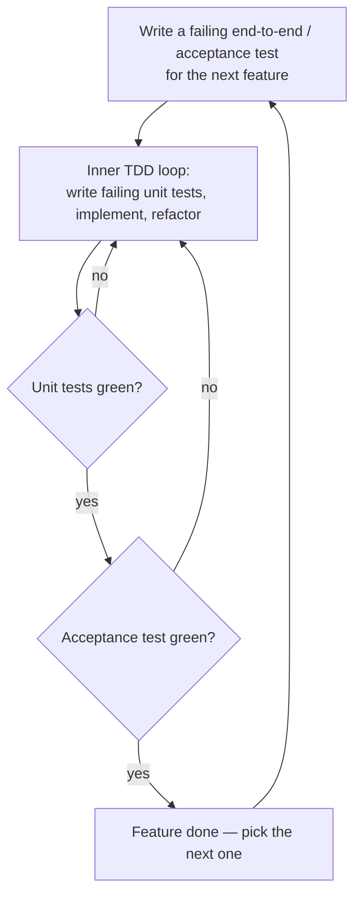

# Growing Object-Oriented Software, Guided by Tests

Steve Freeman and Nat Pryce's 2009 book (Addison-Wesley, commonly "GOOS") takes
test-driven development past the basic red-green-refactor cycle and turns it into a
technique for *designing* object-oriented systems. Its premise: tests are not just a
correctness check bolted on after the fact — they are the primary feedback loop that
grows the design. You "grow" software incrementally, letting each test pull the next
slice of behavior and the object structure needed to support it into existence.

Where [Test-Driven Development by Example](test-driven-development-by-example.md)
establishes the mechanics of the cycle and
[the five practices of TDD](tdd-five-practices.md) frame the discipline, GOOS is the
canonical statement of the **London school** (interaction-based, "mockist") variant of
TDD, in contrast to the classicist/state-based style. The whole book is organized
around one extended worked example so the ideas land in context rather than as slogans.

## Outside-in, London-school TDD

Classical TDD tends to build from the inside out: write and verify small units, then
assemble them. GOOS works **outside-in** instead. You start from what the system should
do at its boundary and drive inward, discovering collaborators as you need them. At each
object, you ask "who does this object need to talk to?" and express those needs as
**roles** — interfaces the object depends on — before any concrete implementation
exists. Mock objects stand in for those collaborators, so a test specifies not only the
result but the *conversation* between objects: which messages are sent, in what order,
to whom. This is why the style is called interaction-based — you design by specifying
protocols between roles, and the interfaces that emerge are narrow and intention-revealing.

## The walking skeleton

Before growing features, GOOS builds a **walking skeleton**: the thinnest possible
end-to-end slice that exercises the real deployment and integration path — build,
package, deploy, run — but does almost nothing functionally. Its purpose is to force the
hard architectural and infrastructure questions to the surface on day one, when they are
cheap to answer, and to establish the automated end-to-end test harness that every later
feature will grow inside. You want the plumbing proven before you pour water through it.

## End-to-end first, then unit

GOOS runs two nested feedback loops:

The outer **acceptance-test** loop keeps you honest about delivering real user-visible
behavior and integration; the inner **unit-test** loop drives the fine-grained design of
individual objects. The acceptance test failing tells you *what* to build next; the unit
tests tell you *how* the objects should collaborate. This mirrors the acceptance-driven
outer loop described in [ATDD by Example](../process-and-teams/atdd-by-example.md).

## Listen to the tests

GOOS's most quoted idea: **test pain is a design smell.** When a test is awkward to
write — you have to construct an elaborate web of mocks, you can't set up the object in
isolation, one test reaches through many layers, setup dwarfs the assertion — the tests
are telling you something about the *design*, not about testing. Hard-to-test code is
usually badly-coupled code. The right response is to fix the design (extract a role,
narrow a dependency, split a responsibility), not to fight the test. Tests thus act as
an early-warning system for coupling and cohesion problems, which is the deeper reason
mock-based TDD is a design discipline rather than a verification chore. This complements
the trade-off discussion in [Unit Testing (Khorikov)](unit-testing-khorikov.md) on what
makes a test valuable, and the smell/pattern vocabulary in
[xUnit Test Patterns](xunit-test-patterns.md).

## Mock-based design of roles and interfaces

Mocks in GOOS are a *design tool*, not merely a stubbing convenience. By deciding what to
mock, you are deciding what collaborators an object has and what it may ask of them —
you discover roles. The guidance is deliberate: **mock roles you own, not third-party
types** (wrap external libraries behind your own interfaces and mock those), and mock
the object's peers (dependencies, notifications, adjustments) rather than its internal
values. The result is a system of small, sharply-defined interfaces that each capture one
relationship, keeping objects loosely coupled and highly cohesive. See also the broader
TDD context in [TDD: unit tests](tdd-unit-tests.md).

## References

- [Growing Object-Oriented Software, Guided by Tests — book site](http://www.growing-object-oriented-software.com/)
