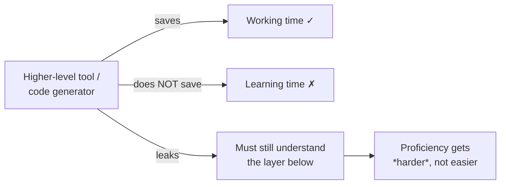

# The Law of Leaky Abstractions

Joel Spolsky's 2002 essay states one rule:

> All non-trivial abstractions, to some degree, are leaky.

An abstraction hides the messy layer below it — until the day the layer below
misbehaves and "leaks" back through. When that happens, the abstraction stops
protecting you and you have to understand what it was hiding.

## The canonical example

TCP "guarantees" your message arrives. It doesn't, really: if the cable is
chewed through, no packets get through and TCP can't help; if you're on an
overloaded hub, TCP still works but everything crawls. TCP abstracts an
unreliable network into a reliable stream — most of the time. The unreliability
leaks through, and you feel it.

Other leaks Spolsky lists: iterating a 2D array by column is far slower than by
row (memory layout leaks through the array abstraction); `"foo" + "bar"` in C++
does something bizarre until you understand `char*` and pointer arithmetic;
ASP.NET hides the HTML difference between a link and a button by generating
JavaScript — which breaks the moment the user disables JavaScript, leaving a
programmer who doesn't know what was abstracted with no clue what's wrong.

## The punchline: abstractions save working time, not learning time

This is the part that matters most for AI-assisted development. Spolsky:

> Abstractions save us time working, but they don't save us time learning.

And the paradox that follows:

> Paradoxically, even as we have higher and higher level programming tools with
> better and better abstractions, becoming a proficient programmer is getting
> harder and harder.

Every "wizzy new code-generation tool" prompts the advice: *learn to do it
manually first, then use the tool to save time.* Because the tool leaks, and the
only way to handle a leak competently is to understand what's underneath.

## Why this is load-bearing for AI coding

An AI agent is the highest-level abstraction yet — it abstracts away the writing
of code itself. By this law it *will* leak: it hallucinates APIs, quietly
rewrites your logic, produces plausible-but-wrong output. When it does, you can
only catch and fix it if you understand the layer below. This is precisely why
[learning the craft](../ai-org/learning-the-craft.md) argues fundamentals still have to be
taught, and it's the mechanism behind [comprehension debt](../ai-org/comprehension-debt.md)
and the [ironies of automation](../systems-thinking/ironies-of-automation.md).

## Related

- [Learning the Craft](../ai-org/learning-the-craft.md) — applies this law to AI-era
  fundamentals.
- [Does AI Make Us Stupid](../ai-org/does-ai-make-us-stupid.md) — cognitive offloading of
  the layer below.

## References
- [The Law of Leaky Abstractions — Joel Spolsky](https://www.joelonsoftware.com/2002/11/11/the-law-of-leaky-abstractions/)
