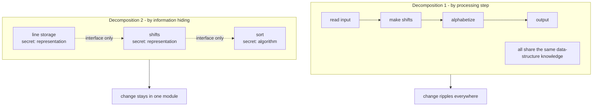

# On the Criteria To Be Used in Decomposing Systems into Modules

David Parnas's 1972 CACM paper is the origin of **information hiding** and the
intellectual foundation for almost everything the field later called modularity. Its
question is deceptively simple: given that we agree systems should be split into
modules, *what criteria should decide where the boundaries go?*

## The two decompositions

Parnas takes one small program (a KWIC index — key word in context) and decomposes it
two different ways to make the criteria concrete.

- **Decomposition 1 — by flowchart / processing steps.** Each module is a step in the
  computation: read input, build the circular shifts, alphabetize, format output. This
  is the "obvious" decomposition — you split along the order things happen. Every module
  shares knowledge of the same data structures and formats.
- **Decomposition 2 — by information hiding.** Each module *hides a design decision*
  from the others. One module owns how lines are stored; another owns how shifts are
  represented; another owns the sort algorithm. No module knows another's internal
  representation — they interact only through interfaces.

Both produce a working program. They are not equally good.

## The criterion: hide what is likely to change

The key insight is that the decomposition should **not** follow the flow of control or
the sequence of processing. It should follow **anticipated change**. Each module is
assigned one "secret" — a design decision (a data representation, an algorithm, an I/O
format) that is likely to change independently. The module's interface exposes only what
*other* modules legitimately need; everything else is hidden behind it.

The payoff is measured against the things that actually cost money over a system's life:

- **Changeability** — a decision that changes affects one module, not a cascade.
- **Independent development** — teams can build modules in parallel against interfaces
  before internals exist.
- **Comprehensibility** — a module can be understood in isolation without holding the
  whole system in your head.

Decomposition 1 fails all three: a change to the storage format ripples through every
step because every step knows the format. Decomposition 2 localizes each change to the
module that owns the secret.

## Why it still matters

Information hiding is the seed of encapsulation, abstract data types, object
orientation, and modern module boundaries. The lasting rule of thumb: **modularize
around what is likely to change, hide those decisions behind interfaces, and let control
flow fall out of that** — not the other way around. A module boundary that merely mirrors
the steps of the algorithm buys you nothing when requirements shift.

## Related notes

- [Clean Architecture](../software-architecture/clean-architecture.md) — dependency boundaries and stable
  abstractions descend directly from this criterion.
- [A Philosophy of Software Design](a-philosophy-of-software-design.md) — Ousterhout's
  "deep modules" are information hiding restated: a simple interface over a substantial,
  hidden implementation.
- [Hexagonal Architecture (Ports and Adapters)](../software-architecture/hexagonal-architecture-ports-and-adapters.md)
  — hides I/O and infrastructure decisions behind ports.
- [Simple Made Easy](simple-made-easy.md) — Hickey's "complecting" is what happens when
  unrelated decisions are *not* hidden from each other.
- [The Mythical Man-Month](../process-and-teams/the-mythical-man-month.md) — conceptual integrity and
  parallel development that clean module boundaries enable.

## References

- [On the Criteria To Be Used in Decomposing Systems into Modules — Communications of the ACM, Dec. 1972](https://dl.acm.org/doi/10.1145/361598.361623)
