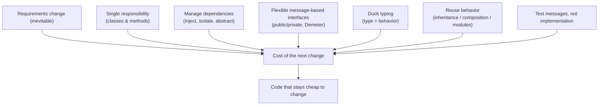

# Practical Object-Oriented Design in Ruby

Sandi Metz's practical field guide (known as *POODR*) to building object-oriented
software that stays cheap to change. Its through-line: applications don't fail because
they're wrong at the moment they ship — they fail because the world changes and the code
resists changing with it. Every technique in the book is judged by one yardstick: does it
make the *next* change easier? Ruby is the medium, but the reasoning is
language-agnostic and lines up with the same forces described in
[Clean Architecture](../software-architecture/clean-architecture.md).

## Design is about managing change, not predicting it

Good design isn't a set of rules to obey; it's a cost-benefit judgment. You pay a little
now (thinking, restructuring) to avoid paying a lot later (rework when requirements
shift). The enemy is **dependencies** — every place one object knows too much about
another is a place a future change ripples outward. The whole book is a catalog of ways
to arrange dependencies so that ripples stay contained.

## Single responsibility (classes and methods)

A class should do the smallest useful thing and have exactly one reason to change. The
test Metz offers: describe the class in one sentence — if you need "and" or "or," it's
doing too much. A telltale sign is a class you can't easily reuse without dragging along
behavior you don't want.

The same discipline applies below the class level. Methods, too, should each do one
thing. Small, single-purpose methods make responsibilities visible, expose hidden
concepts that want to become their own classes, and make code easy to reorganize before
you fully understand it — you can rearrange small pieces without committing to a design
you might regret.

## Managing dependencies

When one object must collaborate with another, minimize what it knows:

- **Depend on abstractions, not concretions.** Knowing a message is safer than knowing a
  concrete class name.
- **Inject dependencies** rather than hard-coding them. Pass a collaborator in instead of
  naming its class inside the method — the object depends on the *role*, not the specific
  type, so any object that plays the role can be substituted.
- **Isolate the dependencies you can't remove.** Wrap external class names, argument
  order, and awkward APIs behind a single well-named method or wrapper, so a change to the
  outside world touches one spot.
- **Reverse dependency direction when it helps.** Depend on the thing less likely to
  change; if the current arrow points at volatile code, flip it.

The goal is that each object is only loosely tied to its neighbors and easy to swap.

## Creating flexible interfaces

Design by thinking about **messages**, not objects — "what does this object need to *ask
for*?" rather than "what class should I make?" This shifts design toward how objects
collaborate rather than what data they hold.

- **Public vs. private interface.** A class's public interface is the small, stable set of
  messages it promises to answer — its contract. Everything else is private implementation
  that others must not lean on. Keeping the public surface intentional and minimal is what
  lets you change internals freely.
- **Law of Demeter.** Don't reach through one object to talk to a distant one
  (`a.b.c.do_thing`). Long chains couple you to a whole structure; a change anywhere along
  the path breaks you. Ask a direct collaborator for what you need instead.

## Duck typing

An object's real type is defined by what it *does*, not by its class. If it responds to
the messages you send, it's the right kind of thing — that's a duck type. Recognizing and
naming these across-class roles removes brittle `case`/`is_a?` type-checking, lets
unrelated classes stand in for one another, and makes the system extensible: new
participants just implement the role's messages. Duck typing is the practical payoff of
designing around messages.

## Inheritance done right

Classical inheritance is for genuine **is-a**, generalization/specialization
relationships — it lets subclasses share a superclass's behavior and override only what
differs. Metz's recipe:

- Reach for inheritance only when you have concrete cases showing a stable general/special
  split; don't design the hierarchy up front from imagination.
- Push the shared, abstract behavior *up* into the superclass; keep only the specialized
  parts in subclasses.
- Use a **template method** pattern so subclasses supply the differing pieces, and make
  the superclass demand them explicitly (fail loudly if a subclass forgets) rather than
  silently misbehaving.
- Avoid forcing subclasses to know the superclass's algorithm — that hidden coupling is
  where fragile hierarchies come from.

Inheritance is powerful but rigid; misused, it's one of the costliest mistakes to unwind.

## Composition over inheritance

Composition builds a larger thing out of smaller parts it **has** and delegates to, rather
than parts it **is**. Prefer it when the relationship is has-a: it keeps the pieces
independent and pluggable, and swapping a collaborator is a runtime decision instead of a
class-hierarchy commitment. The tradeoff — composition adds more objects and more
explicit wiring — is usually worth the flexibility. The rule of thumb: favor composition,
use inheritance only when the is-a case is clear and the shared behavior is stable.

## Sharing role behavior with modules

Some behavior is a **role** shared by otherwise-unrelated classes (schedulable,
printable). Ruby modules (mixins) let many classes share that behavior without a common
superclass — a form of inheritance where the shared code lives in a module included into
each participant. The same disciplines as class inheritance apply: keep the module's
demands on its includers explicit, and don't let the shared code assume too much about the
classes that mix it in.

## Designing cost-effective tests

Tests are worth writing only if they cost less than the bugs and rework they prevent — and
badly-targeted tests can cost *more* than they save by breaking on every refactor. The
guiding principle: **test the interface (the messages), not the implementation.**

- Test **incoming messages** (an object's public interface) for the value they return.
- Test **outgoing command messages** — the ones that cause a side effect on a
  collaborator — by asserting they were sent (mocks/expectations).
- Ignore outgoing **query** messages; testing them just duplicates the collaborator's own
  tests and couples you to internals.
- Never test private methods directly; they're free to change.
- Use **role tests** (shared test modules) to prove every player of a duck-typed role
  honors its contract, and lightweight **doubles** to stand in for collaborators.

Tests written this way document the object's contract and stay green through internal
[refactoring](refactoring-improving-the-design-of-existing-code.md) — they enable change instead of resisting it, which is the same spirit as the
message-level focus in [TDD and unit tests](tdd-unit-tests.md). Together these habits are
core to the ongoing practice of [learning the craft](../ai-org/learning-the-craft.md).

## References

- [Practical Object-Oriented Design in Ruby — poodr.com](https://www.poodr.com/)
