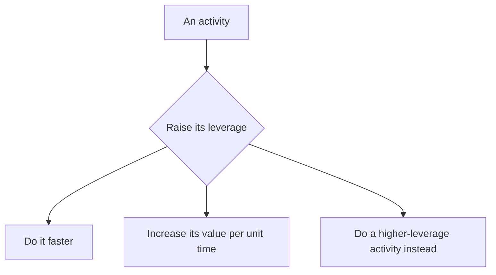

# The Effective Engineer

Edmond Lau's *The Effective Engineer* (2015) argues that an engineer's
effectiveness is not measured by hours worked, effort applied, or tasks
completed, but by the **rate at which they produce value per unit of time**.
The book deliberately contains no code — its subject is the *meta-skills* that
decide where to point your technical ability so that more of your effort turns
into impact. This applies the same "work smart, not just hard" instinct behind
[learning the craft](../ai-org/learning-the-craft.md): raw skill only matters once it is
aimed at the right thing.

## Leverage: the core unit

The book's organizing idea is **leverage**, defined as the impact produced for
the time invested:

```
leverage = impact produced / time invested
```

A high-leverage activity yields a large return on a small slice of time.
Effective engineers instinctively route their time toward these activities and
away from busywork that feels productive but changes little. There are exactly
**three ways to raise the leverage of any activity**:

1. **Do it faster** — complete the same activity in less time.
2. **Increase its value** — get more impact out of the same time spent.
3. **Do something else entirely** — shift the time to a higher-leverage
   activity altogether. (This is the one people forget: the highest-leverage
   move is often to *not do* the thing at all and question whether it needs to
   exist.)

Leverage is the yardstick used throughout the rest of the book; every habit
that follows is a concrete way to increase it.



## Part 1 — Adopt the right mindsets

**Focus on high-leverage activities.** Not all work is equal. Continuously ask
which of the available tasks produces the most impact per hour, and let the
low-leverage ones go. Guard against confusing motion for progress.

**Optimize for learning.** Adopt a *growth mindset* — treat ability as
something that compounds with deliberate effort rather than as a fixed trait.
Because learning compounds like interest, investing in it early pays off for the
rest of a career. Seek environments and work that maximize the rate of learning:
steep but survivable challenges, fast feedback, senior people to learn from, and
autonomy. Reserve time for study that isn't tied to the current sprint.

**Prioritize regularly.** Make prioritization an explicit, repeated habit rather
than an accident of whatever lands in the inbox. Track work in a single trusted
system, focus on what is both important and leverage-heavy, and revisit
priorities often as new information arrives.

## Part 2 — Execute

**Invest in iteration speed.** The faster you can move through the
build-measure-learn loop, the more attempts you get and the more you learn per
unit of calendar time. Fast tests, fast builds, fast deploys, and tight
debugging loops are themselves high-leverage investments because they multiply
every future task. Remove the friction that taxes every iteration.

**Measure what you want to improve.** Pick metrics deliberately: a good metric
maximizes what you actually care about, is actionable, and is hard to game.
Measurement turns vague goals into things you can move, lets you compare the
value of competing efforts, and exposes whether a change helped or hurt. What
gets measured gets managed — so choose the numbers with care.

**Validate ideas early and often.** Reduce wasted effort by testing the riskiest
assumptions cheaply *before* committing to full builds. Prototypes, A/B tests,
small experiments, and talking to users all surface bad ideas before months are
sunk into them. The war stories in the book — features built over weeks that no
one used — are all failures of early validation.

**Improve project estimation.** Estimates are decision-making inputs, not
promises. Decompose work into small tasks, estimate based on effort not
wishful calendar dates, track how estimates diverge from reality, and use that
gap to plan schedules and set expectations honestly.

## Part 3 — Build long-term value

**Balance quality with pragmatism.** Quality is not free and not infinite;
match the investment (tests, code review, abstractions, refactoring) to the
stakes and lifespan of the code. Take on technical debt deliberately and pay it
down before it compounds — neither ship recklessly nor gold-plate forever.

**Minimize operational burden.** Every system you run has an ongoing cost. Do
the simplest thing that works, automate mechanical toil, build to fail
gracefully, and invest in operational ease so that maintenance doesn't quietly
consume the team's leverage over time. Operational load is a tax on all future
work.

**Invest in your team's growth.** Individual leverage is capped; team leverage
is not. Effective senior engineers raise the whole team's output — good hiring,
strong onboarding, mentoring, sharing ownership, and building a culture where
people learn quickly. Investing in others is one of the highest-leverage
activities available to an experienced engineer.

## The through-line

Every habit in the book is a specific answer to one question: *how do I get
more impact out of the time I have?* Mindsets tell you where to aim, execution
habits let you move quickly and correctly toward it, and long-term investments
keep the leverage compounding instead of eroding.

## References

- [The Effective Engineer — Edmond Lau](https://www.effectiveengineer.com/book)
