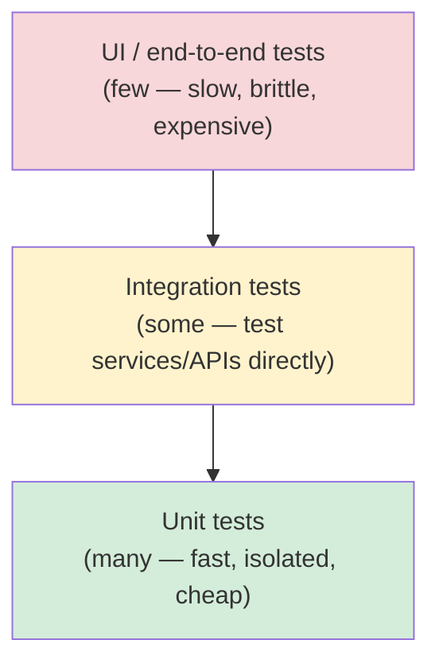

# The Way of the Web Tester

Jonathan Rasmusson's beginner's guide to automating tests for the web. The book
deliberately avoids being a framework tutorial — frameworks change too fast — and
instead teaches the durable fundamentals (HTML, CSS, HTTP, and the shape of a good
test suite) so the ideas transfer to any stack. Examples are in Ruby/Rails and
JavaScript, but those are incidental. The central metaphor is a pyramid that tells a
team how many of each kind of test to write and where to put testing effort.

## The testing pyramid

The pyramid is a model for balancing a test suite by *speed*, *cost*, and *count*.
Three layers, widest at the bottom:

- **Unit tests (base, most numerous)** — exercise a single class or function in
  isolation. Milliseconds to run, so you can have thousands of them. They pin down
  logic and edge cases cheaply and give near-instant feedback. This is where the bulk
  of coverage should live.
- **Integration tests (middle)** — verify that pieces work together across a boundary,
  typically by hitting a web service / RESTful API directly (GET/POST/PUT/DELETE) with
  no browser involved. Slower than unit tests because they cross the network or a real
  dependency, so you write fewer of them. They catch wiring problems units can't see.
- **UI / end-to-end tests (top, fewest)** — drive the app through the browser the way a
  real user would: load a page, select elements via CSS, click, and assert on the
  rendered HTML. High value because they prove the whole stack works, but slow and
  fragile, so keep them few and reserve them for the critical user journeys.

Rasmusson's rule of thumb: push tests *down* the pyramid. If a behavior can be checked
at the unit level, don't check it through the browser. An **inverted pyramid** — lots of
slow UI tests over a thin unit base — is the anti-pattern: the suite becomes slow,
flaky, and expensive to maintain, and teams stop trusting it.

## Why UI tests are brittle and expensive

UI tests fail for reasons that have nothing to do with real bugs: a renamed CSS class or
id, a changed layout, timing/async races (the test asserts before the page finishes
loading), or environmental flakiness. Each failure costs investigation time, and a suite
that cries wolf gets ignored. They're also slow — every test spins up a browser and
round-trips the full stack. This is exactly why they sit at the narrow top: valuable but
rationed. The book devotes a chapter to **flaky tests** — how to recognize them, quarantine
them, and drive their causes out rather than letting them erode confidence in the suite.

## The Page Object pattern

The main defense against brittle UI tests. Instead of scattering CSS selectors and
click sequences throughout every test, wrap a page (or component) in a **Page Object**: a
class that exposes the page's behavior as methods (`login(user, pass)`, `searchFor(term)`)
and hides the selectors and mechanics behind that interface. Tests then read as intent,
not as DOM plumbing.

The payoff is a single point of change. When the markup shifts, you update selectors in
one place — the Page Object — and every test that uses it keeps working. This is the DRY
principle (see below) applied to UI automation, and it's what makes a browser suite
maintainable at all.

## Writing good tests: style, isolation, and assertions

Part II treats test code as real code that must be kept clean, echoing the craftsmanship
ideas in [Test-Driven Development by Example](test-driven-development-by-example.md) and
the practices in [Effective Testing with RSpec 3](effective-testing-with-rspec-3.md).

- **Good assertions** — assert on the one thing the test is about, clearly enough that a
  failure message tells you what broke without opening the code. Prefer specific
  assertions over broad ones.
- **Isolation** — each test stands alone and does not depend on another test's state or
  ordering. Set up fresh state, tear it down, and never leak data between tests. A test
  should pass or fail on its own.
- **Context / clarity** — group related tests and name them so the suite reads as
  documentation of the system's behavior.
- **Kill duplication** — spacing, naming, and duplication matter in tests as much as in
  production code; extract shared setup and helpers (the Page Object being the prime
  example on the UI side).
- **Effective mocking** — mocks let you isolate a unit from slow or awkward
  collaborators, but over-mocking couples tests to implementation detail (the "swamp of
  mocking"). The book points at **ports and adapters** to keep the seams clean so mocks
  test behavior, not internals.

## Fast, isolated, repeatable

A trustworthy suite is **fast** (so people actually run it), **isolated** (each test
independent), and **repeatable** (same result every run, regardless of environment or
order). These properties are what let a team run the tests constantly instead of
avoiding them — and they're mostly bought by keeping the pyramid bottom-heavy.

## Continuous integration

The suite earns its keep when it runs automatically on every change in CI. A fast,
bottom-heavy pyramid gives quick, reliable feedback on each commit; the slow, flaky
inverted pyramid makes CI painful and slow, which is how test suites die. Rasmusson also
walks through **test-driven development** — write a failing test, make it pass, refactor —
as the discipline that produces this kind of suite in the first place, the same
red-green-refactor loop covered in [TDD's five practices](tdd-five-practices.md) and
[TDD unit tests](tdd-unit-tests.md).

## Related notes

- [Test-Driven Development by Example](test-driven-development-by-example.md) — Kent Beck's foundational TDD text.
- [TDD's five practices](tdd-five-practices.md) — the core disciplines behind the red-green-refactor loop.
- [TDD unit tests](tdd-unit-tests.md) — what makes a good unit test at the base of the pyramid.
- [Effective Testing with RSpec 3](effective-testing-with-rspec-3.md) — writing clean, expressive tests in Ruby.

## References

- [The Way of the Web Tester — Pragmatic Bookshelf](https://pragprog.com/titles/jrtest/the-way-of-the-web-tester/)
