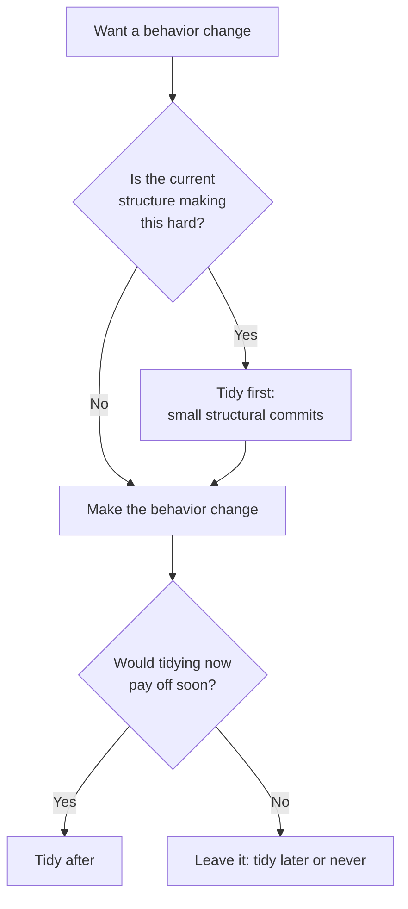

# Tidy First?

Kent Beck's short 2024 book on **empirical software design**: the small, safe cleanups
he calls *tidyings*, and the question of *when* to do them relative to the behavior
change you actually want to ship. It is the first installment of a planned larger work;
this volume covers the tactical layer (individual tidyings) and the beginnings of the
theory (coupling, cohesion, and the economics of design).

## The central distinction: structure vs. behavior

Every change to code is either:

- **Behavioral** — it changes what the system does (new feature, bug fix, altered output).
- **Structural** — it rearranges the code without changing what it does (rename, extract,
  reorder, add an explaining variable).

Beck's discipline: **never mix the two in the same commit.** A commit is either "changed
behavior" or "changed structure," never both. Structural changes are (by definition) safe
to verify — the tests that passed before must still pass — so they can be reviewed and
merged fast. Behavioral changes carry the real risk and deserve full scrutiny. Interleaving
them in one diff hides the risky lines among the safe ones and makes review, revert, and
bisection harder. This is the same "small, safe steps" instinct as
[Refactoring](refactoring-improving-the-design-of-existing-code.md), sharpened into a
commit-hygiene rule.

## Tidyings

The bulk of the book is a catalog of *tidyings* — micro-refactorings small enough to do
in the moment without ceremony. Examples: **guard clauses**, delete **dead code**,
**normalize symmetries** (make similar things look similar), introduce a **new interface
over an old implementation**, fix **reading order** and **cohesion order** so code reads
top-to-bottom, move declaration and initialization together, add **explaining variables**
and **explaining constants**, make **implicit parameters explicit**, and **chunk
statements** into labeled groups. Each is tiny, reversible, and structural.

## When: first, after, or never

The title's question. You can tidy:

- **First** — before a behavior change, when the current structure makes the change hard.
  Tidy until the change becomes easy, then make the easy change.
- **After** — once the behavior change is in, to leave the code better than you found it.
- **Later / never** — sometimes the messy code is stable and you won't touch it again;
  tidying it has no payoff.

The decision is economic, not moral. Tidying is an investment: it costs time now to buy
**optionality** — the ability to make future changes more cheaply. Beck frames it with
**discounted cash flow**: a cleanup pays off only if the future changes it enables are
likely and soon enough to justify the present cost. Sometimes the right answer is *don't
tidy*.

## Theory: coupling, cohesion, optionality

Underneath the tactics is a compact design theory. **Coupling** is what makes change
expensive — if changing A forces you to change B, they are coupled, and cost propagates.
**Cohesion** is grouping the things that change together. Good design reduces the coupling
that spreads a change across the system. And because the future is uncertain, design is
about preserving **optionality**: keeping choices open so you can respond to whatever the
next requirement turns out to be. Beck ends by framing design as an exercise in human
relationships — the code is a medium for a team's ongoing conversation.

## Relation to other notes

- Pairs with [Refactoring](refactoring-improving-the-design-of-existing-code.md): tidyings
  are refactorings restricted to the small, in-the-moment scale.
- The "tests green before and after a structural change" premise assumes a working test
  net — see [Test-Driven Development by Example](test-driven-development-by-example.md)
  and [The Five Practices That Set TDD Apart](tdd-five-practices.md), both also Beck.
- The commit-discipline echoes [Extreme Programming Explained](../process-and-teams/extreme-programming-explained.md)'s
  emphasis on small releasable steps and continuous integration.

## References

- [Tidy First? — O'Reilly](https://www.oreilly.com/library/view/tidy-first/9781098151232/)
