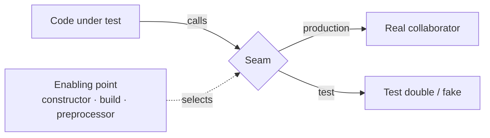
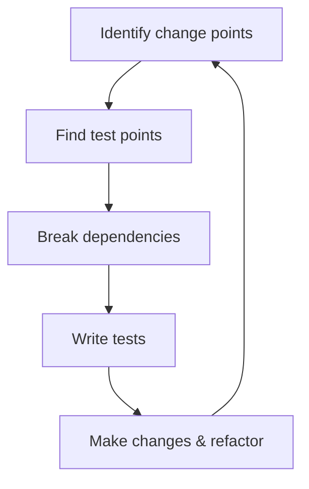

# Working Effectively with Legacy Code

Michael C. Feathers' 2005 book (Prentice Hall PTR, Robert C. Martin Series) on
changing code you're afraid to touch. Its central move is a definition: **legacy code
is simply code without tests.** Age, ugliness, and language don't matter — what makes
code hard to change is the absence of a feedback mechanism that tells you whether an
edit broke something. Reframing the problem this way turns a vague dread into a
concrete engineering task: get the code under test, then change it.

## The core dilemma

Improving code safely requires tests. But to *add* tests to tangled code, you usually
have to change that code first — to break dependencies and create places you can get a
grip on it. So you're stuck: **change requires tests, and tests require change.** The
whole book is a way out of this loop. The trick is to make the smallest, safest edits
needed to get a test harness attached, using techniques mechanical enough that you can
trust them even without tests to back them up.

This connects to [test-driven development](tdd-unit-tests.md): TDD assumes you can
already run a fast, isolated test. Legacy work is the prequel — earning the ability to
write that first test at all.

## Seams and enabling points

A **seam** is a place where you can alter behavior without editing in that place. Every
seam has an **enabling point** — the spot where you decide which behavior applies. Seams
are how you slip a test double in between the code under test and its awkward
collaborators. Feathers names three kinds:

- **Object seam** — the most useful in OO code. Behavior is selected by which object a
  call dispatches to (subclass-and-override, or pass in a different implementation).
  The enabling point is the constructor call or the parameter.
- **Preprocessing seam** — available in languages with a macro/preprocessor step (C/C++);
  you swap definitions before compilation.
- **Link seam** — behavior is chosen by what gets linked or loaded (classpath, build
  config, linker), not by the source. The enabling point lives in the build.

Finding good seams is the practical skill: it's how you achieve *sensing* (observing
effects the code otherwise hides) and *separation* (pulling the code away from
dependencies you can't run in a harness).

## Characterization tests

When you don't understand the code well enough to know what it *should* do, you don't
write tests against a spec — you write **characterization tests** that pin down what the
code *actually does* right now, correct or not. The loop: call the code, let the test
tell you the real output, then encode that output as the expected value. The resulting
tests document current behavior and form a safety net, so any later change that alters
behavior fails loudly. They preserve behavior first; judging whether that behavior is
right comes after.

## The Legacy Code Change Algorithm

The book's spine is a repeatable sequence for making a change safely:

1. **Identify change points** — where in the code the new behavior belongs.
2. **Find test points** — where you can sense the effects of that change and detect
   breakage.
3. **Break dependencies** — the hard part: get the affected code into a test harness by
   introducing seams, minimizing edits and using conservative techniques.
4. **Write tests** — characterization tests to lock in existing behavior around the
   change.
5. **Make changes and refactor** — now that a net exists, add the feature or clean up
   with feedback on every step.

## Adding behavior without a harness: sprout and wrap

Sometimes you can't get the surrounding code under test cheaply but still need to add
behavior. Four patterns let you add *new* code that is testable, while leaving the old
code mostly untouched:

- **Sprout Method** — write the new logic as a fresh, tested method, then call it from
  the existing code. The new code is clean and covered even if its caller isn't.
- **Sprout Class** — same idea when the new logic doesn't belong in the existing class
  (or that class is too hard to instantiate): put it in a new, testable class.
- **Wrap Method** — rename the original method and create a new one under the old name
  that calls the original plus your added behavior, so callers are unchanged.
- **Wrap Class** — a decorator: a new class wraps the original, adding behavior around
  its calls.

These are pragmatic: they quarantine new work behind a clean, tested boundary so the
untested mass doesn't grow. Related to *programming by difference* — adding behavior via
subclassing before folding it back in.

## Dependency-breaking techniques

The catalog at the heart of Part III — small, named, largely mechanical refactorings
whose only job is to introduce a seam so a class or method can be instantiated and run
in a test. Representative examples:

- **Extract Interface** / **Extract Implementer** — put an interface in front of a
  concrete collaborator so a fake can stand in.
- **Subclass and Override Method** — in a test subclass, override the method that does
  something untestable (I/O, network, singletons).
- **Extract and Override Call / Factory Method / Getter** — pull an inconvenient call or
  object creation into a method you can override in a test subclass.
- **Parameterize Constructor** / **Parameterize Method** — pass a dependency in instead
  of creating it internally, so tests can supply a double.
- **Introduce Instance Delegator**, **Introduce Static Setter**, **Replace Global
  Reference with Getter**, **Encapsulate Global References** — tame globals and static
  calls that block isolation.
- **Link Substitution**, **Adapt Parameter**, **Break Out Method Object**, **Supersede
  Instance Variable**, and more.

The point is a vocabulary of safe moves so you're never improvising the risky part.

## Supporting discipline

To edit safely before the net is complete, Feathers leans on conservative habits:
**Preserve Signatures** (avoid re-typing signatures — copy them to prevent slips),
**Lean on the Compiler** (let the type checker find every call site you must touch),
**Single-Goal Editing**, and **Hyperaware Editing**. These are the same craft-mindset
of small, deliberate steps described in [learning the craft](../ai-org/learning-the-craft.md) and
the disciplined-loop practices in [the five practices of TDD](tdd-five-practices.md).

## Why it matters

The book's lasting contribution is reframing "legacy" as a testability problem with a
mechanical solution, and supplying the concrete toolkit — seams, characterization tests,
the change algorithm, sprout/wrap, and the dependency-breaking catalog — to act on it.
It's the bridge between an untested codebase and a codebase where TDD is even possible.

## References

- [Working Effectively with Legacy Code — Michael C. Feathers (Prentice Hall PTR, 2005, ISBN 0-13-117705-2)](https://www.oreilly.com/library/view/working-effectively-with/0131177052/)
