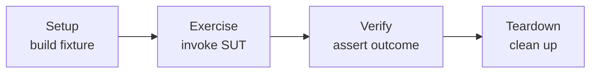

# xUnit Test Patterns: Refactoring Test Code

Gerard Meszaros's 2007 pattern language for automated tests. It is the reference work that
standardized the vocabulary of testing — **test double**, **mock**, **stub**, **fake**,
**dummy**, **fixture**, **System Under Test (SUT)**, **test smell** — and organized the
recurring ways good tests are built and bad tests go wrong. The premise: **test code is
production code**, it rots the same way, and it deserves the same care and
[refactoring](refactoring-improving-the-design-of-existing-code.md).

## Test smells

The book's most enduring contribution is cataloging **test smells** — symptoms that a
test suite is becoming a liability. Smells are grouped by where they show up:

- **Code smells** — problems visible in the test source itself: **Obscure Test** (can't
  tell what it verifies), **Conditional Test Logic** (ifs/loops in tests), **Test Code
  Duplication**, **Hard-Coded Test Data**.
- **Behavior smells** — problems seen when tests run: **Fragile Test** (breaks on
  unrelated changes — the same false-positive problem
  [Khorikov](unit-testing-khorikov.md) calls loss of *resistance to refactoring*),
  **Erratic Test** (flaky / non-deterministic), **Slow Tests**, **Assertion Roulette**
  (a failure gives no clue which assertion fired), **Fragile Fixture**.
- **Project smells** — problems felt at the whole-project level: **Buggy Tests**,
  **Developers Not Writing Tests**, **High Test Maintenance Cost**, **Production Bugs**
  that slip through.

Smells are diagnostic; the patterns are the cures.

## Test doubles: the standard taxonomy

Meszaros defined the now-canonical vocabulary for stand-in objects, collectively **Test
Doubles**:

- **Dummy** — passed around but never actually used; just fills a parameter slot.
- **Stub** — provides canned answers to calls made during the test (feeds indirect
  *inputs* to the SUT).
- **Spy** — a stub that also records how it was called, for later inspection.
- **Mock** — pre-programmed with expectations about the calls it should receive and
  fails the test if they don't happen (verifies indirect *outputs*).
- **Fake** — a working but lightweight implementation (e.g. an in-memory database) not
  suitable for production.

This taxonomy is why "mock" and "stub" are no longer used interchangeably in careful
writing, and it underpins the [Khorikov](unit-testing-khorikov.md) rule about *which*
dependencies to double.

## Fixtures and the four-phase test

A recurring structural pattern is the **Four-Phase Test**: **Setup** (build the fixture)
→ **Exercise** (invoke the SUT) → **Verify** (assert) → **Teardown** (clean up). Much of
the book is about the **fixture** — the known state a test runs against — and strategies
for it: **Fresh Fixture** (rebuild per test; isolated but can be slow) vs. **Shared
Fixture** (reused; fast but a source of Erratic/Fragile tests), plus patterns like
**Testcase Class per Fixture**, **Creation Method**, and **Object Mother** for building
test data cleanly.

## Relation to other notes

- Supplies the shared vocabulary (mock/stub/fake, SUT, fixture) used by
  [Unit Testing: Principles, Practices, and Patterns](unit-testing-khorikov.md), which
  builds its "mock only unmanaged dependencies" rule on top of it.
- "Test code is production code, refactor it" connects directly to
  [Refactoring](refactoring-improving-the-design-of-existing-code.md).
- The tests it helps you write well are the ones [TDD by Example](test-driven-development-by-example.md)
  produces and the ones [Continuous Delivery](../devops-sre/continuous-delivery.md) relies on.
- The RSpec-flavored practice of these ideas is in
  [Effective Testing with RSpec 3](effective-testing-with-rspec-3.md).

## References

- [xUnit Test Patterns (companion site) — xunitpatterns.com](http://xunitpatterns.com/)
