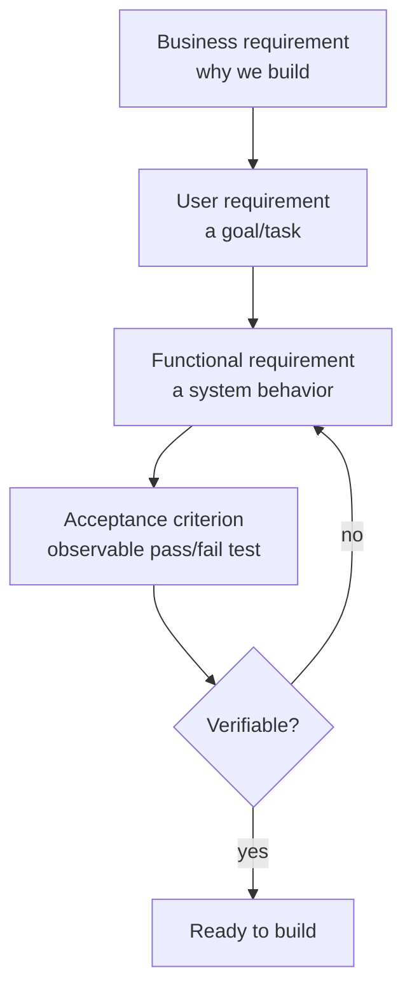

# Software Requirements (3rd ed.)

Karl Wiegers and Joy Beatty's *Software Requirements* (Microsoft Press, 3rd ed.,
2013) is the standard practitioner reference on requirements engineering: how to
elicit, analyze, specify, validate, and manage what a system must do. Its lasting
value for AI-assisted work is its insistence that a requirement is only useful if
it can be **verified** — which forces the writing of falsifiable acceptance
criteria.

## Requirements as a layered vocabulary

The book separates three levels that are routinely conflated:

- **Business requirements** — why the project exists; the value it delivers.
- **User requirements** — goals or tasks users must accomplish (often captured as
  use cases or [user stories](user-stories-applied.md)).
- **Functional requirements** — the specific system behaviors a developer builds
  and a tester checks.

Alongside these run **nonfunctional requirements** (performance, security,
usability) and **constraints**. Confusing the levels is a common failure: a
"requirement" that is actually a business goal cannot be tested, and a
"requirement" that is actually a design decision over-constrains the solution.

## The core discipline: falsifiable criteria

Wiegers and Beatty argue every requirement should be **correct, unambiguous,
complete, consistent, verifiable, feasible, and necessary**. *Verifiable* is the
one that does the most work: if you cannot write a test that passes or fails
against it, the requirement is not done. Vague phrasing ("the system should be
fast", "handle errors gracefully") is the enemy — it defers the real decision to
implementation time, where it is made silently and inconsistently.

Good acceptance criteria are therefore **observable and binary**: a concrete
input, a concrete expected output or state, and no room for interpretation. This
is the same standard as the goal-driven execution idea of turning "add validation"
into "write tests for invalid inputs, then make them pass" — the criterion *is*
the test.

## Why it matters for agentic coding

Ambiguous requirements are the upstream cause of much rework. When the executable
target is precise, an agent (or a junior engineer) has an unambiguous definition
of done and can loop against it without constant clarification. The move from
prose requirements to executable checks is exactly what
[Specification by Example](specification-by-example.md) and
[ATDD by Example](atdd-by-example.md) operationalize, and it is the mindset behind
[Test-Driven Development by Example](test-driven-development-by-example.md) and the
[five TDD practices](tdd-five-practices.md): the specification and the test
converge into the same artifact. The
[spec-driven development](spec-driven-development.md) movement pushes this further,
treating the spec as the source of truth the code is generated from.

## References

- [Software Requirements (3rd ed.) — Microsoft Press](https://www.microsoftpressstore.com/store/software-requirements-9780735679665)
