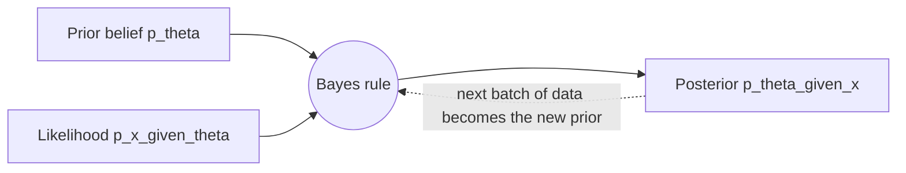

# Bayesian Inference

**Bayesian inference** treats unknown parameters as random variables with probability
distributions, and updates those distributions as data arrive. Where the frequentist
views a parameter θ as a fixed-but-unknown constant, the Bayesian describes θ by a
distribution that encodes belief, and refines that belief with evidence. The engine is
[probability](probability.md) — specifically, Bayes' rule.

## Bayes' rule for inference

$$\underbrace{p(\theta \mid x)}_{\text{posterior}} = \frac{\overbrace{p(x \mid \theta)}^{\text{likelihood}}\;\overbrace{p(\theta)}^{\text{prior}}}{\underbrace{p(x)}_{\text{evidence}}} \;\propto\; p(x \mid \theta)\,p(\theta).$$

- **Prior** p(θ): what we believe about θ before seeing the data. It can encode domain
  knowledge or be deliberately weak ("uninformative").
- **Likelihood** p(x | θ): how probable the observed data are for each value of θ — the
  same object maximized in [estimation.md](estimation.md).
- **Posterior** p(θ | x): the updated belief after combining prior and data. It is the
  complete answer — every inference (point estimates, intervals, predictions) is read off
  the posterior.
- **Evidence** p(x): a normalizing constant; often the hard part to compute.

The last arrow captures the defining feature: inference is *sequential*. Yesterday's
posterior is today's prior, so beliefs accumulate coherently as evidence streams in.

## Conjugacy

For certain prior–likelihood pairs the posterior belongs to the same family as the prior;
these are **conjugate priors**, and they make the update a closed-form formula rather than
an integral. The classic example: a Beta prior on a probability combined with a Binomial
likelihood yields a Beta posterior — you literally add the observed successes and failures
to the prior's parameters. Conjugacy is elegant and cheap but limiting; real models rarely
grant it.

## Summarizing the posterior

- **Point estimates**: the posterior mean, median, or mode (the *maximum a posteriori*, or
  MAP, estimate).
- **Credible interval**: a range containing, say, 95% of the posterior mass. Unlike the
  frequentist [confidence interval](estimation.md), it *does* license the direct statement
  "there is a 95% probability θ lies in this range" — the intuitive reading people
  wrongly attach to confidence intervals is the correct reading of a credible interval.

## Computation: when integrals get hard

Most posteriors have no closed form because the evidence integral is intractable. The
practical breakthrough is **Markov chain Monte Carlo (MCMC)** — Metropolis–Hastings,
Gibbs sampling, Hamiltonian Monte Carlo — which draws samples from the posterior without
ever computing the normalizing constant. Modern probabilistic programming (Stan, PyMC)
makes this routine. See
[resampling-and-monte-carlo.md](resampling-and-monte-carlo.md) for the sampling machinery.

## Prior sensitivity, Bayesian vs frequentist

The prior is the method's greatest strength and its sharpest criticism. With abundant
data the likelihood dominates and the prior washes out; with sparse data, conclusions can
hinge on prior choice, so **sensitivity analysis** — refitting under alternative priors —
is good practice. The philosophical split:

- **Frequentist**: probability is long-run frequency; θ is fixed; uncertainty lives in the
  procedure ([hypothesis-testing.md](hypothesis-testing.md), confidence intervals).
- **Bayesian**: probability is degree of belief; θ is random; uncertainty lives in the
  posterior.

In practice the divide is pragmatic, not tribal — analysts use whichever gives a cleaner
answer for the problem at hand.

## Why it matters

The Bayesian posterior gives full, honest uncertainty about parameters *and* predictions,
which is invaluable where decisions carry risk (medicine, finance) or data are scarce. In
machine learning it underlies Bayesian networks, Gaussian processes, latent-variable
models, Bayesian optimization for hyperparameter tuning, and the modern interest in
calibrated uncertainty for deep networks. Regularization is Bayesian too: an L2 penalty is
a Gaussian prior, an L1 penalty a Laplace prior (see
[regression.md](regression.md) and
[../ai/machine-learning.md](../ai/machine-learning.md)). Thinking in priors and posteriors
is a durable mental model for learning from data.

## References

- [Gelman et al., *Bayesian Data Analysis*](bayesian-data-analysis-gelman.md) — the standard reference for priors, posteriors, MCMC, and model checking.
- [Wasserman, *All of Statistics*](all-of-statistics-wasserman.md) — a compact comparison of Bayesian and frequentist inference.
