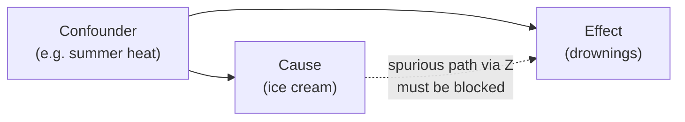

# Causal Inference

Causal inference is the science of answering "what *causes* what" — of predicting how a
system would respond to an intervention, not just describing how its variables currently
move together. It is a different and harder question than the pattern-finding of ordinary
statistics, because the data alone can never settle it: the same observed correlations are
consistent with many incompatible causal stories. The field supplies the extra ingredient —
explicit causal assumptions — that lets you reason from data to intervention.

## Correlation is not causation

That ice-cream sales and drownings rise together does not mean ice cream causes drowning;
a common cause, summer heat, drives both. This **confounding** is the central obstacle. A
variable that influences both the presumed cause and the effect creates a spurious
association, and a naive [regression](regression.md) that ignores it will report a
relationship that vanishes — or reverses — once the confounder is accounted for. The whole
discipline is, in large part, machinery for distinguishing genuine causal effects from
confounded correlations.

## The potential outcomes framework

One rigorous formalization defines causation through **potential outcomes**. For each unit
imagine two outcomes: $Y(1)$, what would happen under treatment, and $Y(0)$, what would
happen without it. The individual causal effect is $Y(1) - Y(0)$. The **fundamental problem
of causal inference** is that you only ever observe *one* of these per unit — the other is a
counterfactual you can never measure. Causal inference is therefore a *missing-data*
problem: we estimate average effects across a population precisely because individual
effects are unobservable.

## Randomization: the clean solution

The reason [randomized experiments](experimental-design-and-ab-testing.md) are the gold
standard is that random assignment makes the treated and untreated groups exchangeable — on
average they differ in nothing but the treatment. So the observed difference in group means
*is* the average causal effect, with no confounding to adjust for. When you can randomize,
the hard problem dissolves. Causal inference's harder work begins when you cannot, and must
extract causation from observational data.

## DAGs and do-calculus

Judea Pearl's framework represents causal assumptions as a **directed acyclic graph (DAG)**:
nodes are variables, arrows are direct causal influences. The graph makes the confounding
structure visible and tells you exactly which variables to adjust for to isolate an effect
(the *back-door criterion*) — and, just as importantly, which to *leave alone*, since
controlling for the wrong variable (a collider or a mediator) can *introduce* bias rather
than remove it.

The **do-operator**, $P(Y \mid \text{do}(X=x))$, formalizes the difference between *seeing*
and *doing*: it is the distribution of $Y$ when we intervene to set $X$, distinct from the
observational $P(Y \mid X=x)$. **Do-calculus** is a set of rules for rewriting an
interventional query into something estimable from observational data plus the graph — the
formal answer to "when can we get causation from correlation, and how?"

## Quasi-experimental strategies

When neither randomization nor a fully known DAG is available, several designs recover
causal effects under weaker assumptions:

- **Instrumental variables (IV).** Find an *instrument* — a variable that affects the
  treatment but influences the outcome *only through* the treatment (and is unrelated to the
  confounders). Variation in the instrument acts like a natural randomizer, letting you back
  out the causal effect even with unmeasured confounding.
- **Difference-in-differences (DiD).** Compare the *change* over time in a group that got a
  treatment against the *change* in a comparable group that did not. If both groups would
  have trended in parallel absent the treatment, the extra movement in the treated group
  estimates the effect — differencing out any fixed group-level confounders.
- **Regression discontinuity** exploits a sharp cutoff (units just above and just below a
  threshold are comparable) to mimic an experiment at the boundary.

## Why it matters

Nearly every decision worth making is causal — will this drug help, will this feature lift
revenue, does more schooling raise earnings — and getting the causal question wrong means
optimizing a spurious correlation. For [machine learning](../ai/machine-learning.md) this is
sharp: models trained to *predict* excel at exploiting correlations, but a model that cannot
distinguish cause from confounder will fail the moment the world is intervened upon or the
data distribution shifts. Causal thinking is what makes a model's decisions robust and its
explanations trustworthy, and it is the theoretical backbone of
[A/B testing](experimental-design-and-ab-testing.md).

## References

- [The Book of Why](the-book-of-why-pearl.md) — Judea Pearl, the accessible account of DAGs, the do-operator, and the ladder of causation
- [All of Statistics](all-of-statistics-wasserman.md) — Larry Wasserman, on causal inference within the broader statistical framework
