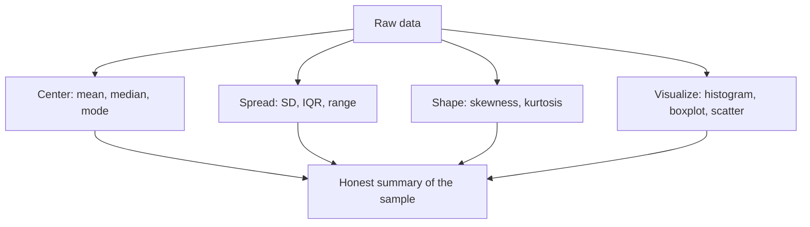

# Descriptive Statistics

**Descriptive statistics** summarize and display the data you actually have — its center,
spread, shape, and structure — without claiming anything about a larger population. This
is the crucial contrast with **inferential** statistics: description reports *what is in
the sample*, while inference (see [estimation](estimation.md) and
[hypothesis testing](hypothesis-testing.md)) uses the sample to make probabilistic claims
about a wider world. Every analysis should begin here, because you cannot model a
distribution you have not looked at.

## Measures of center

- **Mean** $\bar{x} = \frac{1}{n}\sum_i x_i$: the arithmetic average. Uses every value but
  is pulled toward outliers.
- **Median:** the middle value when sorted. Splits the data in half and ignores the
  magnitude of extremes.
- **Mode:** the most frequent value; the only center that works for categorical data.

For a symmetric distribution these roughly coincide; for a skewed one (income, latency),
they diverge, and the gap between mean and median is itself a diagnostic of skew.

## Measures of spread

- **Range:** max minus min — simple but dominated by extremes.
- **Variance / standard deviation:** average squared / root-squared deviation from the
  mean (see [expectation and moments](expectation-and-moments.md) for the population
  analogues). The sample variance uses $n-1$ in the denominator (Bessel's correction) to
  stay unbiased.
- **Interquartile range (IQR):** the spread of the middle 50%, $Q_3 - Q_1$. Robust to
  outliers.

## Quantiles

**Quantiles** cut a sorted dataset into equal-probability pieces. The median is the 0.5
quantile; **quartiles** cut into fourths; **percentiles** into hundredths. Quantiles are
the backbone of latency SLOs (the p99), of the **five-number summary** (min, $Q_1$,
median, $Q_3$, max) drawn as a boxplot, and of robust reasoning about tails.

## Measures of shape

- **Skewness:** asymmetry. Right-skewed data has a long high tail (income); left-skewed a
  long low tail.
- **Kurtosis:** tail heaviness — how outlier-prone the distribution is relative to a
  [normal](random-variables-and-distributions.md).

## Robust statistics

A statistic is **robust** if a few extreme or corrupted values cannot swing it far. The
median and IQR are robust; the mean and standard deviation are not — a single huge outlier
can dominate both. The **breakdown point** formalizes this: the median tolerates up to 50%
contamination before becoming arbitrary, the mean tolerates essentially none. When data is
dirty or heavy-tailed, robust summaries tell a more honest story.

## Visualization

Numbers hide structure that pictures reveal. Anscombe's quartet — four datasets with
identical means, variances, and correlations but wildly different shapes — is the standard
cautionary tale: always plot the data.

Common tools: **histograms** for a single variable's distribution, **boxplots** for the
five-number summary and outliers, and **scatterplots** for the relationship between two
variables — the visual precursor to [regression](regression.md).

## Worked example

Salaries (in thousands): 40, 42, 45, 47, 50, 52, 55, **500**. The mean is 103.9,
inflated by one executive; the median is 48.5, unmoved. Reporting the mean alone would
badly misrepresent a typical salary — the classic reason medians dominate income
reporting. The IQR (roughly 45 to 53.5) captures the bulk far better than the standard
deviation, which the outlier blows up.

## Description vs. inference

Descriptive statistics make **no probabilistic claim** — they are exact facts about the
sample. The moment you say "the population mean is likely near this value" or "this
difference is unlikely to be chance," you have crossed into inference, which requires the
[probability](probability.md) machinery and assumptions of
[estimation](estimation.md) and [hypothesis testing](hypothesis-testing.md). Confusing the
two — treating a sample summary as a population truth — is one of the most common
analytical errors.

## Why it matters

In machine learning, descriptive statistics and **exploratory data analysis (EDA)** are
the first, non-negotiable step: they surface missing values, outliers, class imbalance,
and skew that determine how you preprocess features and which models are viable.
Normalization, standardization, and feature scaling in
[machine learning](../ai/machine-learning.md) are direct applications of center-and-spread
summaries. Good description prevents the "garbage in, garbage out" failures that no
amount of modeling can rescue.

## References

- [All of Statistics (Wasserman)](all-of-statistics-wasserman.md) — foundational summary statistics and the empirical distribution.
- [An Introduction to Statistical Learning (James et al.)](introduction-to-statistical-learning.md) — EDA and visualization as the entry point to modeling.
- [Statistical Inference (Casella & Berger)](casella-berger-statistical-inference.md) — the formal line between sample statistics and population parameters.
