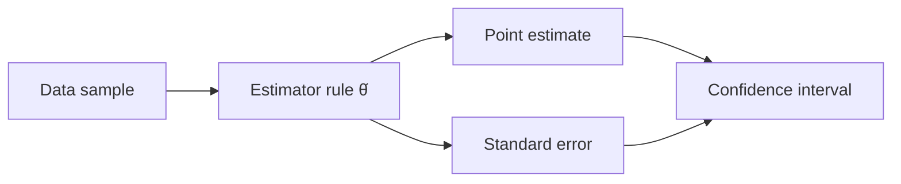

# Estimation

**Estimation** is the branch of statistical inference concerned with using observed data
to guess the unknown parameters of a probability model. If we assume data are drawn from
a distribution indexed by a parameter θ (a mean, a proportion, a regression coefficient),
an **estimator** is a rule — a function of the sample — that produces a value θ̂ meant to
be close to the true θ. Point estimation returns a single number; interval estimation
returns a range that plausibly contains θ.

## Two classic recipes for point estimators

**Maximum likelihood estimation (MLE).** Write down the likelihood — the probability (or
density) of the observed data viewed as a function of θ — and pick the θ that makes the
data most probable:

$$\hat\theta_{\text{MLE}} = \arg\max_\theta \; L(\theta \mid x) = \arg\max_\theta \prod_i f(x_i \mid \theta).$$

In practice we maximize the **log-likelihood** (sums are easier than products) by setting
its derivative to zero. MLEs are the workhorse of statistics: under mild conditions they
are consistent, asymptotically unbiased, and asymptotically efficient (they attain the
smallest possible variance, the Cramér–Rao bound, in the limit).

**Method of moments.** Equate sample moments to their theoretical counterparts and solve
for θ. To estimate a mean, use the sample mean; to estimate a variance, use the sample
variance. It is simple and often gives a starting point, but it is generally less
efficient than MLE. Both recipes lean on the machinery in
[expectation-and-moments.md](expectation-and-moments.md).

## Judging an estimator

An estimator is a [random variable](random-variables-and-distributions.md) — it changes
from sample to sample — so we describe it by its sampling distribution.

- **Bias** = E[θ̂] − θ. An estimator is *unbiased* if its expected value equals the truth.
- **Variance** = the spread of θ̂ across samples. Its square root, the **standard error**,
  measures estimation precision.
- **Mean squared error** decomposes as MSE = bias² + variance. This is the same
  bias–variance decomposition that governs model fitting in
  [../ai/generalization-and-regularization.md](../ai/generalization-and-regularization.md):
  a slightly biased estimator with much lower variance can beat an unbiased one.
- **Consistency**: θ̂ converges in probability to θ as the sample grows (n → ∞). More data
  pins the estimate down.
- **Sufficiency**: a statistic is sufficient for θ if it captures all information in the
  sample about θ — nothing is gained by looking at the raw data beyond it (e.g. the sample
  total is sufficient for a Poisson rate).

## Confidence intervals

A point estimate without a measure of uncertainty is nearly useless. A **confidence
interval** gives a range computed so that, across repeated samples, a fixed fraction
(say 95%) of such intervals would contain the true θ. A common large-sample form is

$$\hat\theta \pm z_{\alpha/2}\cdot \text{SE}(\hat\theta),$$

leaning on the [central limit theorem](expectation-and-moments.md) so that θ̂ is
approximately normal. The frequentist interpretation is subtle: the *interval* is random,
not θ. A given 95% interval either contains θ or does not; the 95% describes the
procedure, not one realization. (The Bayesian analogue, the credible interval, does make
a direct probability statement about θ — see
[bayesian-inference.md](bayesian-inference.md).)

## Why it matters

Estimation is the bridge from data to knowledge about the world, and it underpins the rest
of inference. [hypothesis-testing.md](hypothesis-testing.md) is estimation viewed through a
decision lens; [regression.md](regression.md) estimates relationships between variables;
[bayesian-inference.md](bayesian-inference.md) replaces the single estimate with a full
posterior distribution. In machine learning, *training a model is estimation*: fitting
weights by minimizing a loss is almost always maximum likelihood (or penalized maximum
likelihood) in disguise. Cross-entropy loss is negative log-likelihood; least-squares
regression is MLE under Gaussian noise. Understanding bias, variance, and consistency of
estimators is therefore the same skill as understanding why models overfit or underfit —
see [statistical-learning.md](statistical-learning.md) and
[../ai/machine-learning.md](../ai/machine-learning.md).

## References

- [Casella & Berger, *Statistical Inference*](casella-berger-statistical-inference.md) — the standard graduate treatment of point estimation, MLE, sufficiency, and interval estimation.
- [Wasserman, *All of Statistics*](all-of-statistics-wasserman.md) — concise coverage of estimators and their properties.
- [../math/index.md](../math/index.md) — calculus and optimization behind likelihood maximization.
