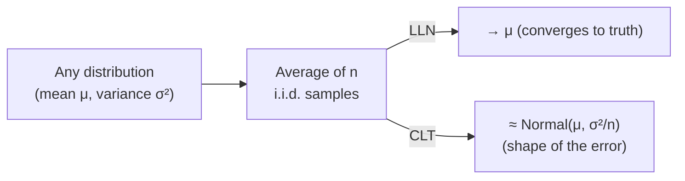

# Expectation and Moments

**Expectation** is the probability-weighted average value of a
[random variable](random-variables-and-distributions.md) — its center of mass.
**Moments** are the family of summary numbers (mean, variance, and higher) that
characterize a distribution's shape. From them flow the two great limit theorems — the
Law of Large Numbers and the Central Limit Theorem — which explain why averaging works
and why the normal distribution is everywhere. These ideas justify nearly every method in
[estimation](estimation.md).

## Expectation

For a discrete variable, $\mathbb{E}[X] = \sum_x x\,p(x)$; for a continuous one,
$\mathbb{E}[X] = \int x\,f(x)\,dx$. Expectation is **linear** — the single most useful
fact about it:

$$\mathbb{E}[aX + bY] = a\,\mathbb{E}[X] + b\,\mathbb{E}[Y],$$

which holds *even when $X$ and $Y$ are dependent*. Linearity of expectation collapses
many hard-looking calculations into easy sums.

## Variance, covariance, correlation

**Variance** measures spread — the expected squared distance from the mean:

$$\mathrm{Var}(X) = \mathbb{E}\big[(X - \mu)^2\big] = \mathbb{E}[X^2] - \mu^2,$$

with **standard deviation** $\sigma = \sqrt{\mathrm{Var}(X)}$ restoring the original units.

**Covariance** measures how two variables move together:
$\mathrm{Cov}(X, Y) = \mathbb{E}[(X-\mu_X)(Y-\mu_Y)]$. Its scaled, unit-free version is the
**correlation** $\rho = \mathrm{Cov}(X,Y) / (\sigma_X \sigma_Y) \in [-1, 1]$.

Crucially, correlation captures only *linear* association, and correlation is **not**
causation — a warning made rigorous in [causal inference](causal-inference.md) and
[The Book of Why](the-book-of-why-pearl.md). Independent variables have zero covariance,
but zero covariance does not imply independence.

## Moments

The $k$-th moment is $\mathbb{E}[X^k]$; the $k$-th **central** moment is
$\mathbb{E}[(X-\mu)^k]$. The first four describe a distribution's silhouette:

| Moment | Name | What it captures |
| --- | --- | --- |
| 1st | Mean | Center |
| 2nd (central) | Variance | Spread |
| 3rd (standardized) | Skewness | Asymmetry |
| 4th (standardized) | Kurtosis | Tail heaviness |

## The Law of Large Numbers

Draw $n$ independent samples and average them: $\bar{X}_n = \frac{1}{n}\sum_i X_i$. The
**Law of Large Numbers (LLN)** says $\bar{X}_n \to \mu$ as $n \to \infty$. This is the
guarantee that sample averages converge to the truth — the reason
[estimation](estimation.md) and [Monte Carlo methods](resampling-and-monte-carlo.md)
work at all.

## The Central Limit Theorem

The **Central Limit Theorem (CLT)** goes further and describes the *shape* of the error.
For i.i.d. variables with mean $\mu$ and finite variance $\sigma^2$, the standardized sum

$$\frac{\bar{X}_n - \mu}{\sigma / \sqrt{n}} \;\xrightarrow{d}\; \mathcal{N}(0, 1)$$

converges to a **standard normal**, *regardless of the original distribution's shape*.
Two consequences:

1. The standard error of the mean shrinks like $\sigma / \sqrt{n}$ — quadrupling the data
   halves the error.
2. Sums and averages of many small independent effects look Gaussian. This is *why* the
   [normal distribution](random-variables-and-distributions.md) appears so often in nature
   and why so many statistical procedures assume normality.

## Worked example

Roll a fair die: $\mathbb{E}[X] = 3.5$, $\mathrm{Var}(X) = 35/12 \approx 2.92$. Average
100 rolls. By the LLN the average lands near 3.5; by the CLT its distribution is
approximately $\mathcal{N}(3.5,\ 2.92/100)$, i.e. standard error $\approx 0.17$. So a
sample mean between roughly 3.16 and 3.84 covers about 95% of outcomes — even though a
single die roll is uniform, not bell-shaped.

## Why it matters

Expectation and variance are the vocabulary of prediction and risk. The
**bias–variance decomposition** at the heart of
[generalization and regularization](../ai/generalization-and-regularization.md) is a
statement about moments of an estimator. The CLT justifies the normal-based confidence
intervals of [hypothesis testing](hypothesis-testing.md), and expectations under a model
distribution are exactly what loss functions in
[machine learning](../ai/machine-learning.md) minimize. See
[information theory](../math/information-theory.md) for entropy, an expectation of
surprise that generalizes these ideas.

## References

- [All of Statistics (Wasserman)](all-of-statistics-wasserman.md) — Ch. 3–5, expectation, variance, LLN, CLT.
- [Statistical Inference (Casella & Berger)](casella-berger-statistical-inference.md) — moments and convergence theorems in full rigor.
- [An Introduction to Statistical Learning (James et al.)](introduction-to-statistical-learning.md) — bias–variance and its moment structure.
