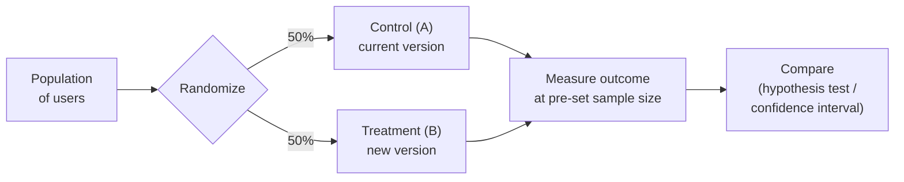

# Experimental Design and A/B Testing

An experiment is a study in which the investigator *intervenes* — deliberately setting the
condition each unit receives — rather than passively observing. That intervention is what
lets an experiment answer a causal question ("does the new checkout flow increase
purchases?") that no amount of observational correlation can settle. **Experimental design**
is the discipline of setting up such a study so its conclusions are valid and precise;
**A/B testing** is that discipline applied to products, where users are randomly split
between variant A and variant B. It is the practical bridge from
[hypothesis testing](hypothesis-testing.md) to [causal inference](causal-inference.md).

## Treatment, control, and randomization

The core structure is a **treatment** group that receives the intervention and a
**control** group that does not, compared on an outcome. The whole edifice rests on
**randomization**: assigning units to groups by chance. Randomization does something no
statistical adjustment can — it makes the groups probabilistically identical on *every*
characteristic, measured or not, so any systematic outcome difference can be attributed to
the treatment. This is why the randomized controlled experiment is the gold standard for
establishing cause, and why it neutralizes the [confounding](causal-inference.md) that
plagues observational data.

## Sample size and power

Before running, you must ask how many units you need. **Statistical power** is the
probability of detecting a real effect of a given size (the complement of a Type II error
from [hypothesis testing](hypothesis-testing.md)). Power rises with the sample size, the
true effect size, and lower outcome variance, and falls as you demand a stricter
significance level. The practical move is a **power calculation**: fix the smallest effect
worth detecting, the desired power (often 80%), and the significance level, then solve for
the sample size. Skipping this is a classic failure mode — an underpowered test that finds
"no significant difference" has usually just failed to look hard enough.

## Blocking and design refinements

- **Blocking** groups similar units (say, by device type or region) and randomizes *within*
  each block. This removes a known source of variation from the comparison, sharpening
  precision — the same idea as controlling for a covariate, but built into the design rather
  than patched in afterward.
- **Stratification** ensures each subgroup is represented proportionally, so estimates hold
  within segments, not just on average.
- **Factorial designs** vary several factors at once and estimate their interactions,
  getting more information from the same number of units than one-factor-at-a-time testing.

## Confounds and threats to validity

Randomization defends against confounding *by design*, but real experiments leak. Common
threats: **selection effects** if assignment is not truly random; **spillover** when the
treatment of one unit affects another (breaking the assumption that units are independent);
**novelty effects** where a change works only because it is new; and **instrumentation
bias** from logging or measurement that differs across arms. A clean A/B test guards each of
these, or it is measuring an artifact instead of the intervention.

## The sequential testing pitfall

The most seductive mistake is **peeking**: repeatedly checking results and stopping the
moment a test crosses significance. Standard p-values assume a *single* analysis at a
*fixed* sample size; every extra look is another chance for noise to cross the threshold,
so continuous monitoring inflates the false-positive rate far above the nominal 5%. The fix
is to commit to a sample size in advance, or to use methods built for repeated looks —
**sequential testing** (e.g. sequential probability ratio tests), **alpha-spending**
functions, or Bayesian approaches — that keep the error rate honest under continuous
evaluation.

## Why it matters

A/B testing is how data-driven organizations decide what to ship, turning opinion into
measured causal effect. The same design logic governs the evaluation of AI systems: rolling
out a new model or prompt to a fraction of traffic and measuring the lift is an A/B test,
and offline comparison of model variants — including
[LLM-as-a-judge evaluations](../ai-platform/evals-llm-as-a-judge.md) — inherits the same
concerns about power, confounds, and peeking. Understanding experimental design is what
separates a reliable "this change works" from a costly false positive. See the broader
organizational view under [../ai-org/index.md](../ai-org/index.md).

## References

- [All of Statistics](all-of-statistics-wasserman.md) — Larry Wasserman, on hypothesis testing and the design of inference
- [The Book of Why](the-book-of-why-pearl.md) — Judea Pearl, on why randomized experiments identify causal effects
