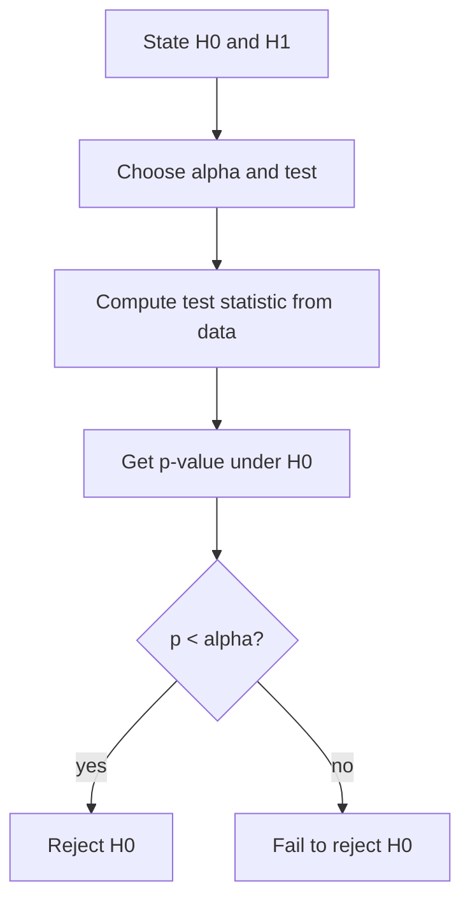

# Hypothesis Testing

**Hypothesis testing** is a formal procedure for deciding whether data provide enough
evidence to reject a default claim about the world. It reframes
[estimation](estimation.md) as a binary decision under uncertainty: rather than asking
"what is θ?", it asks "is θ different from some specified value in a way the data can
support?"

## The machinery

- **Null hypothesis** H₀: the status-quo or "no effect" claim (e.g. the two groups have
  the same mean; the coin is fair). Testing is built around trying to *disprove* H₀.
- **Alternative hypothesis** H₁: what we suspect is true if H₀ fails (one-sided or
  two-sided).
- **Test statistic**: a number computed from the sample whose distribution *under H₀* is
  known (a t-statistic, a χ² statistic, an F-statistic). It measures how far the data
  stray from what H₀ predicts.
- **p-value**: the probability, *assuming H₀ is true*, of observing a test statistic at
  least as extreme as the one we got. A small p-value means the data would be surprising
  if H₀ held.
- **Significance level** α (often 0.05): a pre-chosen threshold. Reject H₀ when p < α.

The p-value is **not** the probability that H₀ is true, and it is **not** the probability
the result is due to chance. It is a statement about data given a hypothesis, not about a
hypothesis given data — reversing them is the base-rate fallacy that
[bayesian-inference.md](bayesian-inference.md) makes explicit.

## Two kinds of error, and power

Every test can be wrong in two ways:

|                      | H₀ true            | H₀ false           |
|----------------------|--------------------|--------------------|
| **Reject H₀**        | Type I error (α)   | Correct (power)    |
| **Fail to reject**   | Correct            | Type II error (β)  |

- **Type I error** (false positive): rejecting a true H₀. Its rate is α.
- **Type II error** (false negative): failing to reject a false H₀. Its rate is β.
- **Power** = 1 − β: the probability of correctly detecting a real effect. Power rises
  with larger samples, larger true effects, and lower noise. Adequate power is the whole
  point of sample-size planning in
  [experimental-design-and-ab-testing.md](experimental-design-and-ab-testing.md).

## Common tests

- **t-test**: compares means (one-sample, two-sample, or paired) when data are roughly
  normal; the test statistic follows a Student's t distribution.
- **χ² test**: tests independence in contingency tables or goodness-of-fit for counts.
- **ANOVA** (analysis of variance): compares means across three or more groups using an
  F-statistic, partitioning total variability into between-group and within-group parts.

## Multiple comparisons

Run twenty independent tests at α = 0.05 and you expect one false positive by chance
alone. This **multiple-comparisons problem** inflates the family-wise error rate.
Corrections rein it in: the Bonferroni correction divides α by the number of tests
(conservative); the Benjamini–Hochberg procedure instead controls the false discovery
rate (the expected fraction of rejections that are false), which is far less punishing at
scale. This matters acutely in genomics, feature selection, and any dashboard running many
[A/B tests](experimental-design-and-ab-testing.md) at once.

## The replication-crisis critique

Null-hypothesis significance testing has drawn heavy fire. The α = 0.05 threshold is
arbitrary and dichotomizes a continuous measure of evidence. **p-hacking** — trying many
analyses and reporting only the significant one — and **publication bias** — journals
preferring positive results — together manufacture false discoveries that fail to
replicate. A small p-value says nothing about *effect size* or practical importance: with
a huge sample, a trivial difference becomes "significant." Reformers push for reporting
effect sizes and confidence intervals, pre-registration, and Bayesian alternatives. The
lesson is not that testing is worthless but that a p-value is one narrow piece of evidence,
easily abused when treated as a verdict.

## Why it matters

Hypothesis testing is the default framework for scientific claims, clinical trials, and
online experimentation, so its logic — and its failure modes — shape which findings the
world believes. In machine learning it appears when comparing models (is model A really
better than B, or is the gap noise?), in feature selection, and in monitoring for drift.
Its close ties to [estimation.md](estimation.md) (a confidence interval that excludes the
null value corresponds to a rejected test) and to
[experimental-design-and-ab-testing.md](experimental-design-and-ab-testing.md) make it
central to turning data into defensible decisions — see also
[../ai/machine-learning.md](../ai/machine-learning.md).

## References

- [Wasserman, *All of Statistics*](all-of-statistics-wasserman.md) — clear treatment of test statistics, p-values, and errors.
- [Casella & Berger, *Statistical Inference*](casella-berger-statistical-inference.md) — the theory of testing, power, and likelihood-ratio tests.
