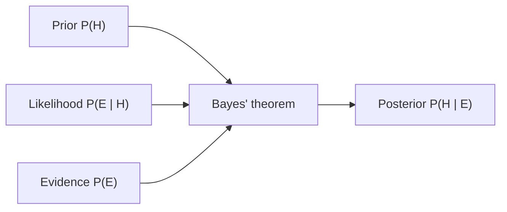

# Probability

Probability is the mathematics of uncertainty: a principled way to assign numbers
between 0 and 1 to events, expressing how likely they are. It is the foundation every
other idea in statistics is built on — [estimation](estimation.md),
[hypothesis testing](hypothesis-testing.md), and
[Bayesian inference](bayesian-inference.md) are all machinery for reasoning about
probabilities we cannot observe directly.

## The setup: sample spaces and events

- The **sample space** $\Omega$ is the set of all possible outcomes of an experiment.
  For one coin flip, $\Omega = \{H, T\}$; for a die, $\Omega = \{1,2,3,4,5,6\}$.
- An **event** is any subset of $\Omega$ — a collection of outcomes we care about.
  "The die shows an even number" is the event $\{2,4,6\}$.
- A **probability** $P$ is a function that maps events to numbers in $[0,1]$.

## The Kolmogorov axioms

All of probability follows from three axioms:

1. **Non-negativity:** $P(A) \ge 0$ for every event $A$.
2. **Normalization:** $P(\Omega) = 1$ — something in the sample space must happen.
3. **Countable additivity:** for mutually exclusive (disjoint) events
   $A_1, A_2, \dots$, $P(A_1 \cup A_2 \cup \cdots) = \sum_i P(A_i)$.

Useful consequences: $P(A^c) = 1 - P(A)$ (complement rule) and the general
$P(A \cup B) = P(A) + P(B) - P(A \cap B)$ (inclusion–exclusion).

## Conditional probability and independence

The **conditional probability** of $A$ given that $B$ occurred is

$$P(A \mid B) = \frac{P(A \cap B)}{P(B)}, \qquad P(B) > 0.$$

It re-normalizes the world to the outcomes consistent with $B$. Rearranging gives the
**multiplication rule**: $P(A \cap B) = P(A \mid B)\,P(B)$.

Two events are **independent** when learning one tells you nothing about the other:
$P(A \cap B) = P(A)\,P(B)$, equivalently $P(A \mid B) = P(A)$. Independence is an
assumption that must be justified, not a default — spurious dependence between
variables is exactly what [causal inference](causal-inference.md) exists to untangle.

## Law of total probability and Bayes' theorem

If $B_1, \dots, B_n$ partition the sample space (disjoint, covering everything), any
event $A$ can be decomposed:

$$P(A) = \sum_{i} P(A \mid B_i)\,P(B_i).$$

This **law of total probability** lets you compute an overall probability by conditioning
on cases. Combine it with the definition of conditional probability and you get
**Bayes' theorem**, the rule for reversing a conditional:

$$P(B_i \mid A) = \frac{P(A \mid B_i)\,P(B_i)}{\sum_j P(A \mid B_j)\,P(B_j)}.$$

In words: **posterior $\propto$ likelihood $\times$ prior**. Bayes' theorem is the engine
of [Bayesian inference](bayesian-inference.md) and of probabilistic classifiers in
[machine learning](../ai/machine-learning.md).

### Worked example: a medical test

A disease affects 1% of people ($P(D)=0.01$). A test has 99% sensitivity
($P(+\mid D)=0.99$) and a 5% false-positive rate ($P(+\mid D^c)=0.05$). You test
positive — what is $P(D \mid +)$?

$$P(D \mid +) = \frac{0.99 \times 0.01}{0.99 \times 0.01 + 0.05 \times 0.99}
\approx \frac{0.0099}{0.0594} \approx 0.167.$$

Despite an accurate test, only ~17% of positives truly have the disease, because the
**base rate** is low. This base-rate effect is one of the most consequential and most
often ignored facts in applied probability.

## Frequentist vs. Bayesian interpretations

The axioms are agreed on; what a probability *means* is not.

- **Frequentist:** probability is the long-run relative frequency of an event over
  many repetitions. A parameter (say a coin's true bias) is a fixed unknown constant;
  probability statements attach to data and procedures, not to the parameter. This view
  underlies confidence intervals and p-values in [hypothesis testing](hypothesis-testing.md).
- **Bayesian:** probability is a degree of belief that can be updated by evidence via
  Bayes' theorem. Parameters *have* probability distributions expressing our uncertainty.
  This view underlies [Bayesian inference](bayesian-inference.md).

Neither is "correct"; they answer different questions and are both indispensable in
[statistical learning](statistical-learning.md).

## Why it matters

Probability is the shared language of every quantitative discipline. In machine
learning it appears everywhere: models output probability distributions, loss functions
are negative log-likelihoods, and generative models literally learn $P(\text{data})$.
Understanding conditional probability and Bayes' theorem is the difference between using
these tools and merely invoking them. See
[random variables and distributions](random-variables-and-distributions.md) for the next
layer up, where outcomes become numbers.

## References

- [All of Statistics (Wasserman)](all-of-statistics-wasserman.md) — Ch. 1–2, probability foundations.
- [Statistical Inference (Casella & Berger)](casella-berger-statistical-inference.md) — rigorous treatment of probability and conditioning.
- [Bayesian Data Analysis (Gelman et al.)](bayesian-data-analysis-gelman.md) — the Bayesian interpretation in depth.
- [The Book of Why (Pearl)](the-book-of-why-pearl.md) — on why probabilistic dependence is not causation.
