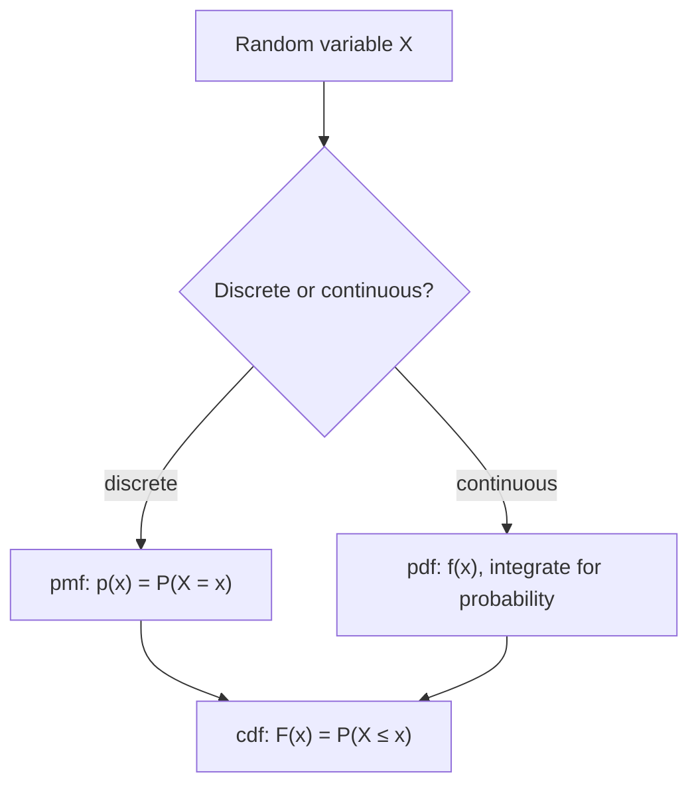

# Random Variables and Distributions

A **random variable** is a function that assigns a number to each outcome in a
[sample space](probability.md). It turns messy outcomes ("heads", "the machine failed")
into numbers we can add, average, and model. A **distribution** describes how probability
is spread across the values a random variable can take. Together they are the bridge from
raw [probability](probability.md) to the numeric machinery of
[expectation and moments](expectation-and-moments.md) and all of statistics.

## Discrete vs. continuous

- A **discrete** random variable takes countable values (0, 1, 2, …). Its distribution is
  a **probability mass function (pmf)** $p(x) = P(X = x)$, with $\sum_x p(x) = 1$.
- A **continuous** random variable takes values on a continuum. Individual points have
  probability zero, so its distribution is a **probability density function (pdf)** $f(x)$,
  where probabilities come from integrating: $P(a \le X \le b) = \int_a^b f(x)\,dx$ and
  $\int_{-\infty}^{\infty} f(x)\,dx = 1$.

Both share the **cumulative distribution function (cdf)** $F(x) = P(X \le x)$, which
increases monotonically from 0 to 1 and works for any random variable.

## The key distributions

Each is a modeling default for a recurring situation.

**Discrete:**

- **Bernoulli($p$):** a single yes/no trial; $P(X=1)=p$. The atom of binary events.
- **Binomial($n, p$):** number of successes in $n$ independent Bernoulli trials.
  $P(X=k) = \binom{n}{k} p^k (1-p)^{n-k}$.
- **Poisson($\lambda$):** count of rare events in a fixed interval when the rate is
  $\lambda$; $P(X=k) = e^{-\lambda}\lambda^k / k!$. Arrivals, defects, requests per second.

**Continuous:**

- **Uniform($a, b$):** every value in $[a,b]$ equally likely; constant density.
- **Normal (Gaussian) $\mathcal{N}(\mu, \sigma^2)$:** the bell curve, $f(x) \propto
  e^{-(x-\mu)^2 / 2\sigma^2}$. Ubiquitous because of the Central Limit Theorem (see
  [expectation and moments](expectation-and-moments.md)).
- **Exponential($\lambda$):** waiting time until the next Poisson event; memoryless.
- **Beta($\alpha, \beta$):** a distribution *over* probabilities, supported on $[0,1]$.
  The natural prior for a Bernoulli/binomial rate in [Bayesian inference](bayesian-inference.md).
- **Gamma($\alpha, \beta$):** positive-valued, generalizes the exponential; models waiting
  times and serves as a conjugate prior for rates and precisions.

## Joint, marginal, conditional

Real problems involve several variables at once. Their **joint distribution** $p(x, y)$
(or $f(x,y)$) describes them together.

- **Marginal:** recover one variable by summing/integrating out the other:
  $p(x) = \sum_y p(x, y)$.
- **Conditional:** $p(y \mid x) = p(x, y) / p(x)$ — the same conditioning idea from
  [probability](probability.md), now for numeric variables.

Variables are **independent** when the joint factors: $p(x, y) = p(x)\,p(y)$. Modeling
which variables depend on which — and factoring the joint accordingly — is the core of
probabilistic graphical models used in [machine learning](../ai/machine-learning.md).

## Worked example

A call center receives on average $\lambda = 3$ calls per minute. Modeling calls as
Poisson, the probability of exactly 5 calls in a minute is
$P(X=5) = e^{-3} 3^5 / 5! \approx 0.10$. The waiting time between calls is then
Exponential($3$), with mean $1/3$ minute. The two distributions describe the same process
from complementary angles — counts vs. gaps.

## Why it matters

Every statistical model is a claim about the distribution that generated the data.
Choosing a likelihood in [estimation](estimation.md), specifying a prior in
[Bayesian inference](bayesian-inference.md), or picking a loss in
[statistical learning](statistical-learning.md) is really choosing a distribution.
In machine learning, classifiers output categorical distributions, regressors often
assume Gaussian noise, and generative models learn to sample from $P(\text{data})$
directly. Fluency with these named distributions is what lets you read and design models
quickly.

## References

- [All of Statistics (Wasserman)](all-of-statistics-wasserman.md) — Ch. 2–3, random variables and common distributions.
- [Statistical Inference (Casella & Berger)](casella-berger-statistical-inference.md) — thorough catalog of distributions and their properties.
- [Bayesian Data Analysis (Gelman et al.)](bayesian-data-analysis-gelman.md) — conjugate families (beta, gamma) in Bayesian modeling.
- [An Introduction to Statistical Learning (James et al.)](introduction-to-statistical-learning.md) — distributions in a modeling context.
