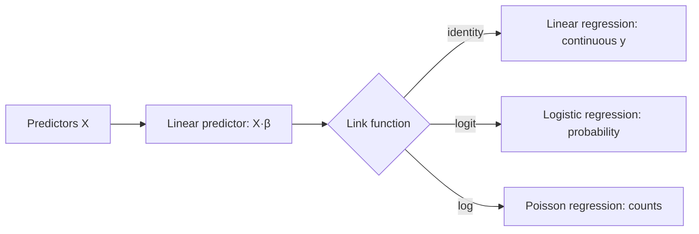

# Regression

**Regression** models how a response variable depends on one or more predictor variables.
It is the most widely used tool in applied statistics and the conceptual root of
supervised machine learning: fit a function that maps inputs to an output, then use it to
explain relationships or predict new outcomes. Regression is
[estimation.md](estimation.md) applied to a relationship rather than a single quantity.

## Linear regression (OLS)

The linear model assumes the response is a weighted sum of predictors plus noise:

$$y_i = \beta_0 + \beta_1 x_{i1} + \dots + \beta_p x_{ip} + \varepsilon_i.$$

**Ordinary least squares (OLS)** chooses the coefficients β that minimize the sum of
squared residuals, ∑(yᵢ − ŷᵢ)². This has a clean closed-form solution,
β̂ = (XᵀX)⁻¹Xᵀy, and — under Gaussian noise — coincides with the maximum-likelihood
estimate.

**Interpretation.** Each coefficient βⱼ is the expected change in y for a one-unit change
in xⱼ *holding the other predictors fixed*. That "holding fixed" clause is why regression
coefficients are not causal by default — omitted variables and confounders can make them
misleading (see [causal-inference.md](causal-inference.md)).

**Assumptions** (worth checking, because violations break inference):

1. **Linearity** — the mean of y is linear in the predictors.
2. **Independence** — errors are uncorrelated.
3. **Homoscedasticity** — error variance is constant across x.
4. **Normality** of errors — mainly needed for exact small-sample intervals and tests.

## Logistic regression and GLMs

When the response is binary (spam / not-spam), linear regression is inappropriate — it can
predict outside [0, 1]. **Logistic regression** models the log-odds of the outcome as
linear in the predictors:

$$\log\frac{p}{1-p} = \beta_0 + \beta_1 x_1 + \dots + \beta_p x_p,$$

so the fitted probability is the logistic (sigmoid) of that linear combination.
Coefficients are estimated by maximum likelihood, not least squares. This is one instance
of the broader **generalized linear model (GLM)** framework, which links a linear
predictor to a response from the exponential family through a *link function* — identity
link for normal data, logit for binomial, log for Poisson counts. GLMs unify a large slice
of applied modeling under one estimation procedure.

## Regularized regression

When predictors are many or correlated, OLS overfits and its coefficients become unstable.
**Regularization** adds a penalty on coefficient size to the loss:

- **Ridge (L2)**: penalizes ∑βⱼ². Shrinks coefficients toward zero, stabilizing them, but
  keeps all predictors. Equivalent to a Gaussian prior on β
  (see [bayesian-inference.md](bayesian-inference.md)).
- **Lasso (L1)**: penalizes ∑|βⱼ|. Drives some coefficients exactly to zero, performing
  automatic variable selection. Equivalent to a Laplace prior.
- **Elastic net**: a blend of the two.

This is the same bias–variance trade being managed in
[../ai/generalization-and-regularization.md](../ai/generalization-and-regularization.md):
accept a little bias to cut variance and generalize better.

## Diagnostics

A fitted model is only trustworthy after checking it. Residual plots reveal nonlinearity
and heteroscedasticity; Q-Q plots check normality; leverage and Cook's distance flag
influential outliers; the variance inflation factor detects multicollinearity; and R²
(with adjusted R²) summarizes explained variance — though a high R² never implies a correct
or causal model. Honest evaluation uses held-out or cross-validated error, not in-sample
fit — see [resampling-and-monte-carlo.md](resampling-and-monte-carlo.md).

## Why it matters

Regression is the bridge between classical statistics and machine learning. Linear and
logistic regression are the interpretable baselines every predictive project should start
from, and their vocabulary — coefficients, residuals, regularization, link functions —
carries directly into [statistical-learning.md](statistical-learning.md) and
[../ai/supervised-learning.md](../ai/supervised-learning.md). A single neuron with a
sigmoid activation *is* logistic regression; a neural network is stacked, nonlinear
regression trained by the same likelihood principle. Mastering regression is mastering the
core loop of fit, interpret, regularize, and validate that all supervised learning shares.

## References

- [James et al., *An Introduction to Statistical Learning*](introduction-to-statistical-learning.md) — accessible treatment of linear and logistic regression, ridge, and lasso.
- [Casella & Berger, *Statistical Inference*](casella-berger-statistical-inference.md) — the estimation theory behind least squares and maximum likelihood.
