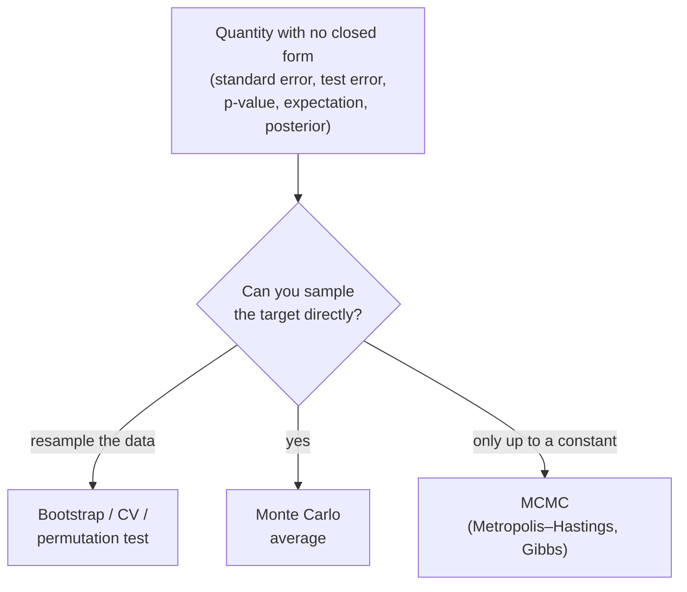

# Resampling and Monte Carlo Methods

Classical statistics leans on closed-form formulas — the standard error of a mean is
$\sigma/\sqrt{n}$, a difference of proportions has a known sampling distribution, and so
on. But most interesting quantities (the median, a correlation, an out-of-sample error
rate, a complicated Bayesian posterior) have no clean formula, or one that holds only under
assumptions you cannot check. **Resampling** and **Monte Carlo** methods replace the
missing algebra with computation: instead of deriving a distribution, you *simulate* it.
This is the pragmatic engine behind most modern [estimation](estimation.md),
[hypothesis testing](hypothesis-testing.md), and [Bayesian inference](bayesian-inference.md).

## The bootstrap

The **bootstrap** estimates the sampling distribution of a statistic by resampling the data
you already have. Given a sample of $n$ observations, draw $n$ points *with replacement* to
form a bootstrap sample, recompute the statistic, and repeat thousands of times. The spread
of those recomputed values approximates the statistic's true sampling variability, letting
you attach a standard error or confidence interval to almost anything.

The logic is a substitution: the empirical distribution of your data stands in for the
unknown population, and resampling from it mimics drawing fresh samples from the world. It
works because for many statistics the empirical distribution converges to the truth as $n$
grows. It is not magic — it fails for the sample maximum, for heavy tails, and for
dependent data without modification — but for a huge range of everyday estimators it turns
"I have no formula for the standard error" into a few lines of code.

## Cross-validation

**Cross-validation** applies the same resampling instinct to model assessment. To estimate
how a model will perform on unseen data, repeatedly split the data into a part used for
fitting and a held-out part used for scoring. In *k-fold* cross-validation you partition
the data into $k$ folds, train on $k-1$ of them, test on the remaining one, and rotate so
every fold serves once as the test set; averaging the $k$ test errors gives a nearly
unbiased estimate of generalization error. This is the workhorse for model selection and
hyperparameter tuning, and it is central to the bias-variance reasoning of
[statistical learning](statistical-learning.md) and
[../ai/generalization-and-regularization.md](../ai/generalization-and-regularization.md).

## Permutation tests

A **permutation test** builds a null distribution by shuffling. If the null hypothesis says
a treatment label is irrelevant, then reassigning labels at random should not change the
observed statistic beyond chance. So you compute the statistic on the real data, then
recompute it on many random relabelings; the fraction of shuffled values as extreme as the
real one is an exact p-value that needs no parametric assumption. It is the assumption-light
counterpart to the parametric tests in [hypothesis testing](hypothesis-testing.md) and a
natural fit for analyzing [A/B experiments](experimental-design-and-ab-testing.md).

## Monte Carlo simulation

**Monte Carlo** is the broad idea of answering a question by drawing random samples and
averaging. To estimate an expectation $\mathbb{E}[g(X)]$ (see
[expectation and moments](expectation-and-moments.md)), draw many $X$ from its
distribution and average $g(X)$; the law of large numbers guarantees convergence and the
error shrinks like $1/\sqrt{N}$ regardless of dimension. This is how you evaluate
intractable integrals, propagate uncertainty through a model, or price a scenario with no
analytic solution. The same machinery underlies **Monte Carlo methods in reinforcement
learning** ([../ai/reinforcement-learning.md](../ai/reinforcement-learning.md)), where value
estimates are averages over sampled episodes.

## MCMC: sampling from hard distributions

Plain Monte Carlo assumes you can draw from the target distribution. Often you cannot — a
Bayesian posterior is known only up to an unknown normalizing constant. **Markov chain
Monte Carlo (MCMC)** sidesteps this by constructing a Markov chain whose stationary
distribution *is* the target; run the chain long enough and its states become samples from
the distribution you wanted.

- **Metropolis–Hastings** proposes a candidate move and accepts it with a probability that
  depends only on the ratio of target densities — so the unknown normalizing constant
  cancels. Uphill moves are always accepted; downhill moves are accepted probabilistically,
  which lets the chain explore rather than get stuck.
- **Gibbs sampling** is a special case that updates one variable at a time from its
  *conditional* distribution given the others, useful when those conditionals are easy even
  though the joint is not.

## Why it matters

Resampling and Monte Carlo are the reason modern statistics is not shackled to the handful
of problems with tidy formulas. The bootstrap gives error bars for arbitrary estimators;
cross-validation is the default honesty check in machine learning; permutation tests give
assumption-free inference; MCMC made applied [Bayesian inference](bayesian-inference.md)
practical and powers most probabilistic modeling today. Across
[../ai/machine-learning.md](../ai/machine-learning.md), the shift from "derive it" to
"simulate it" is what lets us reason about models too complex for pencil and paper.

## References

- [All of Statistics](all-of-statistics-wasserman.md) — Larry Wasserman, on the bootstrap, simulation, and MCMC
- [An Introduction to Statistical Learning](introduction-to-statistical-learning.md) — James et al., on cross-validation and the bootstrap for model assessment
- [Bayesian Data Analysis](bayesian-data-analysis-gelman.md) — Gelman et al., on MCMC for posterior computation
