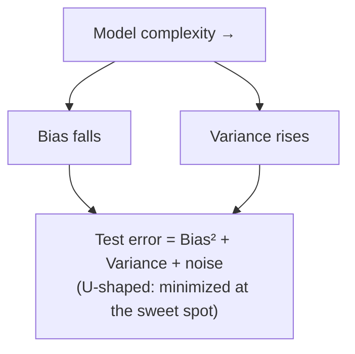

# Statistical Learning

Statistical learning is the meeting point of statistics and
[machine learning](../ai/machine-learning.md): the study of methods that use data to
estimate an unknown function relating inputs to outputs. Where classical statistics
emphasizes *inference* — quantifying uncertainty about parameters and testing hypotheses —
statistical learning emphasizes *prediction*: building a model that generalizes to new data.
The two share the same probabilistic foundations, and the field is essentially statistics'
framing of what the AI world calls learning.

## The setup

We posit that an output $Y$ relates to inputs $X$ through
$$ Y = f(X) + \varepsilon, $$
where $f$ is an unknown systematic relationship and $\varepsilon$ is irreducible noise. The
goal is to use a training dataset to produce an estimate $\hat{f}$. Once you have it you can
*predict* new outputs and, sometimes, *infer* which inputs matter and how. Every learning
method — from linear [regression](regression.md) to deep
[neural networks](../ai/neural-networks.md) — is a different strategy for constructing
$\hat{f}$ from data.

## Supervised vs unsupervised

- **Supervised learning** has labeled outputs: each training example pairs an input with the
  correct $Y$, and the model learns the input–output map. Regression (continuous $Y$) and
  classification (categorical $Y$) both live here. See
  [../ai/supervised-learning.md](../ai/supervised-learning.md).
- **Unsupervised learning** has no labels; the goal is to find structure in the inputs
  alone — clusters, low-dimensional representations, density. See
  [../ai/unsupervised-learning.md](../ai/unsupervised-learning.md).

## Training error, test error, and the bias–variance trade-off

The pivotal distinction is between error on the *training* data and error on *unseen* data.
A model can be made to fit the training set arbitrarily well while performing terribly on
new data — it has memorized noise instead of learning signal. This is **overfitting**, and
avoiding it is the central problem of the field.

The **bias–variance trade-off** explains why. A model's expected test error decomposes into
three pieces:
$$ \text{Test error} = \text{Bias}^2 + \text{Variance} + \text{Irreducible noise}. $$

- **Bias** is error from approximating a complex reality with too simple a model
  (underfitting) — a straight line for a curved relationship.
- **Variance** is how much $\hat{f}$ would swing if you re-trained on a different sample —
  high for flexible models that chase every wiggle (overfitting).

Simple models are high-bias/low-variance; flexible models are low-bias/high-variance.
Minimizing test error means tuning **model complexity** to the sweet spot between them —
exactly the concern of [../ai/generalization-and-regularization.md](../ai/generalization-and-regularization.md).

## Model selection

Because you cannot see test data while training, you *estimate* generalization error and
select the model that minimizes it. The standard tools are
[resampling methods](resampling-and-monte-carlo.md) — cross-validation and the bootstrap —
which reuse the training data to approximate out-of-sample performance, plus penalized
criteria (AIC, BIC) and [regularization](regression.md), which shrink complex models toward
simplicity. This is where [estimation](estimation.md) and prediction meet: you fit
parameters *and* choose among models.

## The statistical view of learning

Framing learning statistically buys clarity. It says a learning algorithm is an estimator,
so it has bias and variance you can reason about; that "more data helps" is the law of large
numbers pulling variance down; that regularization is a prior favoring simpler explanations;
and that a validation score is itself a noisy estimate with its own uncertainty. This lens
turns machine learning's empirical knobs into quantities with principled meaning, and it is
why probability and statistics are the true prerequisites for
[deep learning](../ai/deep-learning.md).

## Why it matters

Statistical learning is the conceptual bridge that makes modern AI comprehensible rather
than magical. The bias–variance trade-off explains why bigger is not always better; the
train/test split is the discipline that keeps claimed performance honest; and cross-validated
model selection is the everyday practice of building anything that must generalize. Every
serious practitioner of [machine learning](../ai/machine-learning.md) is, whether they name
it or not, doing statistical learning.

## References

- [An Introduction to Statistical Learning](introduction-to-statistical-learning.md) — James, Witten, Hastie, Tibshirani; the accessible standard
- [The Elements of Statistical Learning](../ai/elements-of-statistical-learning.md) — Hastie, Tibshirani, Friedman; the advanced treatment
- [All of Statistics](all-of-statistics-wasserman.md) — Larry Wasserman, connecting statistical theory to learning
