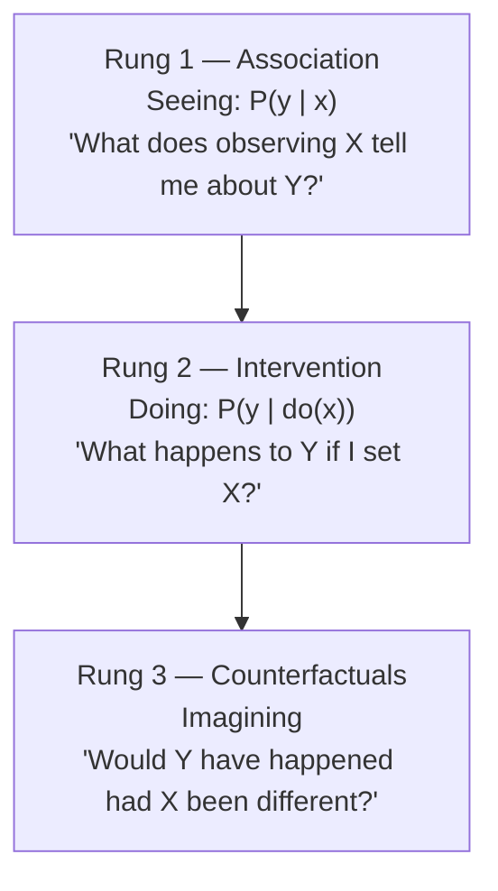

# The Book of Why: The New Science of Cause and Effect

*The Book of Why* by Judea Pearl and Dana Mackenzie (Basic Books, 2018) is the popular,
argument-driven presentation of Pearl's program for **causal inference**. Where a textbook
proves theorems, this book makes a case: that classical statistics, by confining itself to
correlations and distributions, deliberately amputated the language of cause and effect, and
that a formal, mathematical account of causation is both possible and necessary. Written for
a broad audience yet faithful to the underlying framework, it is the readable entry point to
the ideas developed with full rigor in Pearl's *Causality* and the *Primer*, and it anchors
[causal-inference.md](causal-inference.md).

## The core ideas

**The Ladder of Causation.** The book's central metaphor arranges questions into three rungs
of increasing power, and argues that no amount of data alone can lift you from one rung to
the next — a causal *model* is required.

Ordinary statistics and most machine learning — including modern deep learning — live on
rung 1: they find patterns in observed data ([../ai/machine-learning.md](../ai/machine-learning.md)).
Experiments and interventions live on rung 2. Retrospective, "what if it had been otherwise"
reasoning — the stuff of explanation, blame, and regret — lives on rung 3. This ladder is
the book's frame for [causal-inference.md](causal-inference.md).

**Causal diagrams (DAGs).** Pearl argues that causal assumptions should be made explicit as
a **directed acyclic graph** whose arrows encode which variables cause which. The graph is
not decoration: it dictates which statistical associations are spurious and which reflect
real effects, and it tells you exactly which variables to adjust for — and, importantly,
which *not* to. This is where the book explains **confounding**, colliders, and the mistake
of controlling for the wrong variable.

**The do-operator and do-calculus.** The heart of the framework is the intervention operator
`do(x)`, which distinguishes *seeing* X take a value from *making* X take that value. Pearl's
**do-calculus** is a set of rules for deciding when a causal quantity `P(y | do(x))` can be
computed from purely observational data given the causal graph — a form of "causal
identification." When it can, you get the effect of a policy without running the experiment;
when it cannot, the graph tells you what is missing.

**Counterfactuals and mediation.** The top rung formalizes counterfactual claims and
supports **mediation analysis** — decomposing a total effect into a direct path and a path
that runs through an intermediate cause.

## Approach and significance

The narrative is threaded with history — the near-erasure of causal language from statistics
in the 20th century, the smoking-and-cancer debates, Simpson's paradox — used to show why
correlation-only thinking repeatedly went wrong. The book's claim is that these formal tools
resolve confusions that stumped a century of statisticians. For a reader in AI it lands
directly: it is Pearl's case that systems which only fit distributions cannot, on their own,
reason about interventions or explanations, and that graphical causal models supply the
missing structure. It is the conceptual foundation for [causal-inference.md](causal-inference.md)
and a bridge from statistics into the parts of AI concerned with reasoning rather than
pattern-matching.

## References

- [The Book of Why — authors' page (Judea Pearl, UCLA)](http://bayes.cs.ucla.edu/WHY/)
