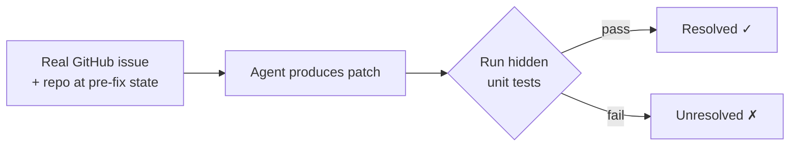

# SWE-bench Leaderboard

**SWE-bench** is the field's dominant agentic-coding benchmark. Each task hands an
agent a real GitHub issue plus the repository at the state before it was fixed; the
agent must produce a code patch. The patch is scored by running the project's
**hidden unit tests** — if they pass, the instance is *resolved*. Every entry reports
one headline metric, **% Resolved**: the fraction of instances solved. It is the
number model labs quote, and it is the [public benchmark](public-benchmarks.md) the
whole field calibrates against.

## The variants

The leaderboard splits into several datasets, each a different slice of difficulty,
scope, or modality:

| Variant | Instances | What it is |
| --- | --- | --- |
| **Full** | 2294 | The complete task set. |
| **Verified** | 500 | Human-filtered subset confirmed solvable — the standard headline board. |
| **Lite** | 300 | A curated subset for cheaper, faster evaluation. |
| **Multilingual** | 300 | Tasks across 9 programming languages (not just Python). |
| **Multimodal** | 517 | Issues that include visual elements. |

Scores have climbed fast — from roughly 38% on Lite in mid-2024 to open agents
resolving well over 70% of Verified, some with only a few hundred lines of harness
(see [mini-SWE-agent](mini-swe-agent.md), which scores >74% on Verified). The board
lets you compare *models* while holding the *agent scaffold* fixed — the
"SWE-bench (bash only)" view uses mini-SWE-agent as a constant harness so the number
reflects the model, not the scaffold.

## How the task is scored

## Caveats

A high SWE-bench score means an agent can fix *some* open-source Python issues — it
says little about your stack, conventions, or scale, and the dataset can
[rot and leak](fixing-swe-bench-toloka.md). Treat it as the coarse filter for
*what to trial*, not proof of real-world capability. See
[public benchmarks](public-benchmarks.md) for why to distrust the number, and run
your own [evals](evals-llm-as-a-judge.md) on your codebase to decide what works.

## Related

- [Public Benchmarks](public-benchmarks.md) — why benchmarks matter and why to distrust them.
- [SWT-Bench](swt-bench-unit-test-generation.md) — the sibling benchmark for test *writing*.
- [Fixing SWE-bench (Toloka)](fixing-swe-bench-toloka.md) — audit of SWE-bench's flaws.
- [mini-SWE-agent](mini-swe-agent.md) — the 100-line harness used as the board's constant scaffold.
- [Automated QA](automated-qa.md) — where test-generation benchmarks fit.

## References
- [SWE-bench Leaderboards](https://www.swebench.com/)
