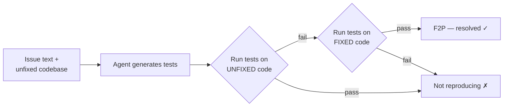

# SWT-Bench: Unit Test Generation

**SWT-Bench** flips [SWE-bench](swe-bench-leaderboard.md) around. Where SWE-bench asks
an agent to *fix* a bug, SWT-Bench asks it to *write the test that proves the bug
exists* — the test-writing counterpart in the benchmark family. It comes from the SRI
Lab at ETH Zurich (Mündler, Müller, He, Vechev; NeurIPS 2024).

## The task

Each task is built from a real GitHub pull request that resolved a user-reported
issue — the PR contains both the code patch that fixes it and the unit tests that
exercise the fix. The agent is given the codebase in its **original (unfixed) state**
plus the user's issue text, and must **generate tests that reproduce the issue**: they
should **fail on the broken code and pass once the fix is applied**.

## How it's scored

Two metrics:

- **Success rate (S)** — an instance is resolved if the agent produces at least one
  **Fail-to-Pass (F2P)** test (fails before the fix, passes after) and *no* test that
  breaks on the already-fixed code (no F2F or P2F). In other words: the generated test
  must genuinely catch the bug without being flaky against the correct code.
- **Coverage increase (ΔC)** — the gain in line coverage over the lines that the fix
  actually changed. A good reproducing test doesn't just fail; it exercises the
  changed code.

## Why it matters

Fixing a bug and *proving* you fixed it are different capabilities. A benchmark that
measures whether an agent can write a failing regression test targets the verification
half of the loop — the part that lets agents self-check rather than hand un-vetted
code to a human. It also has a **Verified** subset (433 human-verified solvable
issues, matching SWE-bench Verified). Specialized testing agents (Otter/e-Otter++,
AEGIS, AssertFlip) top the board, with success rates climbing past 60% on Verified.

## Related

- [SWE-bench Leaderboard](swe-bench-leaderboard.md) — the bug-*fixing* sibling.
- [Public Benchmarks](public-benchmarks.md) — SWT-Bench is the test-writing flavour.
- [Automated QA](automated-qa.md) — agents writing and validating tests.
- [Evals & LLM-as-a-Judge](evals-llm-as-a-judge.md) — deriving signal from systems.

## References
- [SWT-Bench: Assessing capabilities at Unit Test Generation](https://swtbench.com/)
