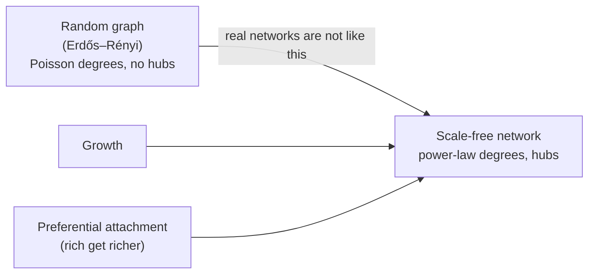

# Network Science

Albert-László Barabási's *Network Science* is the canonical modern textbook of the field,
published in print by Cambridge University Press and offered free online at
networksciencebook.com. It is the reference that turned the study of real-world networks
from a scattering of graph-theory results into a coherent empirical science with its own
laws, models, and measurements. The book's argument is that networks drawn from the real
world — the web, the cell, the power grid, social ties, the brain — share a small number
of organizing principles that are invisible to the classical random-graph view, and that
those principles have concrete consequences for how the systems behave.

## The central story

Barabási builds the field around a break from the **Erdős–Rényi random graph**, in which
every pair of nodes connects with equal probability and node degrees follow a narrow,
Poisson-like distribution around an average. Real networks are almost never like this.
Instead their degree distributions are **heavy-tailed**, following a power law: most nodes
have few links, but a small number of **hubs** have enormously many. These are the
**scale-free networks** the book is named for — "scale-free" because a power law has no
characteristic scale, no typical node degree to anchor on.

The mechanism that generates scale-free structure is **growth plus preferential
attachment** (the Barabási–Albert model): networks are not static, they grow by adding
nodes over time, and new nodes prefer to link to nodes that are already well-connected —
"the rich get richer." Growth and preferential attachment together are both necessary;
remove either and the power law collapses. This gives a *dynamical* origin story for a
*structural* fact, which is the book's signature move throughout.

## What the structure buys and costs

Scale-free topology has sharp behavioral consequences, and the book devotes chapters to
each:

- **Small-world distances.** Hubs act as shortcuts, so path lengths across even a huge
  network stay tiny — the "six degrees" effect, made even shorter ("ultra-small world") by
  the hubs.
- **Robustness with an Achilles' heel.** Scale-free networks are extraordinarily tolerant
  of *random* failure — knock out random nodes and the network stays connected, because
  random hits almost always land on low-degree nodes. But they are fragile to *targeted*
  attack on the hubs: remove the few highest-degree nodes and the network fragments. This
  robust-yet-fragile duality is a recurring theme of [complex systems](complex-systems.md).
- **Spreading and epidemics.** On a scale-free contact network the classic epidemic
  threshold can vanish: because hubs are so well-connected, even weakly infectious agents
  can persist and spread. This reframes disease control, viral information, and cascading
  failure as problems governed by degree distribution, not just average connectivity.
- **Community structure, degree correlations, and network robustness** round out the
  later chapters, connecting topology to function.

## Why it anchors this field

*Network Science* is the empirical, data-first counterpart to the abstract machinery of
[graph theory](../math/graph-theory.md): it takes the graph as the object of study but
insists on measuring real networks and explaining the regularities that measurement
reveals. Its core finding — that a few simple growth rules generate self-similar,
hub-dominated structure with strong functional consequences — is a paradigm case of
[emergence](emergence.md) and of the organizing patterns that define
[complex systems](complex-systems.md). The scale-free framework underpins the broader
treatment of networks as the connective tissue of [network science](network-science.md)
as a discipline.

## References

- [Network Science — Albert-László Barabási (free online)](http://networksciencebook.com/)
