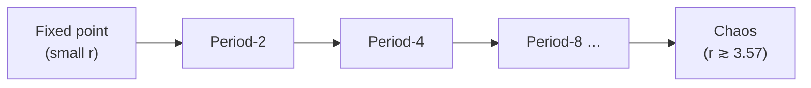

# Chaos and Nonlinear Dynamics

A **dynamical system** is a rule that says how a state evolves over time — a differential
equation $\dot{x} = f(x)$ in continuous time, or a map $x_{n+1} = f(x_n)$ in discrete
time. When $f$ is **linear**, effects scale with causes and solutions superpose; the
behavior is tame and, in principle, predictable forever. **Nonlinear dynamics** studies
what happens when $f$ is not linear — and one of its headline discoveries is
**deterministic chaos**: systems that follow exact, fully determined rules yet remain
practically *unpredictable*. Chaos dissolves the old equation of determinism with
predictability.

## Sensitive dependence on initial conditions

The defining signature of chaos is **sensitive dependence on initial conditions**: two
starting points arbitrarily close together diverge *exponentially* fast. If the
separation grows like $\delta(t) \approx \delta_0\, e^{\lambda t}$ with a positive
**Lyapunov exponent** $\lambda > 0$, then any finite-precision knowledge of the initial
state is exhausted after a finite horizon, beyond which prediction is worthless. This is
the **butterfly effect**, from Edward Lorenz's discovery that a truncated weather
simulation, restarted from a rounded intermediate value, produced a wholly different
forecast. The dynamics are perfectly deterministic; it is our *measurement* that can never
be infinitely precise, and chaos amplifies that gap without bound.

## Attractors and strange attractors

Trajectories in a dissipative system settle onto an **attractor** — the set of states the
system tends toward long-term. Simple attractors are familiar: a **fixed point** (settling
to rest), or a **limit cycle** (settling into periodic oscillation). Chaotic systems
instead settle onto a **strange attractor**: a bounded set with fractal geometry on which
trajectories never repeat and never cross, yet stay confined. The Lorenz attractor's
double-lobed "butterfly" shape is the icon. The paradox is captured exactly by the
geometry: motion is confined (bounded, stable *as a set*) yet locally divergent
(unpredictable *as a trajectory*).

## The logistic map and bifurcations

The cleanest demonstration is the **logistic map**, a one-line model of population growth:

$$ x_{n+1} = r\, x_n (1 - x_n), \qquad x_n \in [0,1]. $$

As the growth parameter $r$ increases, the long-run behavior changes qualitatively at
**bifurcations** — points where a small parameter change flips the system into a new
regime:

- small $r$: the population dies out or settles to a single stable value (a fixed point);
- around $r \approx 3$: **period-doubling** — the fixed point splits into a 2-cycle, then
  a 4-cycle, 8-cycle, and so on;
- the doublings accelerate (their ratio approaching the universal **Feigenbaum constant**
  $\delta \approx 4.669$) and pile up at $r \approx 3.57$, beyond which the behavior is
  **chaotic**, threaded with narrow periodic windows.

That such richness — including universality across utterly different systems — falls out
of a quadratic recurrence is why the logistic map became the emblem of the field.

## Why it matters

Chaos sets a *principled* ceiling on prediction. In any [complex
system](complex-systems.md) with nonlinear feedback, long-horizon forecasting is not a
matter of better instruments — it is impossible past the Lyapunov horizon, and the honest
response is to build for adaptation and [resilience](resilience-and-robustness.md) rather
than to chase precise foresight. The mathematics lives in [differential
equations](../math/differential-equations.md) and iterated maps. For AI: training dynamics
of deep networks are nonlinear dynamical systems (sensitive to initialization and learning
rate); recurrent and autoregressive models can exhibit chaotic sensitivity where tiny
prompt or seed changes cascade into divergent trajectories; and bifurcation is a useful
lens on *phase transitions* in learning — capabilities that appear abruptly as a
parameter (scale, data) crosses a threshold.

## References

- [Nonlinear Dynamics and Chaos — Steven Strogatz](strogatz-nonlinear-dynamics-and-chaos.md) — the standard text
- [Complexity: A Guided Tour — Melanie Mitchell](mitchell-complexity.md)
- [Thinking in Systems — Donella Meadows](thinking-in-systems.md)
