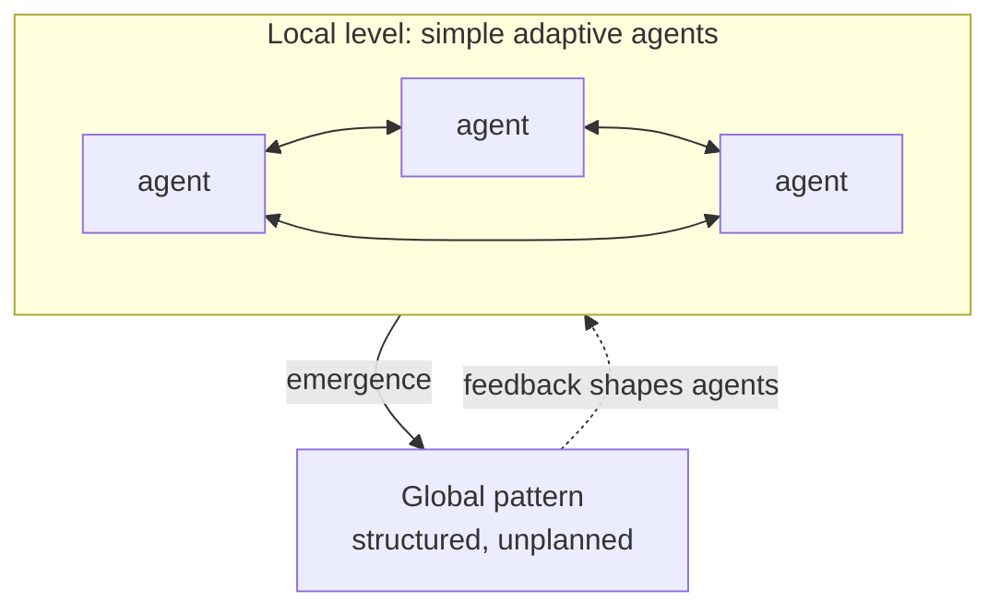

# Complex Adaptive Systems

A **complex adaptive system (CAS)** is a system made of many interacting agents that each
follow relatively simple local rules, learn or adapt from experience, and — without any
central controller — collectively produce rich, structured, often unpredictable global
behavior. Ecosystems, economies, immune systems, brains, ant colonies, markets, cities, and
multi-agent AI are the canonical examples. The idea crystallized at the **Santa Fe
Institute** in the 1980s–90s, with John Holland the central figure; Melanie Mitchell's
[mitchell-complexity.md](mitchell-complexity.md) is the accessible synthesis of that program.

## What makes a system a CAS

Not every complicated system is a CAS. A jet engine is complicated but not adaptive — its
parts do not learn or change their rules. A CAS has a distinctive cluster of features:

- **Many agents, local interaction.** Each agent senses and responds only to its local
  neighborhood, not to global state. No agent sees or controls the whole.
- **Simple rules, no central control.** Global order arises from the bottom up — this is
  [emergence.md](emergence.md) and [self-organization.md](self-organization.md), not
  top-down design.
- **Adaptation.** Agents (or the population of agents) change their behavior over time in
  response to feedback, becoming better fitted to their environment — a live application of
  [feedback-loops.md](feedback-loops.md).
- **Nonlinearity and history.** Small differences can amplify; where the system ends up
  depends on the path it took to get there, linking CAS to
  [chaos-and-nonlinear-dynamics.md](chaos-and-nonlinear-dynamics.md).

## Adaptation, co-evolution, and fitness landscapes

The engine of a CAS is **adaptation**: agents that fit their environment better are
reinforced (they reproduce, spread, or are imitated), so the population's behavior shifts
over time. A useful picture is the **fitness landscape** — a terrain where each point is a
possible strategy or configuration and the height is how well it performs. Adaptation is a
hill-climbing walk across this landscape toward peaks of higher fitness, complicated by the
fact that the landscape is rugged (many local peaks) and, crucially, *not fixed*.

That last point is **co-evolution**: because every agent is part of every other agent's
environment, one agent's adaptation reshapes the landscape for others. Predators evolve
speed, prey evolve evasion, predators adapt again — the "peaks" move as everyone climbs. A
CAS therefore rarely settles into equilibrium; it lives in a perpetual, path-dependent dance
often described as poised at the **"edge of chaos"** between frozen order and pure randomness,
where enough stability preserves structure and enough flux allows novelty.

## Why it matters

CAS is the lens for any system whose global behavior you cannot get by adding up its parts:
you have to understand the interaction rules and let the aggregate behavior emerge. It
reframes management and design questions — you rarely dictate outcomes in a CAS; you shape
the local rules and incentives and let structure form, the same insight behind the
leverage-point thinking in [thinking-in-systems.md](thinking-in-systems.md).

For AI the connection is direct. A single learning agent already climbs a fitness landscape:
[reinforcement learning](../ai/reinforcement-learning.md) is adaptation via reward feedback,
and its instabilities (non-stationary environments, moving reward signals) are exactly the
co-evolution problem. **Multi-agent** AI systems — populations of models, agents, or humans
and agents interacting — are complex adaptive systems outright: their global behavior emerges
from local interactions and can surprise, self-organize, or destabilize in ways no single
agent's design predicts. Understanding a fleet of interacting AI agents means treating it as
a CAS, not as one big program.

## References

- [Complexity: A Guided Tour (Mitchell)](mitchell-complexity.md)
- [Emergence](emergence.md)
- [Self-Organization](self-organization.md)
- [Reinforcement Learning](../ai/reinforcement-learning.md)
