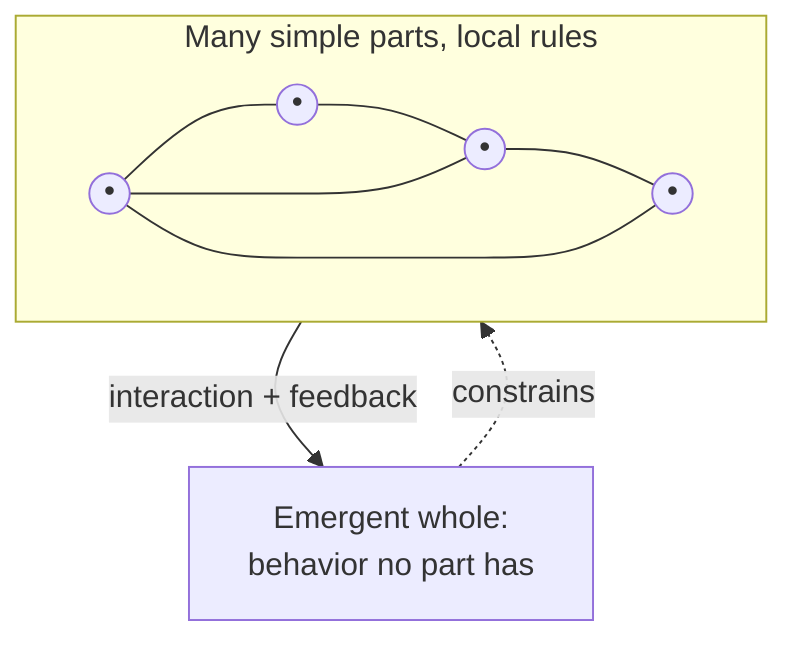

# Complex Systems

A **complex system** is one made of many components that interact — usually
nonlinearly and with [feedback](feedback-loops.md) — so that the system as a whole
produces behavior none of the parts exhibit alone, and no single component is in
charge. Weather, ecosystems, brains, economies, cities, the immune system, the
Internet, and a large production software stack are all complex systems. The
defining trait is that you *cannot* understand the whole by studying the parts in
isolation; the behavior lives in the interactions.

Melanie Mitchell's working definition ([Complexity: A Guided
Tour](mitchell-complexity.md)) is a good anchor: a system in which large networks
of components with no central control, following simple rules, give rise to
collective behavior, sophisticated information processing, and adaptation via
learning or evolution.

## Complex vs. complicated

The most useful distinction — and the one most often blurred — is *complex* versus
*complicated*.

- A **complicated** system (a jet engine, a compiler, a mechanical watch) has many
  parts but is, in principle, fully decomposable and predictable. Given the design
  you can trace cause to effect, reason about parts one at a time, and reassemble.
  Complicated systems reward analysis: break down, understand, rebuild.
- A **complex** system resists that decomposition. Its parts are densely coupled by
  feedback, so cause and effect are circular, distant in time and space, and often
  disproportionate (a small input can trigger a large response — see [chaos and
  nonlinear dynamics](chaos-and-nonlinear-dynamics.md)). You can know every part
  and still not be able to predict the whole, because the behavior is a property of
  the *relationships*, not the components.

The engineering error is treating a complex system as merely complicated — assuming
that if you understand each service you understand the system, that a root cause
exists, that behavior is the sum of parts.

## Signature properties

- **Many interacting components** with dense, often local, coupling.
- **Nonlinearity** — outputs not proportional to inputs; small causes can have
  large effects and vice versa. This is what breaks superposition and defeats
  "sum-of-parts" reasoning.
- **[Feedback loops](feedback-loops.md)**, reinforcing and balancing, that make
  cause and effect circular and delayed.
- **No central control** — order arises from local interactions
  ([self-organization](self-organization.md)), not from a controller.
- **[Emergence](emergence.md)** — macro-level structure and behavior that the micro
  rules do not obviously contain.
- **Adaptation** in many cases — the system learns or evolves, becoming a [complex
  *adaptive* system](complex-adaptive-systems.md).

## Why the whole exceeds the sum

Because the components are coupled by feedback, the state of each depends on the
states of others, and those dependencies loop. The system's behavior is a
*trajectory through a high-dimensional state space* shaped by all the couplings at
once — mathematically the domain of [chaos and nonlinear
dynamics](chaos-and-nonlinear-dynamics.md), rooted in [differential
equations](../math/differential-equations.md). That coupling is exactly what makes
the whole irreducible to a catalog of parts: the "extra" is the relationships, and
relationships are not stored in any part.

## Why it matters

Nearly everything an engineer operates at scale is a complex system, not a
complicated one, and misclassifying it is the source of recurring pain. [How
Complex Systems Fail](how-complex-systems-fail.md) is the direct statement of this
for software operations: there is no single root cause, systems run in degraded
mode, and safety is emergent — all consequences of complexity, not of sloppiness.
[Resilience engineering](resilience-engineering-woods.md) is the discipline of
coping with it. [Distributed systems](../distributed-systems/index.md) and
[DevOps/SRE](../devops-sre/index.md) are complex-systems engineering under other
names.

For AI, the systems are doubly complex: a trained model is a complex system whose
capabilities [emerge](emergence.md) from scale ([large language
models](../ai/large-language-models.md)), and an agent embedded in a codebase and
toolchain forms a further complex system whose behavior comes from the [feedback
loops](feedback-loops.md) you build around it — the reason [loop
engineering](../harness-engineering/loop-engineering.md) treats the harness, not
just the model, as the object of design. It also shapes how
[economics](../economics/index.md) models markets and how
[philosophy](../philosophy/index.md) treats minds.

## References

- [Complexity: A Guided Tour](mitchell-complexity.md) — Melanie Mitchell
- [Thinking in Systems](thinking-in-systems.md) — Donella Meadows
- [How Complex Systems Fail](how-complex-systems-fail.md) — Richard Cook
- [Nonlinear Dynamics and Chaos](strogatz-nonlinear-dynamics-and-chaos.md) — Steven Strogatz
