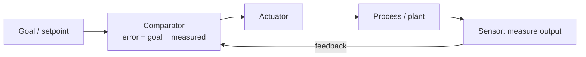

# Cybernetics

Cybernetics is the study of **control and communication in the animal and the machine** —
the phrase is Norbert Wiener's, and it is deliberately indifferent to whether the system
in question is made of neurons, gears, or code. Its central claim is that *steering* a
system — biological, mechanical, or social — is a single phenomenon governed by the same
laws regardless of substrate. The word itself comes from the Greek *kybernetes*, the
helmsman of a ship, and the metaphor is exact: a helmsman does not command the sea, he
senses the boat's drift and continuously corrects it. Cybernetics is the general theory of
that correction.

It is the intellectual root of control theory, of much of early AI, and of the modern
**reconciler pattern** in [distributed systems](../distributed-systems/index.md): a
controller that continuously observes actual state, compares it to desired state, and acts
to close the gap.

## Feedback and regulation

The atom of cybernetics is the [feedback loop](feedback-loops.md): the output of a system
is measured and fed back to influence its input. **Negative feedback** subtracts the
measured error from the goal and drives the system *toward* a setpoint — this is
regulation, the stabilizing force. **Positive feedback** adds error back in and drives the
system *away*, amplifying deviations (growth, collapse, runaway).

The canonical device is **Watt's centrifugal governor** on a steam engine: as the engine
speeds up, spinning weights fly outward under centrifugal force, which mechanically closes
a valve, which reduces steam, which slows the engine — a purely physical negative-feedback
loop that holds speed roughly constant without any explicit computation. It is the proof
that *purpose-like behavior* (holding a target) needs no mind, only a loop.

## Requisite variety

Cybernetics gives regulation a hard quantitative limit: Ashby's **Law of Requisite
Variety**, "only variety can absorb variety." *Variety* is the count of distinct states a
system can occupy (or its log, in bits). A regulator can hold a system's essential
variables inside safe bounds only to the extent that it commands *as much variety* as the
disturbances it faces. If the environment can do more distinct things to you than you have
distinct responses, some disturbances *must* get through — no cleverness recovers control
you never had the range to exert. This is the formal reason a thin wrapper cannot reliably
govern a powerful, wide-ranging generator: the regulator is under-varied for its
disturbance space. See [an introduction to cybernetics](introduction-to-cybernetics.md)
for the full theorem.

## First- and second-order cybernetics

**First-order cybernetics** treats the observer as outside the system — it studies
*observed systems*: thermostats, governors, control loops the engineer designs and watches
from the outside. **Second-order cybernetics** (Heinz von Foerster, Margaret Mead)
folds the observer *into* the system, studying *observing systems*: the cybernetics of
cybernetics. Once you admit that the observer's own goals, measurements, and models are
part of the loop, you get reflexivity — systems that model themselves, which connects
directly to [self-reference and strange loops](self-reference-and-strange-loops.md). A
learning agent that revises its own reward model, or an ops team that changes what it
monitors based on what monitoring revealed, is doing second-order cybernetics.

## Why it matters

Cybernetics is the shared ancestor of ideas that later split into separate disciplines:
control theory (the engineering formalization of negative feedback), early AI (Wiener's
contemporaries built the first goal-seeking machines), [system dynamics](system-dynamics.md)
(feedback and delay in social systems), and [self-organization](self-organization.md). In
AI, [reinforcement learning](../ai/reinforcement-learning.md) is cybernetics made
statistical: an agent senses state, acts, observes reward, and adjusts — a feedback loop
over policy space. The reconciler/control loop that keeps a [distributed
system](../distributed-systems/index.md) converging on its declared desired state is a
first-order cybernetic regulator in production. Requisite variety, meanwhile, is the
standing warning for anyone building a harness to govern generative AI: match the variety
of your checks to the variety of the failures.

## References

- [Cybernetics — Norbert Wiener](cybernetics-wiener.md) — the founding work
- [An Introduction to Cybernetics — W. Ross Ashby](introduction-to-cybernetics.md) — the Law of Requisite Variety
- [Thinking in Systems — Donella Meadows](thinking-in-systems.md)
