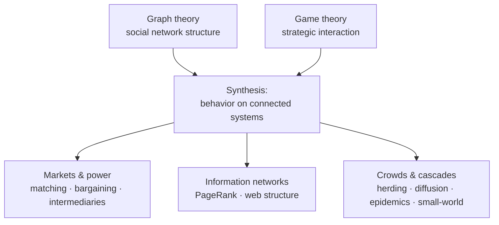

# Networks, Crowds, and Markets

David Easley and Jon Kleinberg's *Networks, Crowds, and Markets: Reasoning About a Highly
Connected World* (Cambridge University Press, 2010; free online at Cornell) is the
canonical interdisciplinary text on connected systems. It grew out of an introductory
Cornell course with no formal prerequisites, and its ambition is to explain how the
social, economic, and technological worlds hang together by drawing on **graph theory,
game theory, economics, and sociology at once**. Where [Newman](newman-networks.md) and
[Barabási](barabasi-network-science.md) study network *structure* as physicists,
Easley–Kleinberg study network *behavior* — how the links between people and institutions
shape incentives, decisions, and collective outcomes.

## The three pillars and their synthesis

The book is built on two foundational toolkits and then repeatedly fuses them:

- **Graph theory and social networks.** The structural vocabulary — graphs, paths,
  components, the **strength of weak ties**, triadic closure, homophily, structural balance
  in signed networks — that describes the shape of social connection. This is the sociology
  of network position expressed in the language of [graph theory](../math/graph-theory.md).
- **Game theory.** The theory of interdependent decisions — Nash equilibria, dominant
  strategies, evolutionary stability, Braess's paradox in traffic — for reasoning about how
  self-interested agents behave when each one's payoff depends on the others'.

The rest of the book applies this fused toolkit to concrete domains:

- **Markets and strategic interaction on networks** — matching markets and market-clearing
  prices, trade through intermediaries, and **bargaining and power** determined by one's
  position in an exchange network. This is the [economics](../economics/index.md) core:
  network structure becoming price and power.
- **Information networks and the web** — link analysis, **PageRank** and hubs/authorities,
  and the structure of the web as a directed graph.
- **Aggregate and dynamic behavior** — **information cascades** and herding, network
  effects and markets with tipping, the **wisdom (and madness) of crowds**, and the
  dynamics of adoption and voting.
- **Network dynamics** — **cascading behavior** and diffusion of innovations, the
  **small-world phenomenon** and decentralized search ("six degrees"), and **epidemics**
  (branching processes, SIR/SIS) as the spread of both disease and ideas across ties.

## Why it anchors this field

*Networks, Crowds, and Markets* is the note that ties [network science](network-science.md)
to human systems. It shows that the same graph a physicist measures is, from another angle,
a field of incentives — so a cascade of adoptions, a run on a market, or a segregated
neighborhood are all **emergent** outcomes of local strategic choices propagating over
network structure, a paradigm example of [emergence](emergence.md) in social systems. Its
game-theoretic treatment of markets and power grounds forward links into
[economics](../economics/index.md), and its account of weak ties, homophily, cascades, and
collective action grounds links into [sociology](../sociology/index.md). It is the
canonical bridge from the mathematics of networks to the economics and sociology of a
connected world.

## References

- [Networks, Crowds, and Markets — David Easley & Jon Kleinberg (free online)](http://www.cs.cornell.edu/home/kleinber/networks-book/)
