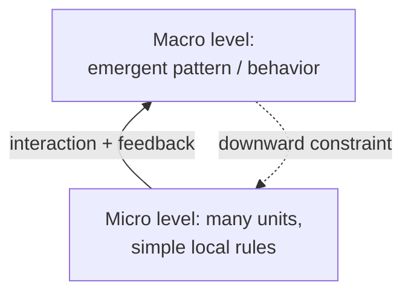

# Emergence

**Emergence** is the appearance of order, structure, or behavior at the *macro*
level of a system that arises from *micro*-level interactions among parts, yet is
not obviously present in — or easily predicted from — the parts and their rules
taken individually. The slogan "more is different" (Philip Anderson) captures it:
change the number of interacting units enough and qualitatively new phenomena
appear at a higher level of description. Emergence is the reason the whole of a
[complex system](complex-systems.md) exceeds the sum of its parts.

## Mechanics

Emergence is not magic; it is what local interaction plus [feedback](feedback-loops.md)
produces at scale. The ingredients are consistent:

1. **Many units** following relatively **simple, local rules** — each acting on
   information from its neighbors, not from a global blueprint.
2. **Interaction and feedback** among them, so effects propagate and compound.
3. **A higher level of description** at which stable patterns become visible and
   can be named, measured, and reasoned about — often with its own laws (thermodynamics
   over molecular mechanics, psychology over neurons).

No unit "knows" the macro pattern; the pattern is a statistical, dynamical
consequence of all the local interactions at once. This is the same engine as
[self-organization](self-organization.md) — self-organization emphasizes that the
order forms *without a controller*, emergence emphasizes that the order lives at *a
different level* than its causes. They almost always co-occur.

## Canonical examples

- **Flocking / swarming.** Boids following three local rules (separate, align,
  cohere) produce coordinated flocks with no leader. The flock is real, but it is
  nowhere in a single bird.
- **Ant colonies.** Individually near-blind ants, coordinating through
  [stigmergy](self-organization.md) (pheromone trails), collectively find shortest
  paths, allocate labor, and regulate foraging — colony-level intelligence from
  individually simple agents.
- **Markets.** Prices aggregate the dispersed local decisions of many traders into
  a global signal no participant computes — the central emergent phenomenon of
  [economics](../economics/index.md).
- **Minds.** Consciousness and thought as macro-phenomena over neurons; Hofstadter
  argues the self is an emergent, self-referential pattern ([I Am a Strange
  Loop](i-am-a-strange-loop.md), [Gödel, Escher,
  Bach](godel-escher-bach.md)) — see [self-reference and strange
  loops](self-reference-and-strange-loops.md).
- **LLM capabilities.** Abilities like in-context learning, chain-of-thought
  reasoning, and instruction following are not programmed in; they *emerge* as a
  [large language model](../ai/large-language-models.md) is scaled up in parameters
  and data. Some appear to switch on sharply with scale (though measurement choices
  affect how sharp they look), a paradigm case of "more is different" in
  engineering.

## Weak vs. strong emergence

A standard philosophical distinction, worth keeping straight:

- **Weak emergence** — the macro pattern is novel and surprising and not *tractably*
  predictable from the parts, but it is fully *reducible in principle*: it follows
  from the micro rules and would be reproduced by simulating them. The
  unpredictability is practical (computational irreducibility — you often have to
  run the system to see what it does), not fundamental. Almost all scientifically
  respectable emergence — flocks, markets, LLM abilities — is weak.
- **Strong emergence** — the macro level has causal powers that are *not even in
  principle* deducible from the micro level (sometimes invoked for consciousness).
  This is philosophically contentious and empirically hard to defend; most working
  scientists treat "emergence" as weak emergence and reserve strong emergence for
  [philosophy of mind](../philosophy/index.md) debates.

The useful engineering stance: treat emergence as weak — real, higher-level, and
consequential, but grounded in the parts — which means you can sometimes *shape* it
by changing the rules or couplings below.

## Why it matters

Emergence is why you cannot fully specify a complex system top-down and cannot fully
predict it bottom-up. For AI it is the central surprise: capabilities (and failure
modes) appear that were never explicitly designed, which is why evaluation is
empirical and why [reinforcement learning](../ai/reinforcement-learning.md) and
scaled pretraining produce behavior that must be *discovered* rather than read off
the code. For engineering feedback loops it means the reliable behavior of an agent
harness is itself emergent from the loop you build — the practical claim behind
[loop engineering](../harness-engineering/loop-engineering.md) and [engineer the
loop](../harness-engineering/engineer-the-loop.md): shape the local rules and
signals, and useful global behavior emerges; leave them noisy, and so does the
behavior. It connects directly to [complex systems](complex-systems.md),
[self-organization](self-organization.md), [complex adaptive
systems](complex-adaptive-systems.md), and the emergent-safety argument in [How
Complex Systems Fail](how-complex-systems-fail.md).

## References

- [Complexity: A Guided Tour](mitchell-complexity.md) — Melanie Mitchell
- [Gödel, Escher, Bach](godel-escher-bach.md) — Douglas Hofstadter
- [I Am a Strange Loop](i-am-a-strange-loop.md) — Douglas Hofstadter
- [The Sciences of the Artificial](simon-sciences-of-the-artificial.md) — Herbert Simon
