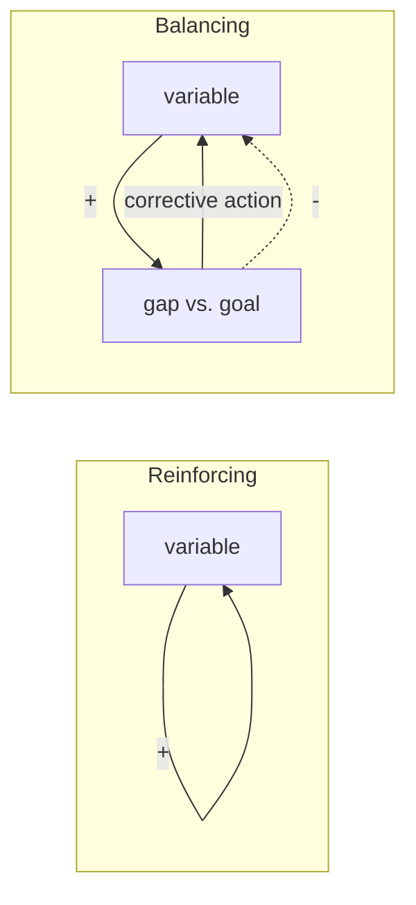

# Feedback Loops

A **feedback loop** exists whenever the state of a system is fed back to influence
its own future state. Output loops around to become input. This single mechanism —
a variable that acts, however indirectly, on itself — is the primitive from which
almost all interesting system behavior is built: growth, decay, stability,
oscillation, collapse. Understanding a system usually means finding its loops.

The vocabulary comes from [cybernetics](cybernetics.md), the science of control
and communication in animal and machine that Norbert Wiener named
([Cybernetics](cybernetics-wiener.md), [An Introduction to
Cybernetics](introduction-to-cybernetics.md)). Donella Meadows made it the spine
of everyday [systems thinking](thinking-in-systems.md).

## Two kinds of loop

Every loop is either reinforcing or balancing, depending on whether it amplifies or
opposes change.

- **Reinforcing (positive) loop** — the output pushes the input in the *same*
  direction, so a change compounds. More begets more; less begets less. This is
  exponential growth (compound interest, viral spread, a population) or runaway
  collapse (a bank run, a death spiral of tech debt where every slow change breeds
  more debt). Positive loops are engines: they create the change in a system but,
  left unchecked, drive it to a limit or to ruin.
- **Balancing (negative) loop** — the output opposes the input, pulling the system
  toward a goal or equilibrium. A thermostat drives room temperature toward its
  setpoint; a body sweats to hold 37 °C; a team throttles feature work as its bug
  backlog grows. Balancing loops are the source of *stability, regulation, and
  self-correction* — the "steering" (from Greek *kubernḗtēs*, helmsman) at the root
  of cybernetics.

Real systems interleave many of both. Behavior over time is the net result of which
loop dominates at each moment — a reinforcing loop growing a stock until a balancing
loop (a resource limit) catches up produces the classic S-curve.

## Delays: where loops go wrong

A loop's behavior is dominated not just by its sign but by its **delays** — the lag
between an action and its felt effect. A balancing loop with a long delay
overshoots and oscillates: the actor keeps correcting because the earlier
correction has not yet shown up. This is why a shower with a slow water heater
swings between scalding and freezing, why supply chains bullwhip, and why hiring to
fix an overloaded team helps only months later. Delay converts a stabilizing loop
into an oscillating one. Meadows treats delays as a first-class structural feature,
not an afterthought — see [system dynamics](system-dynamics.md), which simulates
stock/flow/loop/delay structures explicitly.

## The through-line to control theory and agents

The negative feedback loop is the atom of **control theory**: sense the current
state, compare it to a reference, actuate to close the gap, repeat. A thermostat,
a PID controller, a cruise control, and a homeostatic organism are the same
structure at different scales. [An Introduction to
Cybernetics](introduction-to-cybernetics.md) generalizes this into the *law of
requisite variety* — a regulator must have at least as much variety as the
disturbances it absorbs.

The same loop is the atom of an **agent**. An autonomous agent — a control system,
a reinforcement-learning policy ([reinforcement
learning](../ai/reinforcement-learning.md) is literally reward feeding back to
shape a policy), or an LLM coding agent — runs sense → decide → act → observe,
using the observation of its last act to choose its next. Designing that loop well
*is* the engineering problem: see [loop
engineering](../harness-engineering/loop-engineering.md) and [engineer the
loop](../harness-engineering/engineer-the-loop.md), which treat the agent's
feedback loop — tests, linters, type checkers, and other fast verifiers feeding
signal back into the next action — as the primary lever on reliability. A tight,
low-delay, high-signal balancing loop keeps an agent on target; a loop with delayed
or noisy feedback lets it drift and oscillate exactly as the shower does. The same
reasoning shapes SRE control loops (autoscaling, error-budget throttling) in
[DevOps/SRE](../devops-sre/index.md) and consensus/backpressure loops in
[distributed systems](../distributed-systems/index.md).

## Why it matters

Loops explain *why systems keep doing the thing they do*. Persistent behavior comes
from structure, not from events, so the leverage is in the loops — their strength,
their sign, and above all their delays — not in the symptoms. This is the core
mechanism underneath [complex systems](complex-systems.md),
[emergence](emergence.md), [self-organization](self-organization.md), and the
failure and resilience literature ([How Complex Systems
Fail](how-complex-systems-fail.md), [resilience
engineering](resilience-engineering-woods.md)). Automating one side of a loop
without understanding the whole loop is precisely the trap in [the ironies of
automation](ironies-of-automation.md) and [AI and the ironies of
automation](ai-and-the-ironies-of-automation.md). It reaches into
[economics](../economics/index.md) (markets as loops) and
[philosophy](../philosophy/index.md) (self-reference as a loop of a mind on
itself).

## References

- [Thinking in Systems](thinking-in-systems.md) — Donella Meadows
- [Cybernetics](cybernetics-wiener.md) — Norbert Wiener
- [An Introduction to Cybernetics](introduction-to-cybernetics.md) — W. Ross Ashby
