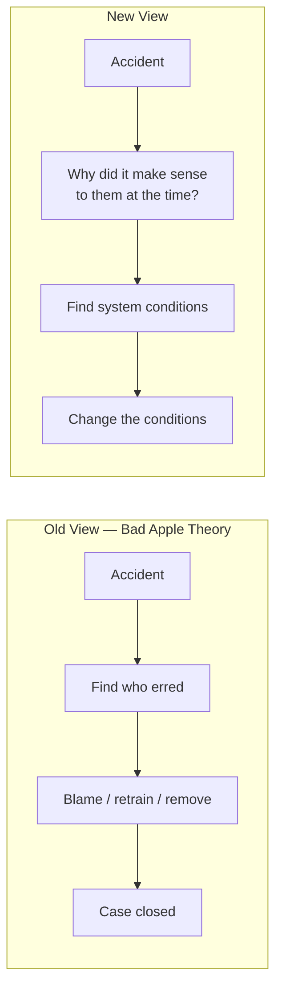

# The Field Guide to Understanding 'Human Error'

Sidney Dekker's field guide (3rd edition, 2014) makes one argument and drives it home: **"human
error" is not an explanation, it is a label for something you have not explained yet.** When
you conclude that an accident was caused by human error, the investigation is just beginning —
you have named the place to start looking, not the cause. The book is a practical handbook for
doing that looking well. It is close kin to
[How Complex Systems Fail](how-complex-systems-fail.md) and the resilience engineering
tradition ([Woods' four concepts](resilience-engineering-woods.md)).

## Two views of human error

Dekker's organizing contrast:

- **The Bad Apple Theory (the Old View)** — the system is basically safe; trouble comes from
  unreliable people. Fix safety by finding the bad apples, retraining, adding rules, and
  removing the culprits. The error is the *conclusion* of the investigation.
- **The New View** — human error is a *symptom* of deeper trouble inside the system. People's
  actions made sense to them given the information, goals, and pressures they had at the time.
  The job is to reconstruct why it made sense. The error is the *starting point*.

## The core traps to avoid

- **Hindsight bias.** After you know the outcome, the path to disaster looks obvious and the
  warning signs look like they were flashing. They were not, at the time. Dekker's discipline:
  reconstruct the situation as it unfolded *forward*, from inside the tunnel, not backward from
  the outcome.
- **Judging instead of explaining.** "They should have noticed / checked / followed the
  procedure" is a counterfactual, not an account. Trade indignation for explanation: replace
  every "they should have" with "here is why this looked reasonable."
- **Cause is constructed, not found.** There is no single objective "the cause" lying in the
  wreckage waiting to be discovered. What you call the cause depends on your accident model and
  where you choose to stop asking why. Make that model explicit.
- **You can't count errors.** Error is not a stable, countable thing; how you categorize
  actions determines the count. Error tallies mislead.
- **Sharp end vs. blunt end.** The operators at the sharp end inherit the constraints,
  tradeoffs, and latent conditions created by the blunt end (management, design, regulation,
  procurement). Look up into the organization, not just at the person at the controls.

## Doing the work

The practical chapters walk through building a timeline, putting data back in context, leaving
a trace others can follow, and looking into the organization for the conditions that shaped
behavior. Then the payoff: making recommendations that change conditions rather than blame
individuals — and abandoning the **Fallacy of the Quick Fix**, the urge to close a case with a
new rule or a firing that leaves the underlying system untouched.

## Why it matters for software and AI

This is the intellectual backbone of [blameless post-mortems](../devops-sre/blameless-post-mortems.md).
When an incident happens, the reflex is to find the engineer who ran the command or merged the
change. Dekker's New View says: that person's action almost certainly made sense given the
alerts, dashboards, time pressure, and defaults they faced — and *those* are what to fix. The
lesson compounds with the [ironies of automation](ai-and-the-ironies-of-automation.md) and
with AI-assisted work generally: as automation absorbs the routine, the human is left
accountable for the surprises, and "operator error" becomes an even lazier place to stop. The
investigation should end at the conditions, not at the person.

## References

- [The Field Guide to Understanding 'Human Error' (3rd ed.) — Routledge](https://www.routledge.com/The-Field-Guide-to-Understanding-Human-Error/Dekker/p/book/9781472439055)
