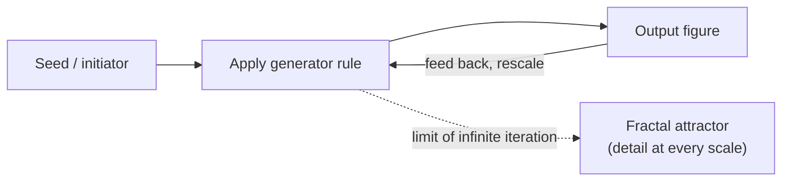

A **fractal** is a geometric object that exhibits detail at every scale: zoom in and you
keep finding structure rather than eventually hitting a smooth, featureless patch. The
defining property is **self-similarity** — the whole is built from smaller copies of
itself — and the striking consequence is that a fractal's "dimension" is generally a
**fraction**, not the familiar integer 1, 2, or 3. Fractals are, in Mandelbrot's framing,
the natural geometry of roughness: the shape of coastlines, clouds, mountains, turbulence,
and the [strange attractors](chaos-and-nonlinear-dynamics.md) of chaotic systems. They are
the geometry of chaos and [complex systems](complex-systems.md).

## Self-similarity: exact vs. statistical

- **Exact (deterministic) self-similarity.** Each part is a precise, rescaled copy of the
  whole. Mathematical fractals — the Cantor set, Koch snowflake, Sierpinski triangle —
  are exactly self-similar: magnify the right piece by the right factor and you recover
  the original.
- **Statistical self-similarity.** Each part is not an identical copy but shares the same
  *statistical* character (roughness, texture, distribution) across scales. Natural
  objects — coastlines, mountain ranges, branching trees — are statistically self-similar:
  a boulder resembles the mountain it came from without being a literal miniature of it.
- **Self-affinity** is the anisotropic cousin: rescaling by *different* factors along
  different axes (typical of time series like stock prices, where the time and value axes
  scale differently).

## Fractal (non-integer) dimension

Ordinary dimension counts independent directions. Fractal dimension instead measures **how
detail proliferates as you look closer** — how the object fills space. Two common,
equivalent-in-nice-cases definitions:

- **Box-counting (Minkowski–Bouligand) dimension.** Cover the object with a grid of boxes
  of side ε and count the number N(ε) needed. For a fractal, N(ε) ∝ ε^(−D). Then
  **D = lim (log N(ε) / log(1/ε))** as ε → 0. Practically, you count boxes at several
  scales and fit a line to log N vs. log(1/ε); the slope is D. This is the dimension
  actually measured for real coastlines and images.
- **Hausdorff dimension.** The rigorous mathematical definition, built from covering the
  set by pieces of vanishing diameter and finding the critical exponent at which the
  total "d-dimensional measure" jumps from infinite to zero. It is harder to compute but
  is the theoretical gold standard; for self-similar sets it agrees with the simpler
  **similarity dimension** D = log(N) / log(1/r), where the object is made of N copies each
  scaled by factor r.

Similarity dimension makes the fractions concrete:

- **Cantor set** — remove the middle third repeatedly: N = 2 copies at r = 1/3, so
  D = log 2 / log 3 ≈ 0.631 (more than a point, less than a line).
- **Koch curve** — N = 4 copies at r = 1/3, so D = log 4 / log 3 ≈ 1.262 (a curve
  "thicker" than a line but not area-filling; the Koch snowflake has infinite perimeter
  bounding finite area).
- **Sierpinski triangle** — N = 3 copies at r = 1/2, so D = log 3 / log 2 ≈ 1.585.

## Canonical examples

- **Cantor set** — the prototypical fractal dust on the line.
- **Koch snowflake / Koch curve** — infinite length, finite enclosed area.
- **Sierpinski triangle (and carpet, and the Menger sponge in 3D)** — self-similar
  removal fractals.
- **Mandelbrot set and Julia sets** — *escape-time* fractals from iterating z ↦ z² + c in
  the complex plane; the Mandelbrot set is the "index" of connected Julia sets and is
  the emblem of the whole field (see the anchor reference below).
- **Coastlines** — the coastline paradox: measured length grows without bound as the ruler
  shrinks, because the coast is statistically self-similar (Richardson's observation,
  formalized by Mandelbrot).
- **Trees, river networks, lungs and blood vessels** — recursive branching that packs
  large surface area or reach into bounded volume; the vasculature is a space-filling
  fractal serving every cell.

## Generation by iteration and recursion

Fractals are produced by **repeating a simple rule** — the complexity is emergent, not
written in by hand. This ties fractals directly to
[recursion and self-reference](self-reference-and-strange-loops.md) and to the
[recursion](../math/discrete-mathematics.md) of discrete mathematics.

- **Iterated Function Systems (IFS).** A small set of contraction maps applied repeatedly;
  their unique fixed "attractor" is the fractal. The **chaos game** — plot points by
  randomly choosing one contraction each step — draws the Sierpinski triangle and the
  Barnsley fern from a handful of affine maps.
- **Escape-time iteration.** Iterate a formula (z² + c) per point and color by how fast it
  diverges — this yields the Mandelbrot and Julia sets.
- **L-systems / recursive rewriting.** Grammar rules that expand a string into branching
  instructions, modeling plants and trees.

## Where fractals show up in data

- **1/f (pink) noise.** Power spectra that scale as 1/f^β appear in music, neural firing,
  network traffic, and physiological rhythms — a temporal signature of self-similarity
  (no characteristic scale). Statistical self-affinity in time.
- **Self-similar network and market structure.** Many real
  [networks](network-science.md) are approximately *scale-free* — degree distributions
  follow power laws, with the same hub-and-spoke pattern recurring across scales — and
  financial time series show fat-tailed, self-affine fluctuations (Mandelbrot's early work
  on cotton prices). Power laws are the algebraic face of scale invariance.

## Why it matters

Fractal geometry is the language for the "roughness" that smooth Euclidean geometry and
calculus cannot describe. It is the geometry of [chaos](chaos-and-nonlinear-dynamics.md)
(strange attractors have fractal dimension), of [self-organization](self-organization.md)
and [complex systems](complex-systems.md) (structure emerging across scales from local
rules), and of the recursion that underlies [strange
loops](self-reference-and-strange-loops.md). It connects the
[topology](../math/topology.md) of unusual sets, the dynamics of
[differential equations](../math/differential-equations.md), and the
[recursion](../math/discrete-mathematics.md) of discrete mathematics into one picture:
complexity generated by iterating simple rules.

## References

- [The Fractal Geometry of Nature](mandelbrot-fractal-geometry-of-nature.md) — Benoît
  Mandelbrot's foundational treatment of fractals as the geometry of nature.
