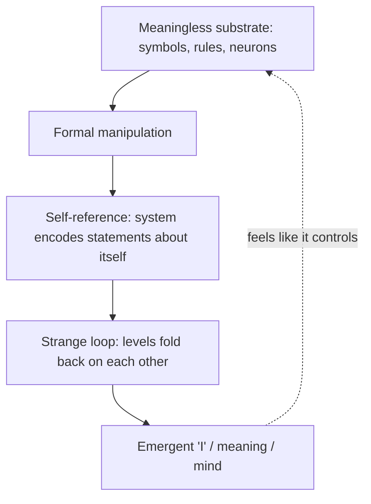

# Gödel, Escher, Bach: An Eternal Golden Braid

Douglas Hofstadter's 1979 book (Pulitzer Prize, 1980) is a book-length argument for one
claim: that a *self* — meaning, intention, consciousness — can arise out of a substrate
that has none of those things. Hofstadter's own later gloss is that GEB is "a very
personal attempt to say how it is that animate beings can come out of inanimate matter."
The braid of the title is the interweaving of three figures — the logician Kurt Gödel,
the artist M. C. Escher, and the composer J. S. Bach — used as three angles on a single
structural idea: **self-reference that crosses levels**.

## The central mechanism: formal systems and their limits

The technical spine is the theory of **formal systems** — collections of symbols
manipulated by purely mechanical rules with no appeal to meaning. Hofstadter builds toy
systems (the MU puzzle, "Typographical Number Theory," and the invented languages BlooP
and FlooP) so the reader can feel, from the inside, what it is for a system to be *only*
syntax. He then walks through **Gödel's incompleteness theorems**: by encoding statements
about a formal system *as* statements *within* it (Gödel numbering), one can construct a
sentence that in effect asserts its own unprovability. Any system rich enough to talk
about arithmetic can therefore express truths it cannot prove. GEB dramatizes this with a
record titled *"I Cannot Be Played on Record Player X"* — a record whose very playing
shatters the machine, an object that destroys the system by referring to it. The rigor of
that encoding argument is the province of [mathematical proof and logic](../math/mathematical-proof-and-logic.md).

## Strange loops

The recurring pattern Hofstadter names is the **strange loop**: a hierarchy of levels
that, when you move consistently "up" (or "down"), unexpectedly returns you to where you
began. Escher's *Drawing Hands* (each hand draws the other), Bach's endlessly rising
canons, and Gödel's self-referential sentence are the same shape in three media. The
book's thesis is that **mind is such a loop**: symbols in the brain that come to stand
for the very system doing the symbolizing, so that a low-level substrate of neurons gives
rise to a high-level "I" that seems to have causal power over the neurons. This is the
seed idea developed at length in [i-am-a-strange-loop.md](i-am-a-strange-loop.md) and is
the anchoring intuition behind [self-reference-and-strange-loops.md](self-reference-and-strange-loops.md).

## Form as argument

GEB's structure is itself part of the argument. Chapters alternate with **dialogues** —
Achilles and the Tortoise (borrowed from Zeno and Lewis Carroll), later the Crab and
others — which are riddled with puns, acrostics, musical forms, and metafiction that
*enact* the ideas the following chapter explains. The book also leans heavily on
[computer science](../computer-science/index.md): recursion, call stacks (dramatized as
"pushing potion" and "popping tonic"), nested genies, and quines (programs that print
their own source, a term Hofstadter coined). These connect the abstract logic to concrete
computation and to the possibility of machine intelligence, which places GEB among the
foundational cultural texts for [artificial intelligence](../ai/index.md).

## Why it anchors this field

GEB is the entry point for the systems-thinking themes of recursion, hierarchy, and
level-crossing causation. Its argument that high-level, meaning-bearing patterns can be
*emergent* consequences of a mindless low-level substrate is the same move that recurs in
[emergence.md](emergence.md), [complex-systems.md](complex-systems.md), and
[complex-adaptive-systems.md](complex-adaptive-systems.md); its loops that feed back on
themselves prefigure [feedback-loops.md](feedback-loops.md) and [cybernetics.md](cybernetics.md);
and its interest in how stable structure emerges from underlying dynamics connects to
[chaos-and-nonlinear-dynamics.md](chaos-and-nonlinear-dynamics.md).

## References

- [Gödel, Escher, Bach: An Eternal Golden Braid — Wikipedia](https://en.wikipedia.org/wiki/G%C3%B6del,_Escher,_Bach)
