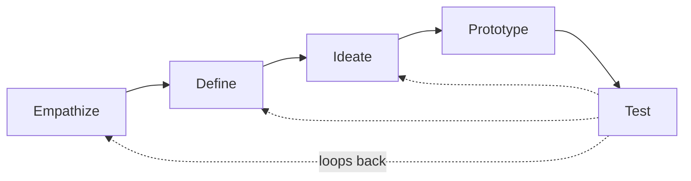
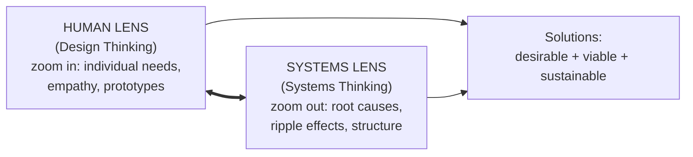

# Human-Centered Systems Thinking for Product Leaders

Zeeshan Khalid (Bootcamp / *Design Bootcamp*) argues that product leaders should fuse two
complementary methodologies — **Design Thinking** (human-centered, iterative, generates
*desirable* solutions) and **Systems Thinking** (holistic, uncovers interconnection,
finds *root causes* and anticipates *broad impacts*). Applied together —
**Human-Centered Systems Thinking (HCST)** — they produce solutions that are innovative,
user-centric, *and* viable within complex organizational and market systems.

The thesis: each methodology's blind spot is exactly where the other is strong, so for
truly complex ("wicked") problems, picking one over the other is suboptimal.

## Design Thinking

A **non-linear, iterative process** to deeply understand users, challenge assumptions,
redefine problems, and prototype/test innovative solutions. Best for **ill-defined /
"wicked" problems** where linear approaches fall short. Human-centered at its core.

**Mindset / principles:**
- **Human-centered** — people over process; empathy is the cornerstone. Shifts the
  question from "what features can we add?" to "what problem are we solving for the user?"
- **Embrace ambiguity & iteration** — failures are learning; loop back freely. (This
  non-linearity clashes with rigid, linear orgs — adoption needs a culture shift.)
- **Collaboration / cross-disciplinary** — integrate engineering, psychology, business,
  design; build on others' ideas.
- **Action-oriented** — rapid prototyping over theory; "how can we test this tomorrow?"
  avoids analysis paralysis.
- **DVF framework (IDEO)** — a viable idea must be **Desirable** (makes sense for people),
  **Viable** (sustainable business model), and **Feasible** (technically possible); plus
  **Responsibility** (ethical, avoids harm).

**Phases** — Stanford d.school's five (**Empathize → Define → Ideate → Prototype →
Test**), presented linearly for clarity but iterative in practice. Variants exist: IDEO's
7-step (Frame a Question → Gather Inspiration → Synthesize → Generate Ideas → Make
Tangible → Test to Learn → Share the Story) and 5-step (Inspiration → Synthesis →
Ideation → Testing → Implementation); NN/g adds an explicit "implement." The invariants
across all: user-centeredness, iteration, experimentation.

**Evolution:** roots in 1950s–60s "designerly ways of knowing" (Arnold's *Creative
Engineering* 1959, Archer's *Systematic Method for Designers* 1963 — Archer foresaw design
and management decision-making converging). The 1970s brought Horst Rittel's **"wicked
problems"** and Herbert Simon's design-as-a-way-of-thinking (*The Sciences of the
Artificial* — see [Simon note](simon-sciences-of-the-artificial.md)). Institutionalized in
the 80s–90s (Lawson, Nigel Cross's "Designerly Ways of Knowing," David Kelley founding
**IDEO** 1991 and Stanford's **d.school**). 2000s onward: shift from creative engineering
to **innovation management**, then social impact. Case studies: Airbnb (rebuilding trust),
Netflix, Uber Eats, GE Healthcare's child-friendly MRI, P&G Swiffer, Nike Flyknit (195
prototype trials), Amex "Pay It Plan It."

## Systems Thinking

A **holistic** approach: view an issue as interconnected, interdependent parts where **the
whole is greater than the sum**. Changing one part ripples through the rest. Transcends
linear cause-and-effect. (Fuller treatment: the [systems-thinking hub](index.md) and
[reductionism↔emergence note](systems-thinking-reductionism-and-emergence.md).)

Core principles: **holistic view** (improving one part can *degrade* the whole),
**interconnections**, **[emergence](emergence.md)**, **synthesis**,
**[feedback loops](feedback-loops.md)** (reinforcing/balancing), **causality**,
**boundaries** (scope the system so it's analyzable), **mental models** (surface & challenge
assumptions), and **[stocks & flows](system-dynamics.md)** (accumulations vs. rates).

**The systems thinker:** open-minded, curious, holistic (avoids linear formulas), good at
finding root causes, a good listener; prioritizes *relationships* over components, and
weighs *how people will react* to change. Uses the **iceberg** — the visible problem is
the tip; underwater lie the structures, people, and systems creating it. Rigorous analysis
of relationships, loops, and mental models finds true **leverage points**, preventing
"local improvements" that degrade the whole.

## How they differ — and why they're complementary

| | Design Thinking | Systems Thinking |
|---|---|---|
| **Focus** | People's real needs → human-centered solutions | Whole systems, dynamics, interdependencies, "wholeness" |
| **Method** | Iterative, non-linear, prototyping, action-oriented | Holistic analysis: linkages, feedback, causality, mental models |
| **In isolation, misses** | Broader systemic implications; sustainability in the whole | Tangible solutions — stuck in analysis; too technical, misses human needs |

**Each one's drawback is the other's strength.** Systems Thinking gives macro
understanding, root-cause analysis, and foresight into ripple effects but lacks rapid
human-centered experimentation; Design Thinking excels at iterative, validated,
user-centered creation but can miss structural issues and unintended consequences.

**Shared ground:** both attack root causes over symptoms, demand contextual
understanding, challenge assumptions/mental models, iterate, apply across
industries, and foster creativity. They're complementary lenses, not opposing forces.

## Human-Centered Systems Thinking (the integration)

For wicked problems that mix complex human needs *and* intricate system dynamics, integrate
the two. The core skill is **"zooming in and out"** — toggling between a **human lens** and
a **systems lens**.

- Start with **people**, but diagnose underlying causes before acting; stay grounded in
  many stakeholders while seeing the larger dynamics.
- Systems Thinking shifts the mindset from **linear to circular**; Design Thinking keeps it
  anchored in real customer needs. Don't isolate the user from their context — the
  customer's world *is* a mappable system.

**Integration frameworks:**
- **Iceberg model** — surface events → patterns → structures → mental models, so you fix
  root causes, not symptoms.
- **Systems map** — visually lay out stakeholders and their connections/influences (list
  stakeholders, draw arrows, reflect on hotspots) to spot opportunities for change.

## Benefits for product professionals

- **Designers** — deeper empathy, better problem framing, more creativity, faster
  iteration/less risk; Systems Thinking lets them tackle deeper, root-cause problems in
  context.
- **Developers** — clearer *why* behind the build, less rework, tighter alignment to user
  needs; Systems Thinking yields more **resilient, adaptable architecture** by seeing how
  components interact.
- **Product managers** — informed, data-driven decisions weighing ripple effects; strategic
  product development across the whole ecosystem (users, tech, business goals, market,
  regulation); resilient products; cross-functional collaboration that breaks silos.

Related: [systems thinking in business](systems-thinking-in-business.md) ·
[Goodman's iceberg primer](systems-thinking-what-why-when-where-and-how.md) ·
[UX design](../ux-design/index.md).

## References
- [Human-Centered Systems Thinking for Product Leaders](https://medium.com/design-bootcamp/human-centered-systems-thinking-for-product-leaders-9d70b9e2f301)
