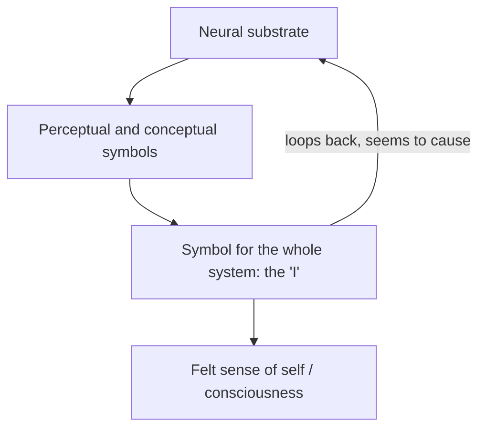

# I Am a Strange Loop

Douglas Hofstadter's 2007 book is the tighter, more direct follow-up to
[Gödel, Escher, Bach](godel-escher-bach.md). Hofstadter had grown frustrated that GEB was
read as a dazzling grab-bag with no through-line; here he isolates and defends what he
insists was its single central claim — that the **self, the "I," is a strange loop of
self-reference running in the brain**. Where GEB approached the idea obliquely through
logic, music, and art, this book states it plainly and argues it as a thesis about the
nature of consciousness.

## The argument

The engine is the same self-referential machinery that
[Gödel's incompleteness theorems](../math/mathematical-proof-and-logic.md) exposed in
formal systems: a system rich enough to *represent* itself can contain a symbol that
stands for the whole system. Hofstadter's move is to carry that property from arithmetic
into neuroscience. A brain, he argues, is a symbol-processing system that inevitably
builds a symbol for the most salient, most persistent pattern in its own experience —
itself. That self-symbol becomes a **level-crossing feedback pattern**: low-level neural
activity gives rise to a high-level abstraction ("I") that then appears, from the inside,
to steer the very machinery producing it. Consciousness, on this account, is not an extra
substance but *what it feels like to be* a sufficiently rich self-referential loop.

This is the concrete, brain-level instance of the pattern catalogued in
[self-reference-and-strange-loops.md](self-reference-and-strange-loops.md). Hofstadter's
picture of the self as a top-down model that the brain builds and then treats as causal
sits close to the [predictive coding and cognition](../neuroscience/predictive-coding-and-cognition.md)
account, in which the brain is fundamentally a self-modeling, prediction-generating
system.

## The provocative extensions

Hofstadter argues that a self is not confined to one skull. Because a self *is* a pattern
— a loop — it can be partially instantiated in other brains: the people close to us carry
low-resolution copies of our loop, so identity is distributed and survives, faintly, in
others. He grounds this in his own life, especially the death of his wife Carol, giving
the book an unusually personal, grief-inflected register for a work of philosophy of mind.
He also uses it to argue that the reality of a self is a matter of *degree* of loopiness,
not a binary — a stance with sharp consequences for personal identity and ethics that
places the book squarely in the [philosophy](../philosophy/index.md) of mind.

## Relation to the field

The book is the purest statement of the strange-loop idea that recurs across
systems-thinking: a high-level pattern that emerges from and then acts back upon its own
substrate is a special, self-directed case of [feedback loops](feedback-loops.md) and of
the level-crossing causation studied in [cybernetics](cybernetics.md) and treated
generally in [emergence](emergence.md).

## References

- [I Am a Strange Loop — Wikipedia](https://en.wikipedia.org/wiki/I_Am_a_Strange_Loop)
