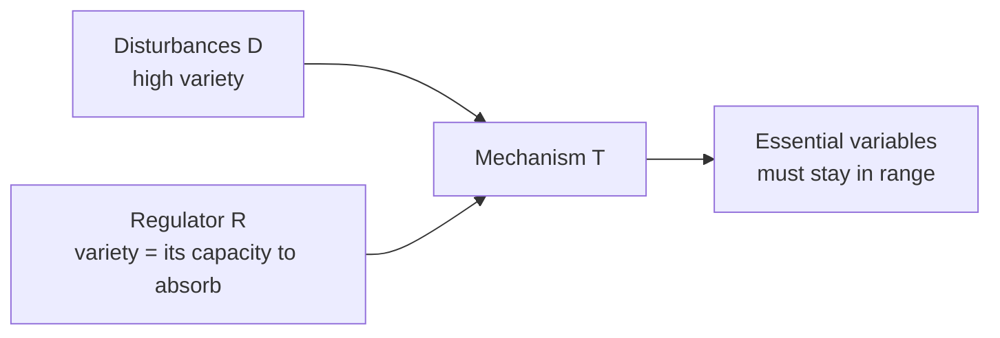

# An Introduction to Cybernetics

W. Ross Ashby's 1956 textbook, one of the founding works of cybernetics — the study of control and regulation in systems, biological or mechanical. Its most durable contribution, and the reason it is worth keeping here, is the **Law of Requisite Variety** (Chapter 11), a precise statement of how much control a regulator can possibly exert.

## Variety

"Variety" is Ashby's measure of complexity: the number of distinct states a system can be in (or the log of that count, in bits). A disturbance source with many possible states has high variety; a regulator with many possible responses has high variety. The whole framework reduces regulation to an accounting of variety flowing between parts.

## The Law of Requisite Variety

Ashby models regulation with three quantities:

- **D** — the disturbances that can push the system away from its acceptable range.
- **R** — the regulator's available responses.
- **T** — the mechanism whose outcomes we care about, with a set of **essential variables** that must stay within survivable limits (his example: an organism keeping blood volume in range through a "duel" with its environment).

The law states that the variety in the outcomes can be reduced *only* to the extent that the regulator R has variety of its own. Once the disturbance variety is fixed, the residual variety in the outcome can be forced down further only by a matching increase in the variety of R. Ashby's compression of it:

> **only variety in R can force down the variety due to D; variety can destroy variety.**

Put bluntly: **only variety can absorb variety.** A regulator can be no more effective than it is various. If the world can do more distinct things to you than you have distinct responses, some of those disturbances *must* reach your essential variables — no cleverness recovers control you never had the range to exert. The amount of regulation achievable therefore has a hard upper limit set by R's variety, and Ashby proves the theorem holds generally, not merely as an artifact of his tabular setup.

## Why it matters here

Requisite variety is the theoretical backbone of "harness" thinking. A system that supervises AI-generated change is a regulator R facing disturbances D (the many ways generation can go wrong); it can only hold quality inside acceptable limits if it commands *comparable variety* — enough sensors, checks, and corrective moves to match the ways things break. This is the formal reason a thin wrapper cannot reliably govern a powerful generator, and it underpins HAL's notes on shaping the loop: [engineer the loop](../harness-engineering/engineer-the-loop.md), [context engineering](../harness-engineering/context-engineering.md), [agent observability](../ai-platform/agent-observability.md), and reliability-focused evaluation like [tau-bench](../ai-platform/tau-bench.md), where an agent's inconsistency is precisely a shortfall of regulatory variety against a varied user.

## References

- [An Introduction to Cybernetics — W. Ross Ashby (author's site, ashby.info)](https://ashby.info/Ashby-Introduction-to-Cybernetics.pdf)
