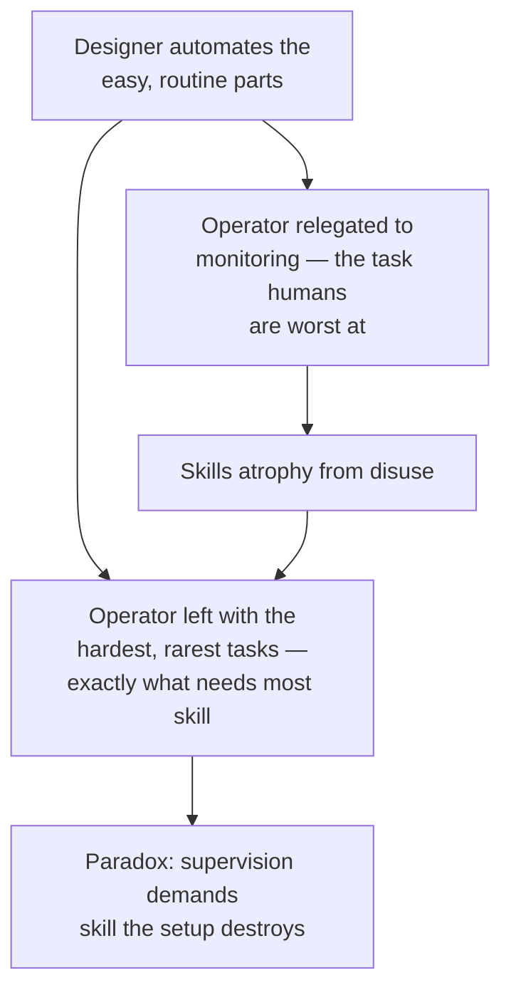

# Ironies of Automation

Lisanne Bainbridge's 1983 paper (*Automatica*) is the foundational text on why
automating a process **does not remove the human problem — it moves and sharpens
it.** Written about industrial process control, it reads today like a direct
warning about handing work to AI agents and keeping a person "in the loop."

## The central paradox

> By automating the process the human operator is given a task which is only
> possible for someone who is in on-line control.

You can only supervise an automated system well — catch its errors and step in —
if you could do the work yourself. But the automation is *why* you no longer do
the work, so the very competence supervision demands is the competence the
arrangement erodes. This is the individual-skill root of
[comprehension debt](../ai-org/comprehension-debt.md).

## The two ironies

1. **Designer errors don't vanish — they relocate.** The designer who couldn't
   automate a task perfectly leaves *that* residue to the human. So the operator
   inherits the tasks too hard, too rare, or too ill-defined to automate — the
   ones that most need expertise.
2. **Monitoring is a task humans are bad at.** Vigilance studies show a person
   cannot hold effective attention on a source where almost nothing happens for
   more than ~30 minutes. Monitoring for rare abnormalities is therefore
   "humanly impossible" to do well.

## Why the usual fixes fail

- **Alarms.** Add an automatic alarm and you just push the question up a level:
  who notices when the *alarm* fails? The operator won't — they've stopped
  watching the thing that's been fine for months.
- **Logs.** "People can write down numbers without noticing what they are."
- **Punishment.** Punishing operators for misses is "punishing them for being
  human" — it produces burnout or resignation, not vigilance.

## The deskilling time-bomb

Skills deteriorate when unused — a former expert reduced to monitoring becomes,
over time, effectively a beginner who once was an expert. Worse is the
**next-generation dilemma:** today's overseers are "riding on skills that later
generations cannot be expected to have," because those newcomers never did the
work that built the judgment. The knowledge needed to supervise the automation
vanishes, and no one is left who can. This is the same missing-rung worry in
[learning the craft](../ai-org/learning-the-craft.md) and
[AI won't kill junior devs](../ai-org/ai-wont-kill-junior-devs.md), and the delayed,
invisible-until-too-late version of atrophy in
[does AI make us stupid](../ai-org/does-ai-make-us-stupid.md).

The deskilling is **delayed** — invisible now because current operators still do
much of the work themselves — which is exactly what makes it dangerous: by the
time it's obvious, it may be too late for countermeasures.

## Related

- [AI and the Ironies of Automation](ai-and-the-ironies-of-automation.md) — Uwe
  Friedrichsen applies this paper directly to AI agents.
- [Comprehension Debt](../ai-org/comprehension-debt.md) — the modern name for the
  understanding gap this predicts.

## References
- [Ironies of Automation — Lisanne Bainbridge, Automatica (1983)](https://ckrybus.com/static/papers/Bainbridge_1983_Automatica.pdf)
