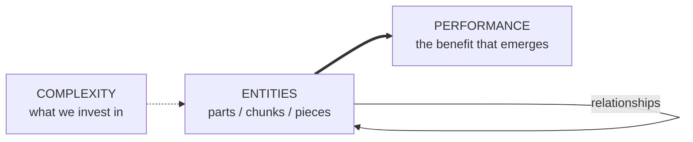

# Ask an MIT Professor: What Is System Thinking and Why Is It Important?

An MIT Open Learning interview with **Prof. Edward Crawley** (Aero/Astro, MIT; lead
faculty for MIT xPRO's system thinking course), who calls system thinking **"*the*
cognitive skill of the 21st century."** Where [Goodman's primer](systems-thinking-what-why-when-where-and-how.md)
is about *diagnosis and feedback loops*, Crawley frames it through **system architecture**
— parts, relationships, and the performance that emerges.

## What it is

> "System thinking is simply thinking about something as a system: the existence of
> entities — the parts, the chunks, the pieces — and the relationships between them."

Two things get measured:

- **Complexity** — *what we invest in*: more parts, more sophisticated parts, more parts
  talking to more parts.
- **Performance** — *the benefit that [emerges](emergence.md)* from those parts and their
  relationships.

The 21st century's defining trait: we keep investing in complexity — "things are just
getting damn complicated" — so the skill of seeing the whole becomes essential.

## Why it matters / who uses it

"System thinking is for everyone on this side of the life–death line." Two broad roles:

- **Leaders** — hold the high-level view; step back and see how all the parts connect.
- **Individual contributors** — understand how the part *they* own fits the bigger
  picture, so they can perform at their potential.

It's not just STEM. Crawley insists most system thinking happens *outside* science and
engineering: **the legal system, the Constitution, public health, national defense,
finance** are all systems. Professionally it's used to understand:

- How organizations work (team dynamics)
- Complex technologies (smartphones, devices)
- How to track/organize information (medical records)
- Intricate processes (the tax system — who pays, how much, how revenue is distributed)

## How it's taught: middle-complexity systems

The pedagogical trick is picking examples with **just the right complexity** — hard
enough that the answer isn't obvious, simple enough to be understood once you have the
tools. Crawley's sweet spot is **"middle-complexity systems people commonly encounter":**

- Rollerblade → too simple
- **Bicycle → just right** (start here)
- Automobile → the goal, but too hard to start on

From these he teaches three layers:

1. **Principles** underlying the system
2. **Methods** for thinking about it
3. Concrete **tools** system thinkers use daily

## Connections

This complements the [complex-systems](complex-systems.md) view (many coupled parts, no
central control) and the definition of [emergence](emergence.md) (macro behavior from
micro interaction — Crawley's "performance that emerges"). Crawley's entities-and-
relationships framing is essentially [system architecture](../software-architecture/index.md);
the "part fits the whole" concern echoes Simon's near-decomposable hierarchy in
[The Sciences of the Artificial](simon-sciences-of-the-artificial.md).

## References
- [Ask an MIT Professor: What Is System Thinking and Why Is It Important?](https://openlearning.mit.edu/news/ask-mit-professor-what-system-thinking-and-why-it-important)
