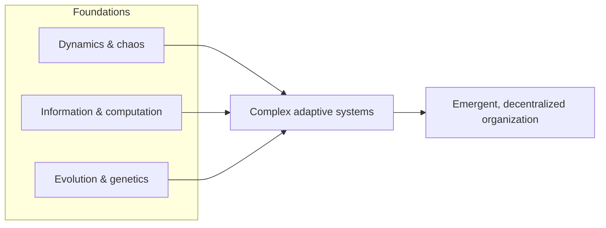

# Complexity: A Guided Tour

Melanie Mitchell's *Complexity: A Guided Tour* (Oxford University Press, 2009; winner of
the 2010 Phi Beta Kappa Science Book Award) is the standard accessible survey of
complexity science. Written by a researcher trained in the tradition of the Santa Fe
Institute — she was a student of Douglas Hofstadter and John Holland — the book maps the
scattered work on complex systems onto a few unifying questions: How do we measure
complexity? How do systems process information and compute? How does organized behavior
*emerge* from many simple parts following simple rules, with no central controller?

## Scope

Mitchell builds up the necessary background rather than assuming it, so the tour doubles
as an introduction to the sciences complexity draws on:

- **Dynamics and chaos** — the sensitivity-to-initial-conditions results and strange
  attractors that show simple deterministic rules can produce unpredictable behavior. This
  is the qualitative version of the material treated rigorously in
  [strogatz-nonlinear-dynamics-and-chaos.md](strogatz-nonlinear-dynamics-and-chaos.md) and
  the concept note [chaos-and-nonlinear-dynamics.md](chaos-and-nonlinear-dynamics.md).
- **Information and computation** — Shannon information, entropy, and the idea that a
  system can *store, transmit, and process* information; Turing machines and the notion of
  universal computation. She uses these to ask what it would even mean to quantify how
  "complex" something is.
- **Evolution and genetics** — natural selection and genetic algorithms as engines that
  search vast possibility spaces and manufacture adaptive organization over time.
- **Emergence and self-organization** — cellular automata, the immune system, ant
  colonies, cellular metabolism, and the brain as cases where global order arises bottom-up.

## The through-line

The book's organizing intuition is that a small set of phenomena — nonlinear feedback,
decentralized information processing, adaptation, and [emergence](emergence.md) — recur
across physics, biology, economics, and computation, and that these are the defining marks
of a **complex system** ([complex-systems.md](complex-systems.md)). When such a system also
learns, adapts, and evolves in response to its environment, it is a **complex adaptive
system** ([complex-adaptive-systems.md](complex-adaptive-systems.md)) — Mitchell's central
category, and the one her examples (ant colonies, immune systems, markets) keep returning
to.

Mitchell is careful and honest about the field's immaturity: she stresses that there is
still no single agreed measure of complexity, and treats the search for one as an open
scientific problem rather than a solved question. That skeptical, empirically grounded
stance — she is also a prominent commentator on the limits of AI — is what makes the book
a reliable map rather than a manifesto.

## References

- [Complexity: A Guided Tour — Oxford University Press](https://global.oup.com/academic/product/complexity-9780199798100)
- Mitchell, Melanie (2009). *Complexity: A Guided Tour*. Oxford University Press. ISBN 978-0-19-512441-5.
