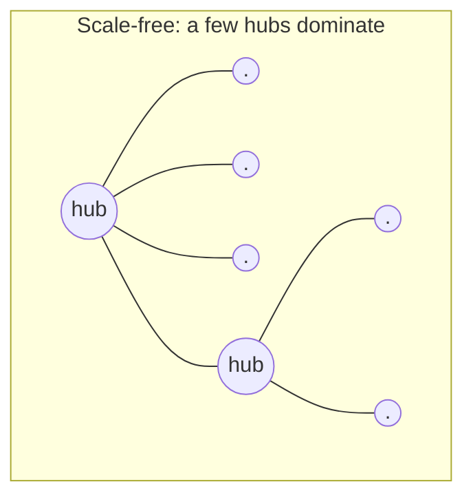

# Network Science

Network science studies systems by treating them as **graphs**: a set of *nodes* (people,
neurons, servers, species, web pages) joined by *edges* (friendships, synapses, links,
dependencies). Its wager is that a system's behavior is shaped as much by the *topology* of
its connections as by the properties of its parts — that how things are wired can matter
more than what they are. The formal vocabulary comes from [graph
theory](../math/graph-theory.md); network science supplies the empirical finding that
*real* networks, across wildly different domains, share a small family of structural
signatures.

## Degree distributions

The **degree** of a node is its number of edges. The **degree distribution** $P(k)$ — the
fraction of nodes with degree $k$ — is the single most diagnostic statistic of a network.
A purely random (Erdős–Rényi) graph has a *Poisson* degree distribution: degrees cluster
tightly around the mean, and there are essentially no outliers. Almost no real network
looks like this.

## Small-world and scale-free networks

Two structural patterns recur across real networks:

- **Small-world** (Watts–Strogatz): most connections are local (high **clustering** — your
  friends tend to know each other), yet a few long-range shortcuts collapse the **average
  path length** so that any two nodes are separated by surprisingly few hops. This is the
  "six degrees of separation" effect: locally clustered, globally close.
- **Scale-free** (Barabási–Albert): the degree distribution follows a **power law**,
  $P(k) \sim k^{-\gamma}$, with no characteristic scale — most nodes have few links, but a
  few **hubs** have enormously many. Power laws arise naturally from **preferential
  attachment**: new nodes attach preferentially to already-popular nodes, so "the rich get
  richer." Airline route maps, the web's hyperlink graph, protein-interaction networks, and
  citation networks are all approximately scale-free.

## Contagion, diffusion, and robustness

Topology governs how things *spread* — information, disease, cascading failures — across a
network. Hubs act as super-spreaders: in a scale-free network, a contagion reaching a hub
propagates explosively, which is why epidemic thresholds can effectively vanish and why
targeting hubs (vaccination, rate-limiting) is so leveraged.

The same structure produces a striking **robustness/fragility asymmetry**. Scale-free
networks are *robust to random failure* — knock out a random node and it is almost surely a
low-degree leaf whose loss barely matters — but *fragile to targeted attack* — deliberately
removing the top few hubs shatters the network into disconnected fragments. This "robust
yet fragile" signature is exactly the tension studied in [resilience and
robustness](resilience-and-robustness.md).

## Why it matters

Network structure is the connective tissue of most [complex systems](complex-systems.md)
and [complex adaptive systems](complex-adaptive-systems.md): [emergent](emergence.md)
behavior, [self-organization](self-organization.md), and [feedback](feedback-loops.md) all
run *over* a topology. In engineering, a [distributed system](../distributed-systems/index.md)
*is* a dependency graph, and its hubs — a shared database, an auth service, a message
broker — are precisely the nodes whose failure cascades, making the robust-yet-fragile
lens directly operational for reliability. In AI, graphs are first-class objects:
graph neural networks compute over them, knowledge graphs structure retrieval, the
attention pattern of a transformer is a weighted graph over tokens, and training corpora
(the web) carry the scale-free structure of their source.

## References

- [Complexity: A Guided Tour — Melanie Mitchell](mitchell-complexity.md) — networks chapter
- [Graph Theory](../math/graph-theory.md) — the formal foundation
- [Thinking in Systems — Donella Meadows](thinking-in-systems.md)
