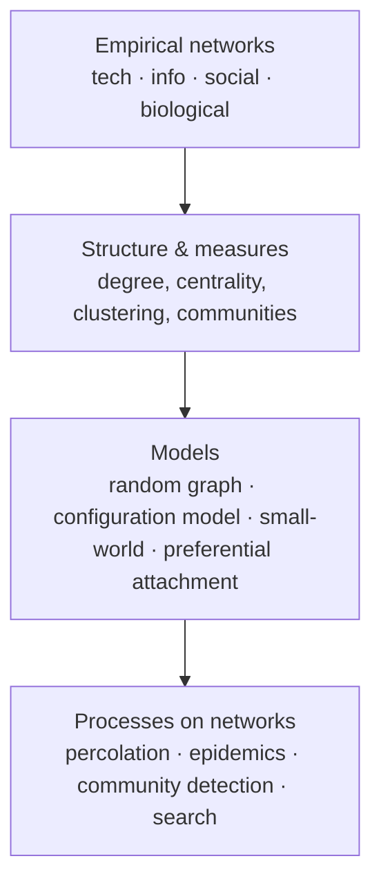

# Networks: An Introduction

Mark Newman's *Networks: An Introduction* (Oxford University Press, 2010; expanded 2nd
edition simply titled *Networks*, 2018) is the comprehensive technical reference for the
science of networks. Where [Barabási's *Network Science*](barabasi-network-science.md)
tells a narrative organized around scale-free structure, Newman's book is the systematic
textbook: a wide, rigorous survey that assembles the field's mathematics, measurements,
data sources, and models in one place. Newman — a physicist at Michigan and the Santa Fe
Institute, and one of the field's principal contributors (configuration model, community
detection, network epidemiology) — writes it as the foundational text a researcher can
learn the whole subject from.

## What the book covers

Newman organizes the material into four large movements:

- **The kinds of networks that exist.** A survey of the empirical substrate — technological
  networks (the Internet, power grids), information networks (the web, citation graphs),
  social networks, and biological networks — and the practical business of how each is
  measured and turned into data.
- **The mathematics of network structure.** The formal core: the adjacency matrix and its
  spectrum, degree, paths, components, and the full battery of **network measures** —
  centralities (degree, eigenvector, betweenness, closeness, PageRank), clustering
  coefficients, assortativity and degree correlations, and community structure. This is
  where the book connects most directly to [graph theory](../math/graph-theory.md) and to
  a rigorous course text like [West's *Introduction to Graph Theory*](../math/west-introduction-to-graph-theory.md),
  extending the pure-graph vocabulary with the statistical measures a real network demands.
- **Network models and their theory.** The generative and analytical models: the classical
  **Erdős–Rényi random graph**, the **configuration model** (random graphs with a
  prescribed degree distribution — Newman's own contribution, analyzed via generating
  functions), the **small-world model**, and **preferential-attachment / growth** models.
  These are the mathematical machinery that predicts structure from simple rules.
- **Processes on networks.** How dynamics unfold on top of structure: **percolation** and
  network robustness, **epidemic spreading** (SIR/SIS models on networks), **community
  detection** and graph partitioning (including modularity, which Newman helped popularize),
  and network search and navigation.

## Why it anchors this field

*Networks: An Introduction* is the technical backbone of [network science](network-science.md):
it is where the field's measures are defined precisely and its models are derived rather
than merely described. It sits between pure [graph theory](../math/graph-theory.md) — from
which it borrows the graph as its object — and the empirical, phenomenon-driven account of
[Barabási](barabasi-network-science.md), supplying the mathematics that makes both the
measurement and the modeling of large real networks rigorous. For anyone moving from the
combinatorial treatment of graphs toward the statistical study of complex networks, this
is the bridging reference.

## References

- [Networks: An Introduction — Mark Newman (Oxford University Press)](https://global.oup.com/academic/product/networks-an-introduction-9780199206650)
