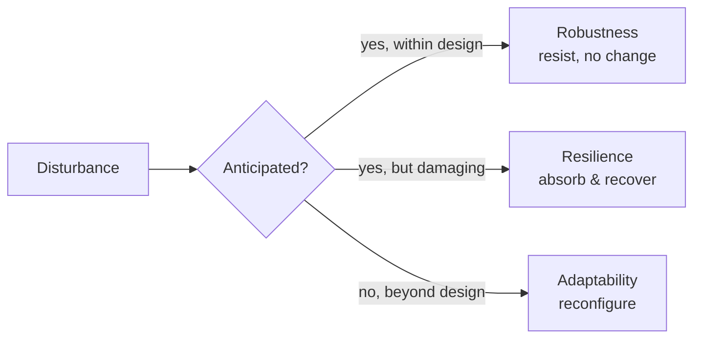

# Resilience and Robustness

"Resilience" and "robustness" are often used interchangeably in casual talk, but in
systems thinking they name genuinely different properties, and a third — **adaptability** —
sits behind both. Keeping them distinct is the first step toward designing systems that
survive the disturbances they will actually meet, including the ones nobody anticipated.

## Three distinct properties

- **Robustness** — the ability to *resist* disturbance: to absorb a perturbation and keep
  behaving the same, with no visible change in function. A load-bearing wall is robust; a
  server pool sized for peak traffic is robust to that peak. Robustness is always defined
  *relative to a known, anticipated set of disturbances*. You harden against what you expect.
- **Resilience** — the ability to *absorb a disturbance and recover*: the system may bend,
  degrade, or partially fail, but it returns to acceptable function rather than collapsing.
  Resilience accepts that damage happens and focuses on rebound and continued operation.
- **Adaptability** — the ability to *reconfigure* in response to disturbances outside the
  anticipated set, including changing the system's own structure or goals. This is the
  deepest and most future-facing property; it is what [resilience-engineering-woods.md](resilience-engineering-woods.md)
  calls graceful extensibility (stretching at the boundary) and sustained adaptability
  (renewing adaptive capacity over many cycles).

## The robustness–fragility tradeoff

The central, counterintuitive result is that robustness and fragility are two faces of the
same coin. Making a system more robust to one class of disturbance almost always makes it
more **fragile** to disturbances outside that class. Optimization tightens a system around
its expected operating envelope — trimming slack, margin, and redundancy — and that same
tightening is what makes it snap when a surprise falls outside the envelope. This "robust
yet fragile" character is a defining feature of highly engineered systems: an aircraft is
extraordinarily robust to the failures its designers foresaw and catastrophically fragile
to the ones they did not. You cannot armor your way out of surprise; past some point,
adding robustness only relocates and sharpens the fragility.

## Graceful degradation

A practical consequence: because failure is not fully preventable, systems should be built
to **degrade gracefully** rather than fail all at once. A graceful system near saturation
sheds load, disables noncritical features, and gives operators time and signal to intervene;
a brittle system collapses abruptly with no warning. Graceful degradation is resilience made
concrete in design — the difference between a website that serves cached, read-only content
under overload and one that returns nothing.

## Antifragility

Nassim Taleb's **antifragility** pushes the spectrum one step further. A fragile system is
harmed by volatility and stress; a robust system is indifferent to it; an *antifragile*
system actually *improves* from it — it uses disorder, small failures, and variability to
get stronger. Biological and market systems show this: muscles strengthen under load,
immune systems learn from exposure. The engineering lesson is to prefer many small,
survivable stressors that teach the system over a false calm that hides accumulating
fragility until it releases catastrophically.

## Why complex systems must fail well

Because [complex-systems.md](complex-systems.md) run in a continuously degraded state and
never fully leave the failure zone, the goal cannot be to eliminate failure — only to fail
*well*. [how-complex-systems-fail.md](how-complex-systems-fail.md) argues that catastrophe
requires many small failures to align, which means the design target is to keep those
failures small, visible, and recoverable rather than to chase an unreachable zero. This is
the philosophy behind [chaos engineering](../devops-sre/chaos-engineering.md): deliberately
injecting controlled failure to expose brittleness and build antifragility, rather than
waiting for uncontrolled failure to find it for you. See the broader
[operations practice](../devops-sre/index.md) for how this shows up in reliability work.

## Why it matters for AI

AI systems concentrate the robustness–fragility tradeoff. A model optimized hard against a
training distribution is robust within it and brittle at the edges — the "beyond design"
disturbances are distribution shift, adversarial inputs, and prompts unlike anything seen in
training. Because the failure boundary of a large model is invisible and its behavior beyond
that boundary is discontinuous, the relevant engineering goal is graceful degradation and
adaptability rather than more in-distribution robustness. Systems built on
[large language models](../ai/large-language-models.md) need fallbacks, confidence signals,
and human-in-the-loop reconfiguration precisely because their brittleness lives at a boundary
no one can fully map in advance. This connects to
[resilience-and-robustness](resilience-and-robustness.md)'s parent idea that adaptive
capacity, not armor, is what carries a system through surprise.

## References

- [Resilience Engineering: Four Concepts (Woods)](resilience-engineering-woods.md)
- [How Complex Systems Fail](how-complex-systems-fail.md)
- [Complex Systems](complex-systems.md)
- [Chaos Engineering](../devops-sre/chaos-engineering.md)
