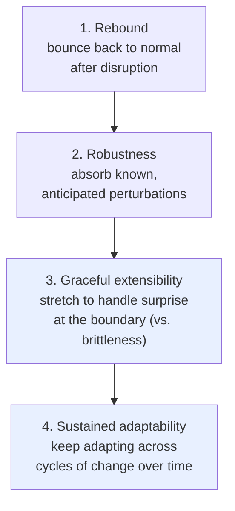

# Resilience Engineering: Four Concepts for Resilience

David Woods is a founder of the resilience engineering field, which studies how complex
systems succeed under pressure — not merely how they fail. His 2015 paper *Four concepts for
resilience and the implications for the future of resilience engineering* untangles a word
that had become overloaded: "resilience" was being used for four genuinely different things,
and conflating them was blocking progress. The paper separates them and argues that only the
last two are the real frontier. It sits alongside
[How Complex Systems Fail](how-complex-systems-fail.md) as core reading on why safety in
sociotechnical systems comes from adaptive human work, not from the absence of trouble.

## The setup: interdependence and surprise

Modern systems live in dense networks of interdependencies, built up by pursuing faster,
better, cheaper. Those same interdependencies produce unanticipated side effects and
surprises that no design anticipated. Woods' question is: what lets a system keep functioning
when it is pushed past the situations it was built for? "Resilience" is the usual answer — but
people mean four different things by it.

## The four concepts

1. **Rebound** — resilience as recovery: how a system returns to normal after a disrupting or
   traumatic event. Necessary but backward-looking; it says nothing about handling the *next*,
   different surprise.
2. **Robustness** — resilience as the ability to absorb perturbations you already anticipated
   and designed for. The trap: robustness is defined relative to a known set of disturbances.
   Making a system more robust to one class of events reliably increases its **brittleness** to
   events outside that class. You cannot armor your way out of surprise.
3. **Graceful extensibility** — the opposite of brittleness: how a system *stretches* to
   handle situations that fall outside what it was designed and prepared for. This is the
   heart of the paper. Every system has boundaries; near saturation, brittle systems collapse
   abruptly while extensible ones degrade gracefully and buy time. Extensibility is a property
   of the adaptive capacity people and organizations bring, not of the static design.
4. **Sustained adaptability** — the ability of a system (or network of systems) to *keep*
   adapting across many cycles of change over the long run, without exhausting or trapping
   itself. This is an architectural question: what structures let an organization renew its
   adaptive capacity indefinitely rather than optimizing itself into fragility?

## The load-out: optimization breeds brittleness

Woods' central trade-off: becoming more optimal against some set of variations increases
brittleness against variations outside that set. Efficiency and robustness are bought by
narrowing the range of what the system can absorb. Resilience in the deep sense (concepts 3
and 4) is about deliberately preserving the slack, margin, and adaptive capacity that pure
optimization eats away.

## Why it matters for software and AI operations

Concepts 3 and 4 reframe reliability work. Instead of only asking "how do we prevent the
known failures," you ask "how does the system behave when it is pushed past its boundaries,
and who has the authority and capacity to adapt at that moment." That is the human work
[How Complex Systems Fail](how-complex-systems-fail.md) describes and that
[blameless post-mortems](../devops-sre/blameless-post-mortems.md) are built to learn from — investigations
should surface how people stretched the system, not who to blame. It also connects to the
[ironies of automation](ai-and-the-ironies-of-automation.md): automating the routine strips
away the adaptive capacity operators need exactly when a surprise arrives. For AI systems
especially, brittleness at the boundary is the failure that matters, and graceful
extensibility is the design goal.

## References

- [Woods, D. (2015). Four concepts for resilience and the implications for the future of resilience engineering. Reliability Engineering & System Safety, 141.](https://doi.org/10.1016/j.ress.2015.03.018)
