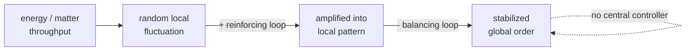

# Self-Organization

**Self-organization** is the spontaneous appearance of global order in a system
from purely *local* interactions among its parts, with **no central controller,
blueprint, or external director** imposing the pattern. The organization is
generated from inside the system by the parts acting on local information. It is the
mechanism by which much [emergence](emergence.md) happens, and a defining trait of
[complex systems](complex-systems.md): order for free, paid for by interaction and
(usually) a throughput of energy.

The key move is negative: self-organization is defined by *what is absent* (a
central organizer) as much as by what is present (order). Where [emergence](emergence.md)
stresses that the pattern lives at a higher *level*, self-organization stresses that
the pattern has no *author*.

## Mechanics

The recurring recipe:

1. **Many components** interacting through **local** rules — each responds to its
   neighborhood, not to a global command.
2. **[Feedback](feedback-loops.md)**: reinforcing loops that amplify a small,
   random fluctuation into a dominant pattern, and balancing loops that stabilize
   it. A chance concentration gets amplified until it becomes structure.
3. Often an **energy or matter throughput** that keeps the system away from
   equilibrium — order forms in the flow, not in the stillness.

Small fluctuations get selected and amplified by positive feedback, then locked in
and bounded by negative feedback; the surviving pattern is the one the dynamics
favor. No part intends the result.

## Canonical examples

- **Dissipative structures.** Ilya Prigogine's term for ordered patterns that
  persist only by dissipating energy far from thermodynamic equilibrium: Bénard
  convection cells in heated fluid, chemical oscillators (the
  Belousov–Zhabotinsky reaction), hurricanes. Order maintained *because* of energy
  flow, not despite it — the resolution to the apparent paradox with the second law
  of thermodynamics (local order is bought with global entropy export).
- **Pattern formation.** Turing's reaction–diffusion model: two chemicals, one
  activating and one inhibiting, diffusing at different rates, spontaneously produce
  spots and stripes — a candidate mechanism for animal coat patterns. The
  mathematics is [differential equations](../math/differential-equations.md) and
  [nonlinear dynamics](chaos-and-nonlinear-dynamics.md).
- **Stigmergy.** Coordination through traces left in a shared environment rather
  than direct communication: ants depositing and following pheromone, termites
  building mounds, or (by analogy) contributors coordinating through a shared
  codebase and its signals. Each agent responds to the environment the others
  modified, and coherent structure accumulates with no plan.
- **Flocks, crystals, cities, markets, neural maps** — all order that assembles from
  local rules with no one in charge.

## Self-organized vs. designed order

The instructive contrast is with **designed** (imposed) order.

| | Self-organized order | Designed order |
|---|---|---|
| Source | Local interaction + feedback | A central plan / designer |
| Control | Distributed, none in charge | Centralized |
| Robustness | High — no single point to break | Brittle at the controller |
| Predictability | Low; must often run it to see it | High; specified in advance |
| Adaptivity | Adapts as conditions change | Adapts only when redesigned |

Herbert Simon's [The Sciences of the Artificial](simon-sciences-of-the-artificial.md)
sits on this seam: artifacts are *designed* to achieve goals, yet the most robust
and evolvable designs use near-decomposable, hierarchical structure that lets order
form and adapt semi-autonomously rather than being dictated in full. Good
engineering blends the two — impose the constraints that matter, let the rest
self-organize.

## Why it matters

Self-organization is the alternative to top-down control, and for systems past a
certain scale it is the *only* option — you cannot centrally direct every packet,
neuron, or ant, so you set local rules and let global order form. This is the design
philosophy behind resilient [distributed systems](../distributed-systems/index.md)
(gossip, eventual consistency, leaderless coordination) and much
[DevOps/SRE](../devops-sre/index.md) practice (autoscaling, self-healing), where
robustness comes from having no single point of control — closely tied to
[resilience and robustness](resilience-and-robustness.md).

For AI it is central twice over: capabilities self-organize during training as
structure the optimizer discovers, not code an engineer wrote ([large language
models](../ai/large-language-models.md), [reinforcement
learning](../ai/reinforcement-learning.md)); and a healthy agent workflow is
engineered *as* self-organization — you cannot script every step, so you shape the
local rules and [feedback loops](feedback-loops.md) and let good behavior assemble.
That is exactly the stance of [loop
engineering](../harness-engineering/loop-engineering.md) and [engineer the
loop](../harness-engineering/engineer-the-loop.md): design the constraints and
signals, not the trajectory. It underpins [complex adaptive
systems](complex-adaptive-systems.md), decentralized markets in
[economics](../economics/index.md), and the strange-loop account of a self-authoring
mind in [philosophy](../philosophy/index.md) / [self-reference and strange
loops](self-reference-and-strange-loops.md).

## References

- [Complexity: A Guided Tour](mitchell-complexity.md) — Melanie Mitchell
- [The Sciences of the Artificial](simon-sciences-of-the-artificial.md) — Herbert Simon
- [Nonlinear Dynamics and Chaos](strogatz-nonlinear-dynamics-and-chaos.md) — Steven Strogatz
- [Thinking in Systems](thinking-in-systems.md) — Donella Meadows
