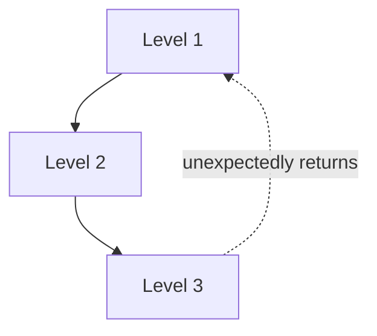

# Self-Reference and Strange Loops

**Self-reference** is what happens when a system refers to, describes, or acts on *itself*.
It sounds like a party trick — "this sentence is false" — but it is one of the deepest ideas
in logic, computation, and mind. When self-reference is wired through a hierarchy of levels
in the right way, Douglas Hofstadter argues, it produces a **strange loop**: you move
upward (or downward) through what look like distinct levels of a system and, unexpectedly,
find yourself back where you started. His [godel-escher-bach.md](godel-escher-bach.md) builds
the case at book length, and [i-am-a-strange-loop.md](i-am-a-strange-loop.md) distills it into
a single thesis about the self.

## Recursion and the tangled hierarchy

Ordinary hierarchies are clean: levels stack, and higher levels sit strictly above lower
ones (a company's org chart, an abstraction stack). **Recursion** — a process defined in
terms of itself — already bends this a little, but stays orderly: a function calls itself on
a smaller input and eventually bottoms out.

A **strange loop** (Hofstadter's "tangled hierarchy") is the pathological, generative case:
the levels are *not* cleanly separable, because traversing them leads you back to the start.
Escher's drawing of two hands each drawing the other, or a staircase that climbs forever yet
returns to its base, are visual strange loops. The hierarchy is "tangled" because the notion
that one level is strictly above another breaks down — the top reaches down and *is* the
bottom.

## Gödel and the halting problem: self-reference as a limit

Self-reference is not just aesthetic; it sets hard limits on formal systems. **Gödel's
incompleteness theorems** work by constructing, inside a formal system of arithmetic, a
statement that in effect says *"this statement is not provable in this system."* If the
system could prove it, the system would be inconsistent; if it cannot, the statement is a
true fact the system cannot reach — so any sufficiently powerful, consistent formal system is
**incomplete**. The engine is self-reference: the system is made to talk about its own
proofs. See [mathematical proof and logic](../math/mathematical-proof-and-logic.md) for the
formal machinery.

The **halting problem** is the computational twin. Turing showed no program can decide, for
every program and input, whether that program halts — the proof feeds a hypothetical decider
a version of *itself*, engineering a contradiction. Both results are the same strange loop:
a formal system pointed at itself hits a wall that cannot be designed away. The
[computer science field](../computer-science/index.md) treats undecidability as this limit
made concrete.

## Strange loops and the "I"

Hofstadter's boldest move, in [i-am-a-strange-loop.md](i-am-a-strange-loop.md), is to claim
that **the self is a strange loop**. A brain is a substrate of neurons with no "I" anywhere in
it. But a brain rich enough to build symbols can build a symbol for *itself* — it perceives,
categorizes, and models its own activity. That self-model, looping back to influence the very
processes it models, is the "I." Consciousness, on this view, is not an extra ingredient but
an [emergent](emergence.md) pattern: a high-level, self-referential loop running on a
low-level substrate, where the loop's downward reference to itself is exactly the strange-loop
tangle. This resonates with [predictive coding and cognition](../neuroscience/predictive-coding-and-cognition.md),
where the brain continuously models the world *and itself* and folds its own predictions back
into perception — a self-referential [feedback loop](feedback-loops.md) at the core of mind.

## Why it matters

Self-reference is where systems become capable of modeling, and therefore of surprising,
themselves. It draws the outer boundary of what formal systems can do (Gödel, Turing), and it
is Hofstadter's candidate mechanism for how minds arise from mindless parts. For AI the theme
is live: a model that represents its own outputs, a training loop that shapes the system
generating its own training signal, or agents that reason about their own reasoning are all
self-referential structures — and the same loops that make such systems powerful are the ones
that make their behavior hardest to bound. The philosophical stakes — whether a strange loop
is *sufficient* for a genuine self — remain open; see the [philosophy field](../philosophy/index.md).

## References

- [Gödel, Escher, Bach (Hofstadter)](godel-escher-bach.md)
- [I Am a Strange Loop (Hofstadter)](i-am-a-strange-loop.md)
- [Mathematical Proof and Logic](../math/mathematical-proof-and-logic.md)
- [Computer Science](../computer-science/index.md)
