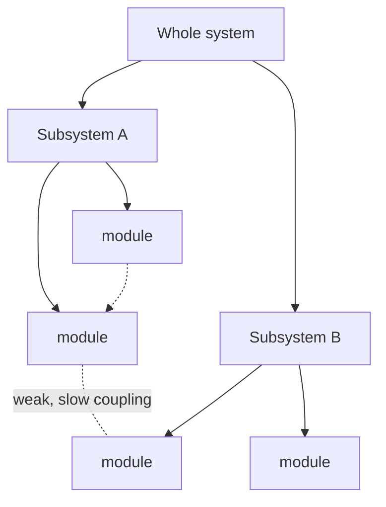

# The Sciences of the Artificial

Herbert A. Simon's *The Sciences of the Artificial* (1969; expanded editions 1981 and
1996) argues that **designed, purposeful things — organizations, computers, economies,
artifacts — can be objects of a genuine science**, distinct from but as legitimate as the
natural sciences. Simon (a Nobel laureate in economics and a founder of artificial
intelligence) wrote it as a slim, integrative statement of ideas that cut across
economics, psychology, computer science, and design.

## The artificial as an interface

Simon's defining move is to characterize an artificial system as an **interface between an
inner environment (its internal machinery and substance) and an outer environment (the
world it operates in)**, organized around **functions, goals, and adaptation**. A clock's
inner workings vary enormously, but if it keeps time in its environment, it serves its
function — so much of an artifact's behavior can be understood from its goals and its
outer environment without knowing its internals in detail. This is what lets an aircraft
and a bird, or a brain and a computer, be studied as instances of the same functional
problem. It also makes design itself analyzable: **design is a science of the possible**,
of adapting inner means to outer ends.

## Bounded rationality

Against the economists' fiction of the perfectly rational optimizer, Simon advances
**bounded rationality**: real agents have limited information, limited time, and limited
computation, so they do not maximize — they **satisfice**, searching until they find an
option that is good enough. This is not a mere caveat; it reframes cognition and
organization as *procedures for coping with complexity under constraint*, and it is the
lens the whole book brings to human and machine problem-solving alike. It is a foundational
idea for [artificial intelligence](../ai/index.md), where an agent's rationality is always
relative to its computational budget.

## Hierarchy and near-decomposability

Simon's most influential contribution to systems thinking is his account of why complex
systems tend to be **hierarchical** and **nearly decomposable**. Complex systems that
survive are almost always built from stable subassemblies nested within larger ones (his
parable of the watchmakers Hora and Tempus shows why: a watch built from stable
intermediate modules can be assembled despite interruptions, while a monolithic one
cannot). In a **nearly decomposable** system, interactions *within* a subsystem are strong
and fast while interactions *between* subsystems are weak and slow — so each level can be
analyzed almost independently, and short-run behavior is dominated by within-module
dynamics, long-run behavior by the slow between-module coupling.

Near-decomposability is *why* complex systems are comprehensible at all: it is the
structural precondition that makes hierarchical description, modular design, and
level-by-level analysis work — the counterpart to the emergent, bottom-up organization
studied in [complex-systems.md](complex-systems.md). Because the surviving complex systems
Simon describes are precisely those that adapt their inner environment to an outer one,
his account connects directly to [complex-adaptive-systems.md](complex-adaptive-systems.md).

## Relation to the field

Simon supplies the *design and organization* half of systems thinking, complementing the
*dynamics* half. Bounded rationality and satisficing are decentralized control strategies,
kin to the regulation studied in [cybernetics.md](cybernetics.md) and
[feedback-loops.md](feedback-loops.md); hierarchy and near-decomposability explain how the
[emergence](emergence.md) of stable higher levels is even possible; and the whole program
of an empirical science of designed, adaptive systems is a direct ancestor of modern
complexity science and AI.

## References

- [The Sciences of the Artificial — Wikipedia](https://en.wikipedia.org/wiki/The_Sciences_of_the_Artificial)
